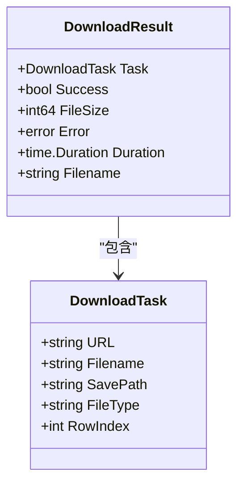
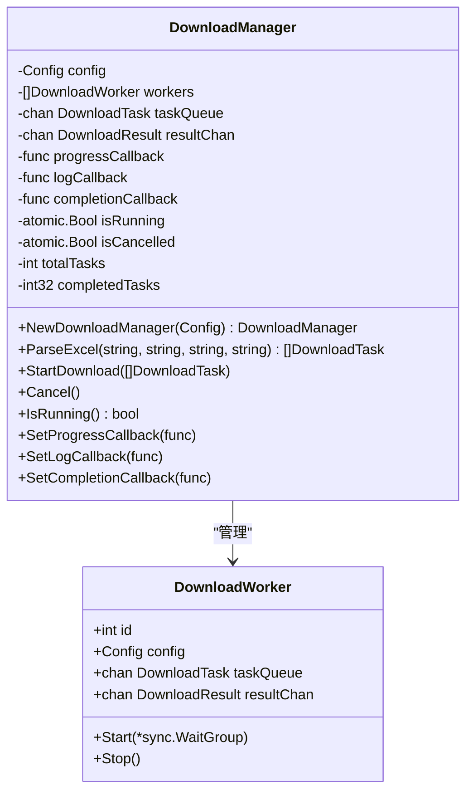
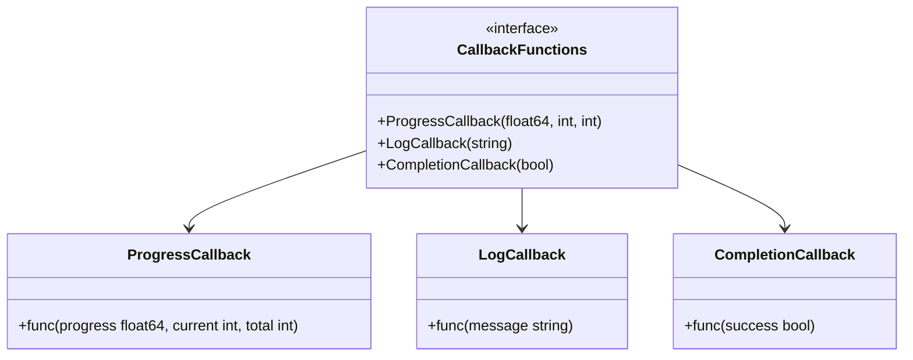
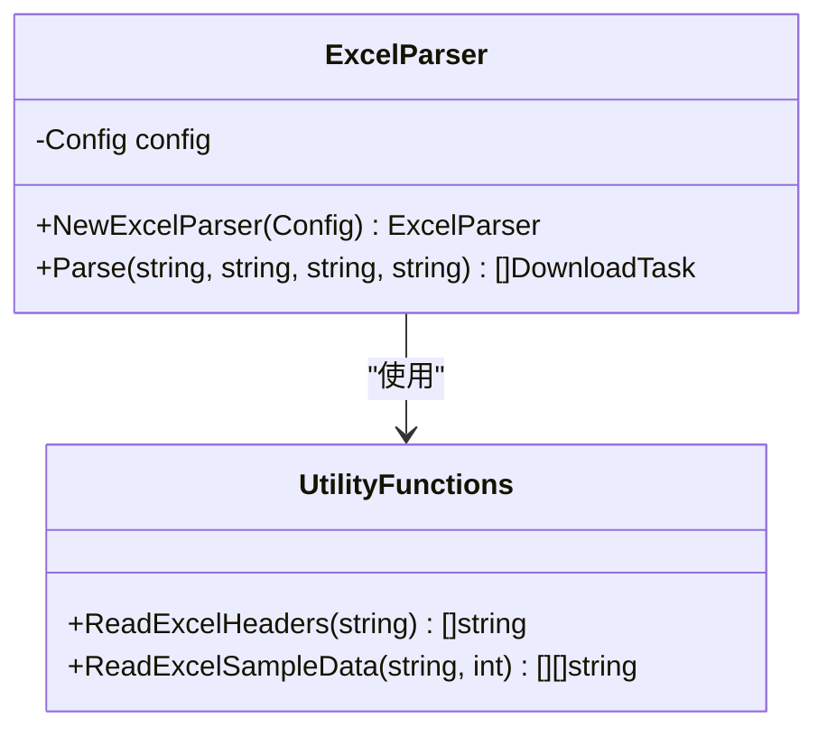
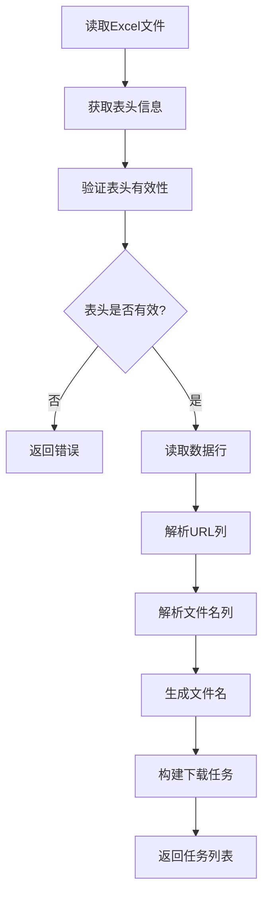
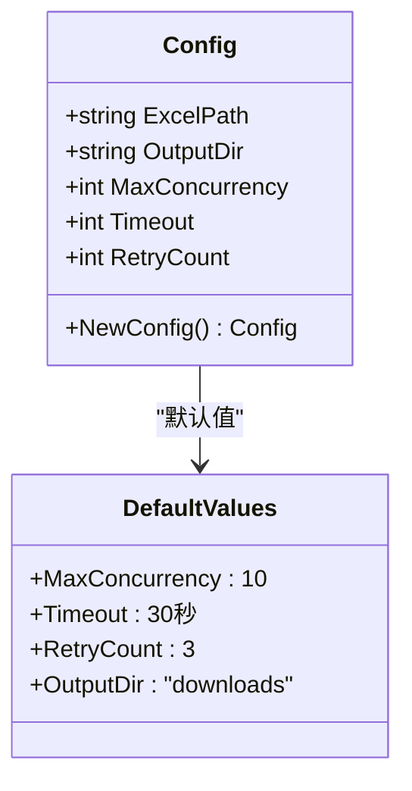
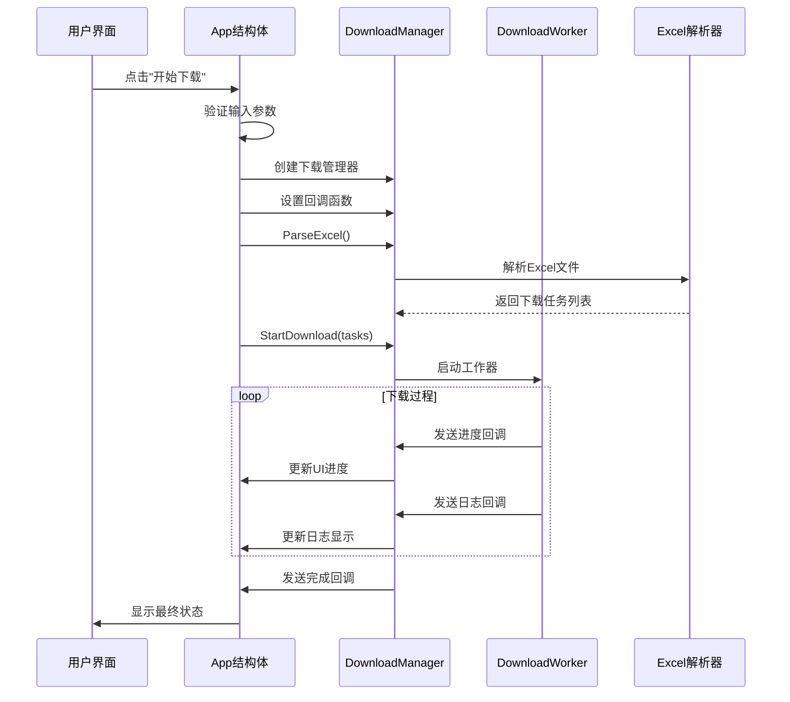
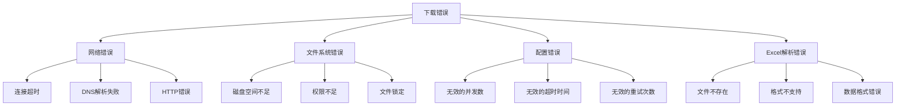

# API参考

<cite>
**本文档中引用的文件**
- [downloader/types.go](file://downloader/types.go)
- [downloader/manager.go](file://downloader/manager.go)
- [downloader/worker.go](file://downloader/worker.go)
- [downloader/excel_parser.go](file://downloader/excel_parser.go)
- [gui/app.go](file://gui/app.go)
- [config/config.go](file://config/config.go)
- [main.go](file://main.go)
</cite>

## 目录
1. [简介](#简介)
2. [核心数据结构](#核心数据结构)
3. [下载管理器API](#下载管理器api)
4. [回调函数接口](#回调函数接口)
5. [Excel解析器API](#excel解析器api)
6. [配置管理](#配置管理)
7. [GUI集成示例](#gui集成示例)
8. [二次开发指南](#二次开发指南)
9. [错误处理](#错误处理)
10. [最佳实践](#最佳实践)

## 简介

批量下载器是一个高性能的并发文件下载系统，提供了完整的API接口供二次开发者集成。该系统采用模块化设计，主要包含下载管理器、工作器、Excel解析器和配置管理等核心组件。

### 主要特性
- **并发下载**: 支持多线程并发下载，可配置最大并发数
- **智能重试**: 内置指数退避重试机制
- **进度监控**: 实时进度跟踪和状态报告
- **错误恢复**: 完善的错误处理和恢复机制
- **Excel集成**: 自动解析Excel文件生成下载任务

## 核心数据结构

### DownloadTask 结构体

下载任务的核心数据结构，定义了单个文件下载的基本信息。



**图表来源**
- [downloader/types.go](file://downloader/types.go#L5-L20)

#### 字段定义

| 字段名 | 类型 | 描述 | 必填 |
|--------|------|------|------|
| URL | string | 文件下载地址 | 是 |
| Filename | string | 生成的文件名 | 是 |
| SavePath | string | 保存完整路径 | 是 |
| FileType | string | 文件类型标识 | 否 |
| RowIndex | int | Excel原始行索引 | 否 |

**章节来源**
- [downloader/types.go](file://downloader/types.go#L5-L11)

### DownloadResult 结果结构体

下载操作的结果反馈结构体，包含详细的执行信息。

#### 字段定义

| 字段名 | 类型 | 描述 |
|--------|------|------|
| Task | DownloadTask | 对应的下载任务 |
| Success | bool | 是否成功完成 |
| FileSize | int64 | 文件大小（字节） |
| Error | error | 错误信息（如有） |
| Duration | time.Duration | 下载耗时 |
| Filename | string | 实际保存的文件名 |

**章节来源**
- [downloader/types.go](file://downloader/types.go#L13-L20)

## 下载管理器API

### DownloadManager 结构体

下载管理器是整个系统的核心控制器，负责协调下载任务的执行。



**图表来源**
- [downloader/manager.go](file://downloader/manager.go#L13-L31)
- [downloader/worker.go](file://downloader/worker.go#L16-L23)

### 核心API方法

#### 1. NewDownloadManager()

创建新的下载管理器实例。

**函数签名**
```go
func NewDownloadManager(cfg *config.Config) *DownloadManager
```

**参数**
- `cfg`: 配置对象，包含并发数、超时时间等设置

**返回值**
- `*DownloadManager`: 新创建的下载管理器实例

**使用示例**
```go
cfg := config.NewConfig()
cfg.MaxConcurrency = 20
cfg.Timeout = 60
cfg.RetryCount = 5

manager := downloader.NewDownloadManager(cfg)
```

**章节来源**
- [downloader/manager.go](file://downloader/manager.go#L33-L42)

#### 2. ParseExcel()

解析Excel文件并生成下载任务列表。

**函数签名**
```go
func (dm *DownloadManager) ParseExcel(urlColumn, nameColumns, separator, fileExtension string) ([]DownloadTask, error)
```

**参数**
- `urlColumn`: 包含下载链接的列（如"A"或"URL"）
- `nameColumns`: 用于生成文件名的列（如"B,C,D"）
- `separator`: 文件名分隔符（如"_"）
- `fileExtension`: 文件扩展名（留空则自动推断）

**返回值**
- `[]DownloadTask`: 解析得到的下载任务列表
- `error`: 错误信息（如有）

**使用示例**
```go
tasks, err := manager.ParseExcel(
    "A",           // URL列
    "B,C,D",       // 文件名列
    "_",           // 分隔符
    "pdf",         // 扩展名
)
if err != nil {
    log.Fatalf("解析Excel失败: %v", err)
}
```

**章节来源**
- [downloader/manager.go](file://downloader/manager.go#L41-L44)

#### 3. StartDownload()

开始执行下载任务。

**函数签名**
```go
func (dm *DownloadManager) StartDownload(tasks []DownloadTask)
```

**参数**
- `tasks`: 要执行的下载任务列表

**功能特点**
- 启动指定数量的工作器
- 分发任务到任务队列
- 监控下载进度和状态
- 处理任务完成后的清理工作

**章节来源**
- [downloader/manager.go](file://downloader/manager.go#L46-L76)

#### 4. Cancel()

取消正在进行的下载任务。

**函数签名**
```go
func (dm *DownloadManager) Cancel()
```

**功能特点**
- 立即停止新任务的接收
- 停止所有活跃的工作器
- 清空任务队列
- 触发完成回调

**章节来源**
- [downloader/manager.go](file://downloader/manager.go#L179-L208)

#### 5. IsRunning()

检查下载是否正在运行。

**函数签名**
```go
func (dm *DownloadManager) IsRunning() bool
```

**返回值**
- `bool`: 是否正在运行

**章节来源**
- [downloader/manager.go](file://downloader/manager.go#L239-L242)

## 回调函数接口

下载管理器提供了三个主要的回调函数接口，用于实时监控下载状态。

### 回调函数类型



**图表来源**
- [downloader/manager.go](file://downloader/manager.go#L18-L22)

### 回调函数注册

#### 1. SetProgressCallback()

设置进度回调函数。

**函数签名**
```go
func (dm *DownloadManager) SetProgressCallback(callback func(float64, int, int))
```

**参数**
- `callback`: 进度回调函数，接收三个参数：
  - `progress`: 当前进度（0.0-1.0）
  - `current`: 已完成任务数
  - `total`: 总任务数

**调用时机**
- 每次任务完成时
- 下载进度更新时
- 任务状态变化时

#### 2. SetLogCallback()

设置日志回调函数。

**函数签名**
```go
func (dm *DownloadManager) SetLogCallback(callback func(string))
```

**参数**
- `callback`: 日志回调函数，接收日志消息字符串

**调用时机**
- 任务开始下载
- 任务成功完成
- 任务失败
- 下载取消
- 统计信息更新

#### 3. SetCompletionCallback()

设置完成回调函数。

**函数签名**
```go
func (dm *DownloadManager) SetCompletionCallback(callback func(bool))
```

**参数**
- `callback`: 完成回调函数，接收一个布尔参数表示是否成功

**调用时机**
- 下载正常完成
- 下载被取消
- 发生不可恢复的错误

### 回调函数使用示例

```go
// 设置进度回调
manager.SetProgressCallback(func(progress float64, current, total int) {
    fmt.Printf("进度: %.1f%% (%d/%d)\n", progress*100, current, total)
})

// 设置日志回调
manager.SetLogCallback(func(message string) {
    fmt.Println("日志:", message)
})

// 设置完成回调
manager.SetCompletionCallback(func(success bool) {
    if success {
        fmt.Println("下载完成!")
    } else {
        fmt.Println("下载已取消或失败")
    }
})
```

## Excel解析器API

### ExcelParser 结构体

Excel解析器负责从Excel文件中提取下载任务信息。



**图表来源**
- [downloader/excel_parser.go](file://downloader/excel_parser.go#L86-L94)

### 核心解析函数

#### 1. ReadExcelHeaders()

读取Excel文件的表头信息。

**函数签名**
```go
func ReadExcelHeaders(excelPath string) ([]string, error)
```

**参数**
- `excelPath`: Excel文件路径

**返回值**
- `[]string`: 表头列名列表
- `error`: 错误信息

#### 2. ReadExcelSampleData()

读取Excel文件的样本数据。

**函数签名**
```go
func ReadExcelSampleData(excelPath string, maxRows int) ([][]string, error)
```

**参数**
- `excelPath`: Excel文件路径
- `maxRows`: 最大读取行数

**返回值**
- `[][]string`: 样本数据二维数组
- `error`: 错误信息

**章节来源**
- [downloader/excel_parser.go](file://downloader/excel_parser.go#L15-L83)

### Excel解析流程



**图表来源**
- [downloader/excel_parser.go](file://downloader/excel_parser.go#L96-L316)

## 配置管理

### Config 结构体

配置管理器提供了系统的全局配置选项。



**图表来源**
- [config/config.go](file://config/config.go#L8-L14)

### 配置参数说明

| 参数名 | 类型 | 默认值 | 描述 |
|--------|------|--------|------|
| ExcelPath | string | "" | Excel文件路径 |
| OutputDir | string | "downloads" | 下载文件保存目录 |
| MaxConcurrency | int | 10 | 最大并发下载数 |
| Timeout | int | 30 | 请求超时时间（秒） |
| RetryCount | int | 3 | 失败重试次数 |

### 配置使用示例

```go
cfg := config.NewConfig()
cfg.ExcelPath = "/path/to/excel.xlsx"
cfg.OutputDir = "/path/to/downloads"
cfg.MaxConcurrency = 15
cfg.Timeout = 45
cfg.RetryCount = 5

manager := downloader.NewDownloadManager(cfg)
```

**章节来源**
- [config/config.go](file://config/config.go#L16-L30)

## GUI集成示例

### 完整的GUI集成架构



**图表来源**
- [gui/app.go](file://gui/app.go#L451-L562)

### GUI集成关键代码

#### 1. 初始化下载管理器

```go
func (a *App) setupDownloadManager() {
    // 创建配置
    cfg := config.NewConfig()
    cfg.ExcelPath = strings.TrimSpace(a.excelPathEntry.Text)
    cfg.OutputDir = strings.TrimSpace(a.outputDirEntry.Text)
    cfg.MaxConcurrency = a.getConcurrency()
    
    // 创建管理器
    a.downloadManager = downloader.NewDownloadManager(cfg)
    
    // 设置回调
    a.setupCallbacks()
}
```

#### 2. 设置回调函数

```go
func (a *App) setupCallbacks() {
    // 进度回调：更新进度条和状态标签
    a.downloadManager.SetProgressCallback(a.updateProgress)
    
    // 日志回调：添加到日志区域
    a.downloadManager.SetLogCallback(a.addLog)
    
    // 完成回调：更新UI状态
    a.downloadManager.SetCompletionCallback(a.downloadComplete)
}
```

#### 3. 执行下载流程

```go
func (a *App) executeDownload() {
    // 解析Excel生成任务
    tasks, err := a.downloadManager.ParseExcel(
        a.urlColumnSelect.Selected,
        strings.Join(a.nameColumnsCheck.Selected, ","),
        strings.TrimSpace(a.separatorEntry.Text),
        strings.TrimSpace(a.fileExtensionEntry.Text),
    )
    
    if err != nil {
        a.addLog(fmt.Sprintf("❌ 解析Excel失败: %v", err))
        a.downloadComplete(false)
        return
    }
    
    // 开始下载
    a.addLog(fmt.Sprintf("📋 找到 %d 个下载任务，开始下载...", len(tasks)))
    a.downloadManager.StartDownload(tasks)
}
```

**章节来源**
- [gui/app.go](file://gui/app.go#L470-L562)

## 二次开发指南

### 基本集成步骤

#### 1. 导入包

```go
import (
    "batch-downloader/config"
    "batch-downloader/downloader"
)
```

#### 2. 创建配置

```go
cfg := config.NewConfig()
cfg.MaxConcurrency = 20
cfg.Timeout = 60
cfg.RetryCount = 3
```

#### 3. 创建下载管理器

```go
manager := downloader.NewDownloadManager(cfg)
```

#### 4. 设置回调函数

```go
// 进度回调
manager.SetProgressCallback(func(progress float64, current, total int) {
    fmt.Printf("进度: %.1f%% (%d/%d)\n", progress*100, current, total)
})

// 日志回调
manager.SetLogCallback(func(message string) {
    fmt.Println("日志:", message)
})

// 完成回调
manager.SetCompletionCallback(func(success bool) {
    if success {
        fmt.Println("下载完成!")
    } else {
        fmt.Println("下载已取消或失败")
    }
})
```

#### 5. 解析Excel并开始下载

```go
// 解析Excel文件
tasks, err := manager.ParseExcel(
    "A",           // URL列
    "B,C,D",       // 文件名列
    "_",           // 分隔符
    "pdf",         // 扩展名
)
if err != nil {
    log.Fatalf("解析Excel失败: %v", err)
}

// 开始下载
manager.StartDownload(tasks)
```

### 高级集成模式

#### 1. 自定义任务生成

```go
// 手动生成下载任务
tasks := []downloader.DownloadTask{
    {
        URL:      "https://example.com/file1.pdf",
        Filename: "document1.pdf",
        SavePath: "/path/to/save/document1.pdf",
        FileType: "pdf",
        RowIndex: 1,
    },
    {
        URL:      "https://example.com/file2.jpg",
        Filename: "image2.jpg",
        SavePath: "/path/to/save/image2.jpg",
        FileType: "jpg",
        RowIndex: 2,
    },
}

manager.StartDownload(tasks)
```

#### 2. 异步下载控制

```go
// 在单独的goroutine中启动下载
go func() {
    defer func() {
        if r := recover(); r != nil {
            fmt.Println("下载过程中发生错误:", r)
        }
    }()
    
    manager.StartDownload(tasks)
}()

// 可以随时取消下载
time.AfterFunc(30*time.Second, func() {
    manager.Cancel()
})
```

#### 3. 自定义错误处理

```go
manager.SetLogCallback(func(message string) {
    // 自定义日志格式
    timestamp := time.Now().Format("2006-01-02 15:04:05")
    formattedMessage := fmt.Sprintf("[%s] %s", timestamp, message)
    
    // 根据消息类型分类处理
    if strings.Contains(message, "失败") {
        fmt.Printf("❌ %s\n", formattedMessage)
    } else if strings.Contains(message, "成功") {
        fmt.Printf("✅ %s\n", formattedMessage)
    } else {
        fmt.Printf("ℹ️ %s\n", formattedMessage)
    }
})
```

### 性能优化建议

#### 1. 合理设置并发数

```go
// 根据网络环境调整并发数
var concurrency int
if networkSpeed > 100 { // Mbps
    concurrency = 50
} else if networkSpeed > 50 {
    concurrency = 30
} else {
    concurrency = 10
}
cfg.MaxConcurrency = concurrency
```

#### 2. 优化超时设置

```go
// 根据文件大小动态调整超时
cfg.Timeout = 30 // 基础超时
for _, task := range tasks {
    estimatedSize := estimateFileSize(task.URL)
    if estimatedSize > 100*1024*1024 { // 100MB
        cfg.Timeout += 60
    }
}
```

#### 3. 批量任务处理

```go
// 分批处理大量任务
const batchSize = 1000
for i := 0; i < len(tasks); i += batchSize {
    end := i + batchSize
    if end > len(tasks) {
        end = len(tasks)
    }
    
    batch := tasks[i:end]
    manager.StartDownload(batch)
    
    // 等待批次完成
    time.Sleep(1 * time.Second)
}
```

## 错误处理

### 常见错误类型



### 错误处理策略

#### 1. 任务级别错误处理

```go
manager.SetLogCallback(func(message string) {
    if strings.Contains(message, "失败") {
        // 提取失败的任务信息
        if strings.Contains(message, "URL") {
            fmt.Println("网络错误:", message)
        } else if strings.Contains(message, "权限") {
            fmt.Println("权限错误:", message)
        } else {
            fmt.Println("未知错误:", message)
        }
        
        // 可以记录到日志文件
        logToFile("error.log", message)
    }
})
```

#### 2. 重试机制

```go
// 自定义重试逻辑
manager.SetLogCallback(func(message string) {
    if strings.Contains(message, "重试") {
        retryCount := extractRetryCount(message)
        if retryCount > 3 {
            // 达到最大重试次数，停止重试
            fmt.Println("达到最大重试次数，放弃任务")
        }
    }
})
```

#### 3. 错误恢复

```go
// 错误恢复示例
manager.SetCompletionCallback(func(success bool) {
    if !success {
        // 检查是否有部分成功
        if partialSuccessCount > 0 {
            fmt.Printf("部分成功: %d/%d\n", partialSuccessCount, totalCount)
            
            // 可以重新尝试失败的任务
            retryFailedTasks()
        } else {
            fmt.Println("全部任务失败，检查配置和网络")
        }
    }
})
```

### 错误诊断工具

```go
// 错误诊断函数
func diagnoseDownloadError(manager *downloader.DownloadManager, tasks []downloader.DownloadTask) {
    fmt.Println("=== 下载错误诊断 ===")
    
    // 检查配置
    fmt.Printf("并发数: %d\n", manager.config.MaxConcurrency)
    fmt.Printf("超时时间: %d秒\n", manager.config.Timeout)
    fmt.Printf("重试次数: %d\n", manager.config.RetryCount)
    
    // 检查任务数量
    fmt.Printf("总任务数: %d\n", len(tasks))
    
    // 检查URL有效性
    invalidURLs := 0
    for _, task := range tasks {
        if !isValidURL(task.URL) {
            invalidURLs++
        }
    }
    fmt.Printf("无效URL数量: %d\n", invalidURLs)
}
```

## 最佳实践

### 1. 资源管理

#### 内存管理
```go
// 使用完后及时释放资源
manager := downloader.NewDownloadManager(cfg)
defer func() {
    // 清理资源
    manager.Cancel()
}()

// 控制内存使用
const maxMemoryUsage = 100 * 1024 * 1024 // 100MB
if memoryUsage > maxMemoryUsage {
    // 减少并发数或暂停下载
    cfg.MaxConcurrency = cfg.MaxConcurrency / 2
}
```

#### 文件句柄管理
```go
// 监控文件句柄使用
manager.SetLogCallback(func(message string) {
    if strings.Contains(message, "创建文件") {
        fileHandleCount++
    } else if strings.Contains(message, "关闭文件") {
        fileHandleCount--
    }
    
    if fileHandleCount > 1000 {
        fmt.Println("警告: 文件句柄过多，可能需要清理")
    }
})
```

### 2. 性能监控

#### 实时性能指标
```go
type PerformanceMetrics struct {
    StartTime     time.Time
    TotalTasks    int
    CompletedTasks int
    FailedTasks    int
    AverageSpeed   float64
    PeakMemory     int64
}

func (a *App) monitorPerformance() {
    metrics := PerformanceMetrics{
        StartTime: time.Now(),
    }
    
    manager.SetProgressCallback(func(progress float64, current, total int) {
        metrics.CompletedTasks = current
        metrics.TotalTasks = total
        
        elapsed := time.Since(metrics.StartTime).Seconds()
        metrics.AverageSpeed = float64(current) / elapsed
        
        // 记录峰值内存使用
        if current%10 == 0 {
            memStats := &runtime.MemStats{}
            runtime.ReadMemStats(memStats)
            if memStats.Alloc > metrics.PeakMemory {
                metrics.PeakMemory = memStats.Alloc
            }
        }
        
        // 输出性能报告
        fmt.Printf("性能: %.1f 个/秒, 完成: %d/%d, 失败: %d\n",
            metrics.AverageSpeed, current, total, metrics.FailedTasks)
    })
}
```

### 3. 用户体验优化

#### 4. 界面响应性
```go
// 使用缓冲通道避免UI阻塞
manager.SetProgressCallback(func(progress float64, current, total int) {
    // 使用异步方式更新UI
    select {
    case uiUpdateChannel <- struct{}{
        Progress: progress,
        Current:  current,
        Total:    total,
    }:
    default:
        // 如果缓冲区满，丢弃更新
        // UI仍然会定期刷新
    }
})
```

#### 5. 取消操作优化
```go
// 实现优雅的取消
func (a *App) cancelDownload() {
    if a.downloadManager.IsRunning() {
        // 设置取消标志
        cancelFlag := make(chan struct{})
        
        // 启动后台取消
        go func() {
            defer close(cancelFlag)
            a.downloadManager.Cancel()
        }()
        
        // 等待取消完成或超时
        select {
        case <-cancelFlag:
            fmt.Println("取消完成")
        case <-time.After(30 * time.Second):
            fmt.Println("取消超时，强制终止")
            // 可以考虑强制终止进程
        }
    }
}
```

### 4. 配置优化

#### 动态配置调整
```go
// 根据网络状况动态调整配置
func optimizeConfig(networkSpeedMbps float64) *config.Config {
    cfg := config.NewConfig()
    
    // 根据带宽调整并发数
    if networkSpeedMbps > 100 {
        cfg.MaxConcurrency = 50
        cfg.Timeout = 30
    } else if networkSpeedMbps > 50 {
        cfg.MaxConcurrency = 30
        cfg.Timeout = 45
    } else {
        cfg.MaxConcurrency = 10
        cfg.Timeout = 60
    }
    
    // 增加重试次数
    cfg.RetryCount = 5
    
    return cfg
}
```

### 5. 日志和调试

#### 结构化日志
```go
type LogEntry struct {
    Timestamp time.Time
    Level     string
    Message   string
    Task      *downloader.DownloadTask
    Error     error
}

func structuredLogging(manager *downloader.DownloadManager) {
    manager.SetLogCallback(func(rawMessage string) {
        entry := LogEntry{
            Timestamp: time.Now(),
            Message:   rawMessage,
        }
        
        // 解析任务信息
        if strings.Contains(rawMessage, "成功:") || strings.Contains(rawMessage, "失败:") {
            entry.Level = "INFO"
        } else if strings.Contains(rawMessage, "失败") {
            entry.Level = "ERROR"
        } else {
            entry.Level = "DEBUG"
        }
        
        // 输出JSON格式日志
        jsonLog, _ := json.Marshal(entry)
        fmt.Println(string(jsonLog))
    })
}
```

### 6. 测试和验证

#### 单元测试示例
```go
func TestDownloadManager(t *testing.T) {
    cfg := config.NewConfig()
    cfg.MaxConcurrency = 5
    
    manager := downloader.NewDownloadManager(cfg)
    
    // 测试基本功能
    assert.NotNil(t, manager)
    assert.False(t, manager.IsRunning())
    
    // 测试Excel解析
    tasks, err := manager.ParseExcel("A", "B", "_", "")
    assert.NoError(t, err)
    assert.Greater(t, len(tasks), 0)
    
    // 测试下载
    manager.SetCompletionCallback(func(success bool) {
        assert.True(t, success)
    })
    
    manager.StartDownload(tasks)
}
```

#### 集成测试
```go
func TestEndToEnd(t *testing.T) {
    // 准备测试数据
    tempDir := t.TempDir()
    excelPath := filepath.Join(tempDir, "test.xlsx")
    
    // 创建测试Excel文件
    createTestExcelFile(excelPath)
    
    // 配置测试环境
    cfg := config.NewConfig()
    cfg.ExcelPath = excelPath
    cfg.OutputDir = filepath.Join(tempDir, "downloads")
    cfg.MaxConcurrency = 2
    
    manager := downloader.NewDownloadManager(cfg)
    
    // 执行端到端测试
    tasks, err := manager.ParseExcel("A", "B", "_", "")
    assert.NoError(t, err)
    
    var completionWg sync.WaitGroup
    completionWg.Add(1)
    
    manager.SetCompletionCallback(func(success bool) {
        defer completionWg.Done()
        assert.True(t, success)
    })
    
    manager.StartDownload(tasks)
    completionWg.Wait()
    
    // 验证结果
    downloadedFiles, _ := ioutil.ReadDir(cfg.OutputDir)
    assert.Equal(t, len(tasks), len(downloadedFiles))
}
```

通过遵循这些最佳实践，您可以构建稳定、高效的下载应用程序，并为用户提供优秀的使用体验。