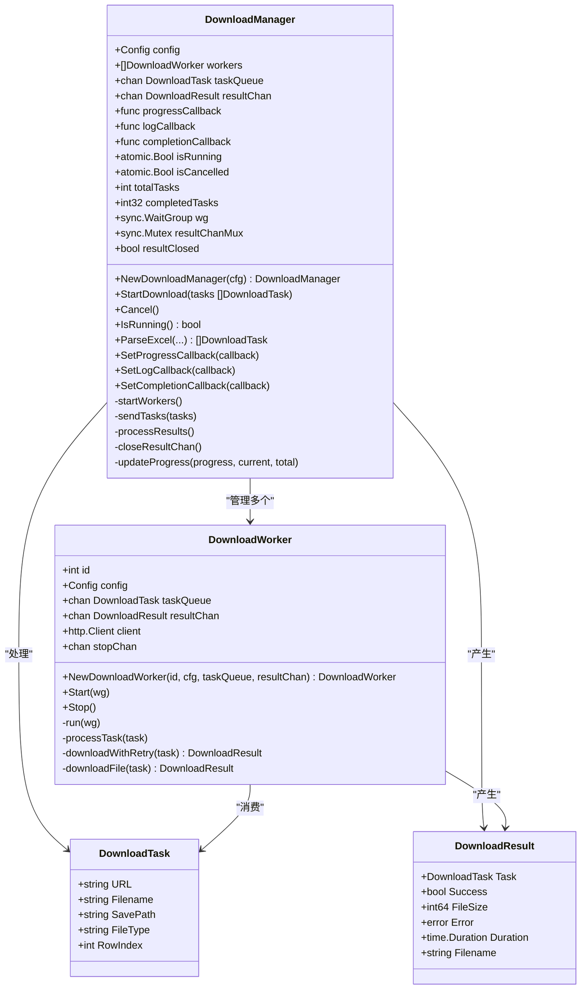
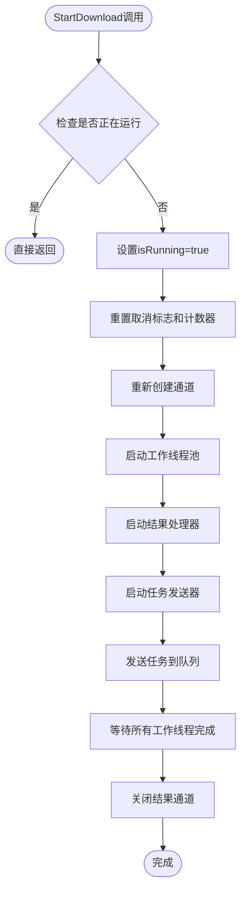
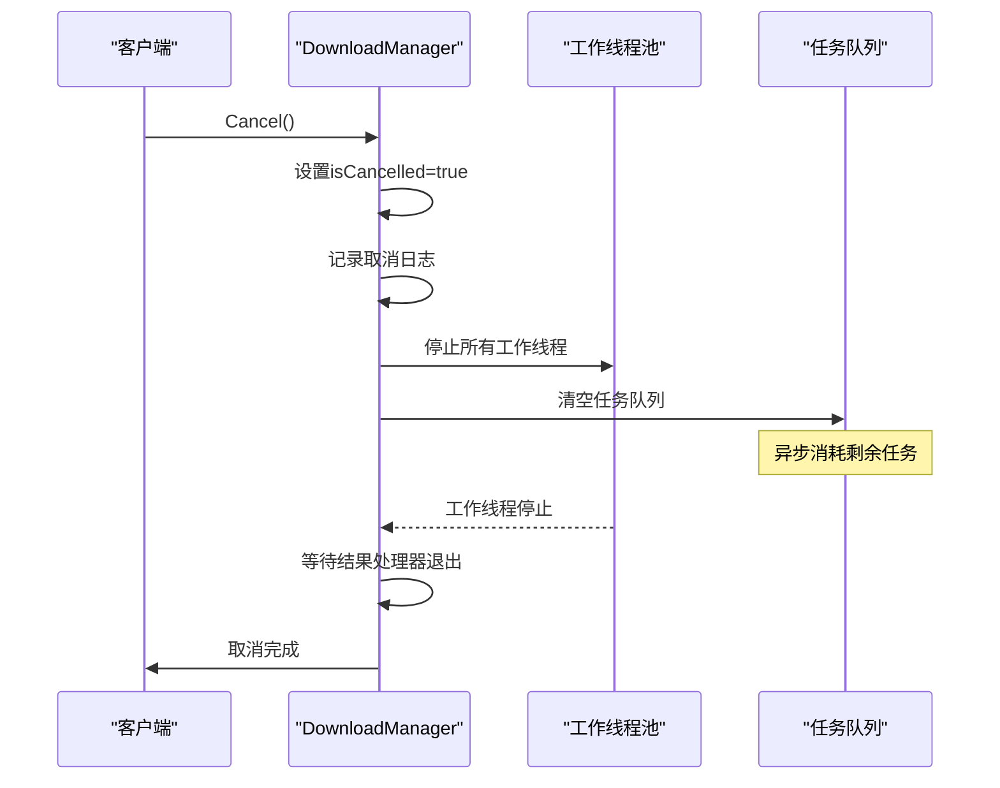
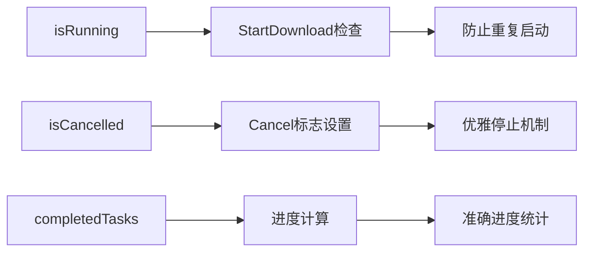
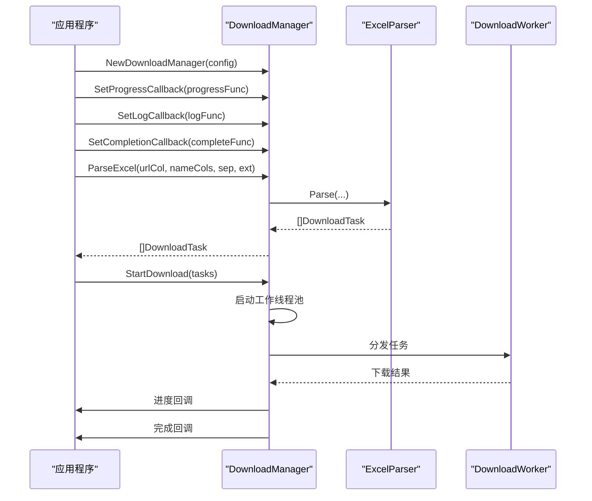
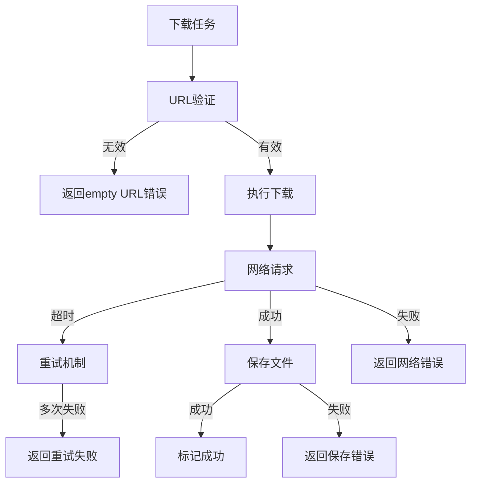

# 下载管理器API详细文档

<cite>
**本文档引用的文件**
- [downloader/manager.go](file://downloader/manager.go)
- [downloader/types.go](file://downloader/types.go)
- [downloader/worker.go](file://downloader/worker.go)
- [downloader/excel_parser.go](file://downloader/excel_parser.go)
- [config/config.go](file://config/config.go)
- [gui/app.go](file://gui/app.go)
- [main.go](file://main.go)
</cite>

## 目录
1. [简介](#简介)
2. [核心结构体](#核心结构体)
3. [公共方法详解](#公共方法详解)
4. [数据结构定义](#数据结构定义)
5. [并发控制机制](#并发控制机制)
6. [使用示例](#使用示例)
7. [错误处理策略](#错误处理策略)
8. [性能优化](#性能优化)
9. [最佳实践](#最佳实践)

## 简介

下载管理器是一个高性能的批量文件下载系统，采用生产者-消费者模式设计，支持并发下载、任务队列管理和优雅的取消机制。该系统通过Go语言的并发特性实现了高效的文件下载管理功能。

## 核心结构体

### DownloadManager 结构体

DownloadManager 是整个下载系统的核心控制器，负责协调任务调度、工作线程管理和状态控制。



**图表来源**
- [downloader/manager.go](file://downloader/manager.go#L13-L31)
- [downloader/worker.go](file://downloader/worker.go#L16-L23)
- [downloader/types.go](file://downloader/types.go#L5-L20)

**章节来源**
- [downloader/manager.go](file://downloader/manager.go#L13-L31)
- [downloader/worker.go](file://downloader/worker.go#L16-L23)

## 公共方法详解

### StartDownload 方法

StartDownload 是下载管理器的核心方法，负责启动批量下载任务。

#### 方法签名
```go
func (dm *DownloadManager) StartDownload(tasks []DownloadTask)
```

#### 参数说明
- `tasks []DownloadTask`: 下载任务列表，每个任务包含下载URL、目标文件名等信息

#### 方法流程图



**图表来源**
- [downloader/manager.go](file://downloader/manager.go#L46-L76)

#### 实现细节

1. **状态检查**: 使用原子布尔变量 `isRunning` 防止重复启动
2. **资源初始化**: 重置任务计数器和通道状态
3. **工作线程启动**: 根据配置的最大并发数创建工作线程池
4. **异步处理**: 启动独立的goroutine处理结果和任务发送

**章节来源**
- [downloader/manager.go](file://downloader/manager.go#L46-L76)

### Cancel 方法

Cancel 方法提供安全的任务取消机制，确保资源正确释放且不影响其他任务。

#### 方法签名
```go
func (dm *DownloadManager) Cancel()
```

#### 取消流程



**图表来源**
- [downloader/manager.go](file://downloader/manager.go#L179-L208)

#### 安全机制

1. **原子标志**: 使用 `atomic.Bool` 确保取消状态的一致性
2. **优雅停止**: 工作线程检测取消标志后自然退出
3. **资源清理**: 清空任务队列避免内存泄漏

**章节来源**
- [downloader/manager.go](file://downloader/manager.go#L179-L208)

### IsRunning 方法

IsRunning 方法提供当前下载状态的查询接口。

#### 方法签名
```go
func (dm *DownloadManager) IsRunning() bool
```

#### 实现特点
- 使用原子操作保证线程安全
- 提供实时的状态查询能力
- 支持UI界面的状态同步

**章节来源**
- [downloader/manager.go](file://downloader/manager.go#L239-L242)

## 数据结构定义

### DownloadTask 结构体

DownloadTask 表示单个下载任务的基本信息。

| 字段名 | 类型 | 描述 | 必需性 |
|--------|------|------|--------|
| URL | string | 文件下载地址 | 必需 |
| Filename | string | 目标文件名 | 必需 |
| SavePath | string | 保存完整路径 | 必需 |
| FileType | string | 文件类型标识 | 可选 |
| RowIndex | int | Excel原始行索引 | 可选 |

**章节来源**
- [downloader/types.go](file://downloader/types.go#L5-L11)

### DownloadResult 结构体

DownloadResult 包含下载任务的执行结果和统计信息。

| 字段名 | 类型 | 描述 |
|--------|------|------|
| Task | DownloadTask | 对应的下载任务 |
| Success | bool | 是否成功 |
| FileSize | int64 | 文件大小（字节） |
| Error | error | 错误信息 |
| Duration | time.Duration | 下载耗时 |
| Filename | string | 文件名 |

**章节来源**
- [downloader/types.go](file://downloader/types.go#L13-L20)

## 并发控制机制

### 原子操作

系统广泛使用原子操作确保并发安全性：



**图表来源**
- [downloader/manager.go](file://downloader/manager.go#L23-L26)

### WaitGroup 协调

使用 `sync.WaitGroup` 协调工作线程的生命周期：

- **启动阶段**: 每个工作线程启动时调用 `wg.Add(1)`
- **运行阶段**: 工作线程主循环中处理任务
- **结束阶段**: 工作线程退出时调用 `wg.Done()`
- **等待阶段**: 主goroutine调用 `wg.Wait()` 等待所有线程完成

### 通道通信

- **任务队列**: `chan DownloadTask` 用于任务分发
- **结果通道**: `chan DownloadResult` 用于结果收集
- **同步机制**: 通道的缓冲区大小限制并发度

**章节来源**
- [downloader/manager.go](file://downloader/manager.go#L28-L30)
- [downloader/worker.go](file://downloader/worker.go#L45-L48)

## 使用示例

### 基本使用流程

以下展示了从创建管理器到执行下载的完整流程：



**图表来源**
- [gui/app.go](file://gui/app.go#L470-L562)

### GUI 应用集成示例

在GUI应用中，下载管理器通常这样使用：

1. **初始化管理器**: 在应用启动时创建
2. **设置回调**: 注册进度、日志和完成回调
3. **解析Excel**: 从用户提供的Excel文件中提取下载任务
4. **启动下载**: 调用 `StartDownload` 开始批量下载
5. **响应取消**: 用户点击取消按钮时调用 `Cancel`

**章节来源**
- [gui/app.go](file://gui/app.go#L470-L562)

## 错误处理策略

### 任务级别错误处理

每个下载任务都有独立的错误处理机制：



**图表来源**
- [downloader/worker.go](file://downloader/worker.go#L105-L219)

### 系统级错误处理

1. **通道关闭**: 使用互斥锁保护结果通道的安全关闭
2. **资源清理**: 确保临时文件和网络连接的正确释放
3. **状态同步**: 使用原子操作保证状态的一致性

**章节来源**
- [downloader/manager.go](file://downloader/manager.go#L210-L219)
- [downloader/worker.go](file://downloader/worker.go#L130-L140)

## 性能优化

### 并发控制

- **最大并发数**: 通过配置控制工作线程数量
- **任务队列缓冲**: 使用带缓冲的通道限制内存占用
- **连接池复用**: HTTP客户端复用连接减少开销

### 内存管理

- **临时文件**: 下载过程中使用 `.tmp` 后缀避免中断丢失
- **结果缓存**: 限制结果通道大小防止内存溢出
- **日志节流**: UI更新频率控制避免界面卡顿

### 网络优化

- **超时控制**: 配置合理的HTTP请求超时时间
- **重试机制**: 指数退避算法减少服务器压力
- **连接复用**: HTTP连接池提高效率

**章节来源**
- [downloader/worker.go](file://downloader/worker.go#L25-L42)
- [gui/app.go](file://gui/app.go#L590-L601)

## 最佳实践

### 调用时序约束

1. **单次启动**: 同一实例只能启动一次，重复调用 `StartDownload` 会被忽略
2. **状态检查**: 使用 `IsRunning()` 检查当前状态再决定操作
3. **优雅取消**: 取消操作会等待所有工作线程完成后再返回

### 资源管理

1. **配置验证**: 确保配置参数的有效性
2. **回调设置**: 在启动前设置所有必要的回调函数
3. **错误恢复**: 实现适当的错误恢复机制

### 扩展性考虑

1. **插件架构**: 支持不同类型的下载源
2. **进度粒度**: 提供细粒度的进度报告
3. **监控指标**: 收集下载性能统计数据

**章节来源**
- [downloader/manager.go](file://downloader/manager.go#L47-L49)
- [gui/app.go](file://gui/app.go#L565-L575)