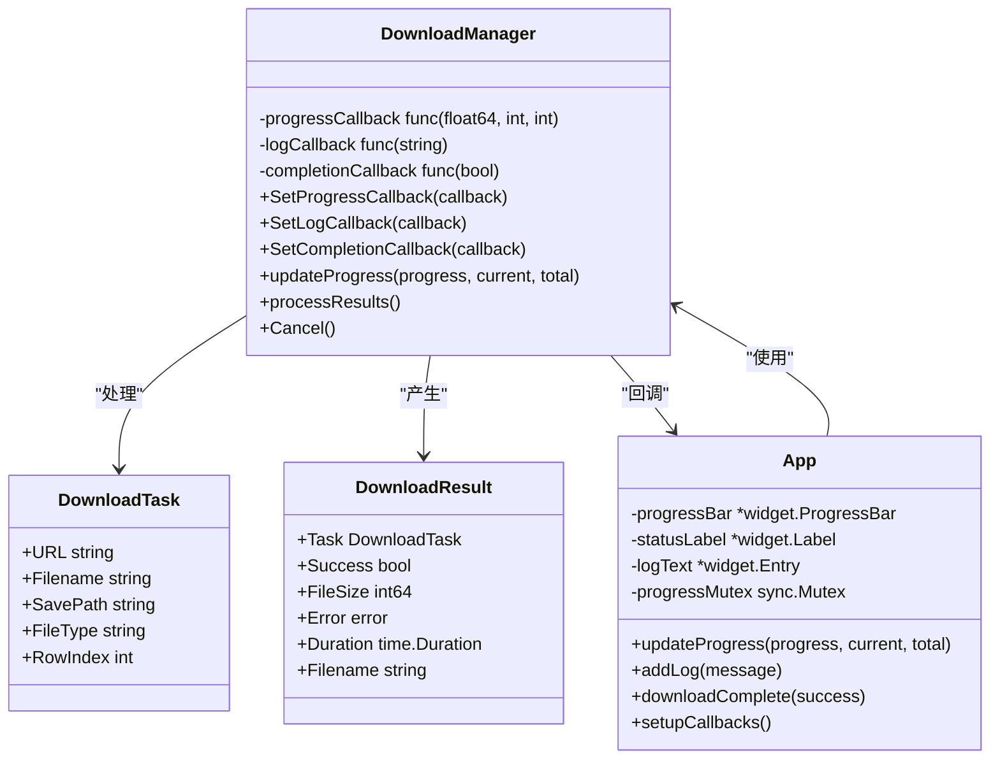
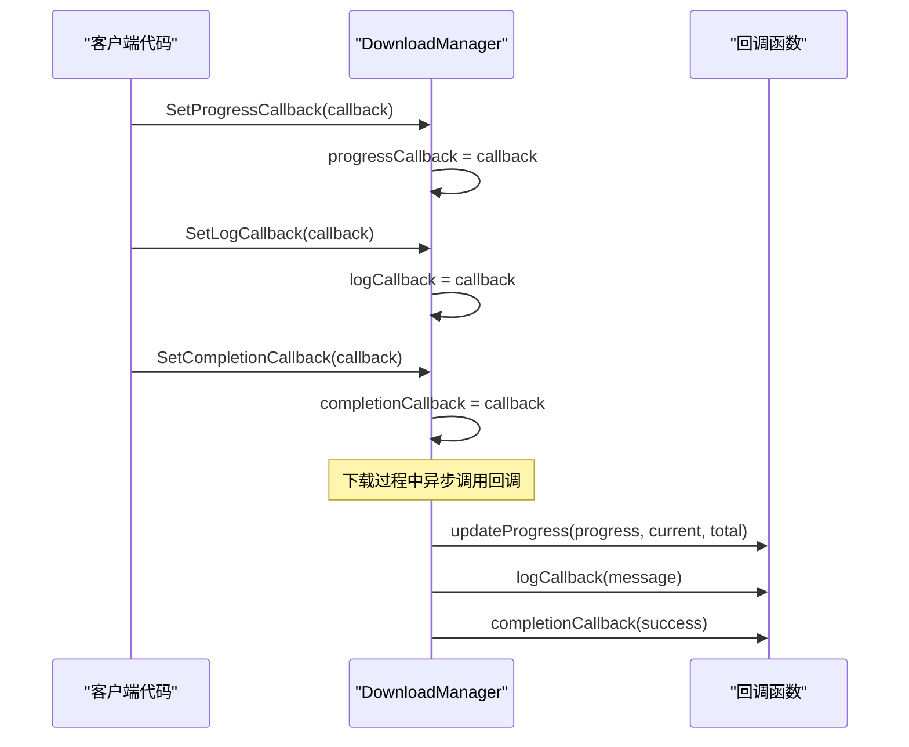
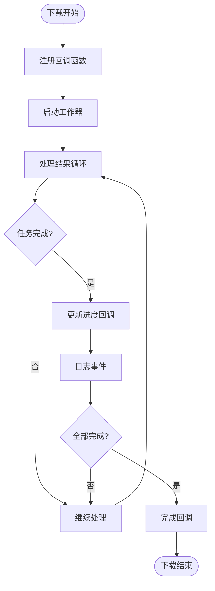
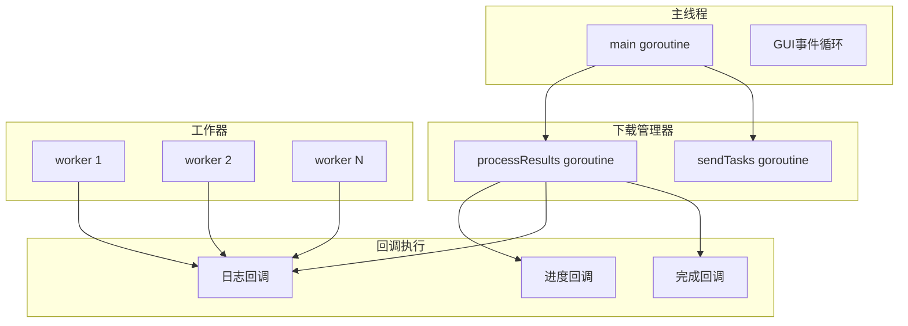

# 回调接口

<cite>
**本文档引用的文件**
- [downloader/types.go](file://downloader/types.go)
- [downloader/manager.go](file://downloader/manager.go)
- [downloader/worker.go](file://downloader/worker.go)
- [gui/app.go](file://gui/app.go)
- [main.go](file://main.go)
</cite>

## 目录
1. [简介](#简介)
2. [回调接口架构](#回调接口架构)
3. [核心回调类型](#核心回调类型)
4. [回调注册机制](#回调注册机制)
5. [GUI层回调实现](#gui层回调实现)
6. [非GUI环境回调](#非GUI环境回调)
7. [线程安全性](#线程安全性)
8. [错误处理与最佳实践](#错误处理与最佳实践)
9. [常见陷阱与解决方案](#常见陷阱与解决方案)
10. [性能优化建议](#性能优化建议)

## 简介

批量下载器采用基于函数指针的回调机制，为下载过程中的关键事件提供灵活的通知和状态更新能力。该系统支持三种主要类型的回调：进度回调（OnProgress）、完成回调（OnComplete）和日志回调（OnLog），通过异步方式在不同的goroutine上下文中执行，确保用户界面的响应性和系统的稳定性。

## 回调接口架构



**图表来源**
- [downloader/manager.go](file://downloader/manager.go#L13-L23)
- [gui/app.go](file://gui/app.go#L44-L73)

**章节来源**
- [downloader/manager.go](file://downloader/manager.go#L13-L23)
- [gui/app.go](file://gui/app.go#L44-L73)

## 核心回调类型

### 进度回调（OnProgress）

进度回调负责在下载过程中定期通知进度状态，提供实时的视觉反馈。

#### 函数签名
```go
func(float64, int, int)
```

#### 参数说明
- `float64 progress`: 当前进度百分比（0.0-1.0）
- `int current`: 已完成的任务数量
- `int total`: 总任务数量

#### 调用时机
- 每次任务完成时
- 进度发生变化时
- 下载开始和结束时

#### 执行上下文
- 在`processResults()` goroutine中执行
- 异步调用，不阻塞主流程

### 日志回调（OnLog）

日志回调用于记录下载过程中的各种事件和状态信息。

#### 函数签名
```go
func(string)
```

#### 参数说明
- `string message`: 日志消息内容

#### 调用时机
- 任务成功完成
- 任务失败
- 下载开始和结束
- 错误发生
- 状态变更

#### 执行上下文
- 在多个goroutine中执行（`processResults`、`worker`等）
- 频率受节流控制，避免过度刷新

### 完成回调（OnComplete）

完成回调在下载任务全部完成或取消时触发。

#### 函数签名
```go
func(bool)
```

#### 参数说明
- `bool success`: 是否成功完成（false表示被取消）

#### 调用时机
- 正常下载完成
- 下载被取消
- 发生不可恢复的错误

#### 执行上下文
- 在`processResults` goroutine中执行
- 作为最后的清理通知

**章节来源**
- [downloader/manager.go](file://downloader/manager.go#L18-L20)
- [downloader/manager.go](file://downloader/manager.go#L221-L231)

## 回调注册机制

### 注册方法



**图表来源**
- [downloader/manager.go](file://downloader/manager.go#L221-L231)

### 回调链路



**图表来源**
- [downloader/manager.go](file://downloader/manager.go#L101-L177)

**章节来源**
- [downloader/manager.go](file://downloader/manager.go#L221-L231)
- [downloader/manager.go](file://downloader/manager.go#L101-L177)

## GUI层回调实现

### 进度更新实现

GUI层通过`updateProgress`方法实现进度条和状态标签的更新，采用节流机制防止界面卡顿。

#### 关键特性
- **线程安全**: 使用互斥锁保护UI更新
- **节流控制**: 每200ms最多更新一次
- **状态计算**: 动态计算下载速度和剩余时间
- **视觉反馈**: 提供进度百分比和统计信息

#### 实现细节
- 进度范围限制在0.0-1.0之间
- 完成状态特殊处理（100%显示）
- 实时计算下载速度和预估时间

### 日志记录实现

`addLog`方法负责在GUI界面上显示下载日志，具有以下特点：

#### 关键特性
- **行数限制**: 最多保留500行日志，防止内存溢出
- **自动滚动**: 新日志自动滚动到底部
- **格式化**: 支持彩色和格式化的日志消息
- **性能优化**: 使用字符串切片操作提高效率

### 完成处理

`downloadComplete`方法处理下载完成后的界面状态更新：

#### 关键特性
- **状态切换**: 根据成功与否更新界面状态
- **按钮控制**: 启用/禁用相关按钮
- **进度同步**: 确保进度条正确显示

**章节来源**
- [gui/app.go](file://gui/app.go#L591-L689)
- [gui/app.go](file://gui/app.go#L578-L588)

## 非GUI环境回调

### 自定义回调实现

在非GUI环境中，可以通过简单的函数实现来自定义回调逻辑：

#### 基础实现示例
```go
// 进度回调示例
func progressCallback(progress float64, current, total int) {
    fmt.Printf("进度: %.1f%% (%d/%d)\n", progress*100, current, total)
}

// 日志回调示例  
func logCallback(message string) {
    timestamp := time.Now().Format("2006-01-02 15:04:05")
    fmt.Printf("[%s] %s\n", timestamp, message)
}

// 完成回调示例
func completionCallback(success bool) {
    if success {
        fmt.Println("下载完成!")
    } else {
        fmt.Println("下载被取消!")
    }
}
```

### 文件写入回调

```go
func fileLogCallback(message string) {
    file, err := os.OpenFile("download.log", os.O_APPEND|os.O_CREATE|os.O_WRONLY, 0644)
    if err != nil {
        return
    }
    defer file.Close()
    
    timestamp := time.Now().Format("2006-01-02 15:04:05")
    logMessage := fmt.Sprintf("[%s] %s\n", timestamp, message)
    file.WriteString(logMessage)
}
```

### 数据库记录回调

```go
func dbLogCallback(message string) {
    // 数据库连接和插入逻辑
    db := getDBConnection()
    stmt, _ := db.Prepare("INSERT INTO download_logs (message, created_at) VALUES (?, ?)")
    stmt.Exec(message, time.Now())
}
```

### HTTP推送回调

```go
func httpPushCallback(message string) {
    payload := map[string]string{
        "message": message,
        "timestamp": time.Now().Format(time.RFC3339),
    }
    
    jsonPayload, _ := json.Marshal(payload)
    req, _ := http.NewRequest("POST", "http://localhost:8080/webhook", 
                            bytes.NewBuffer(jsonPayload))
    req.Header.Set("Content-Type", "application/json")
    
    client := &http.Client{}
    client.Do(req)
}
```

## 线程安全性

### Goroutine上下文

回调函数在不同的goroutine上下文中执行：



**图表来源**
- [downloader/manager.go](file://downloader/manager.go#L65-L76)
- [downloader/worker.go](file://downloader/worker.go#L50-L64)

### 线程安全策略

#### 1. GUI线程安全
GUI层使用互斥锁保护UI更新：
- `progressMutex`保护进度更新
- 避免并发修改UI组件
- 确保Fyne框架的线程安全

#### 2. 数据竞争防护
- 使用原子操作保护共享状态
- 通道通信避免直接共享数据
- 适当的锁机制防止竞态条件

#### 3. 资源访问控制
- 避免在回调中访问已释放的资源
- 使用引用计数或生命周期管理
- 确保资源的正确初始化和清理

**章节来源**
- [gui/app.go](file://gui/app.go#L591-L594)
- [downloader/manager.go](file://downloader/manager.go#L211-L219)

## 错误处理与最佳实践

### 回调错误处理

#### 1. 回调函数检查
```go
func (dm *DownloadManager) updateProgress(progress float64, current, total int) {
    if dm.progressCallback != nil {
        dm.progressCallback(progress, current, total)
    }
}
```

#### 2. 错误隔离
```go
func safeLogCallback(logFunc func(string), message string) {
    defer func() {
        if r := recover(); r != nil {
            // 记录回调错误，但不中断主流程
            fmt.Printf("回调执行错误: %v\n", r)
        }
    }()
    
    if logFunc != nil {
        logFunc(message)
    }
}
```

### 最佳实践指南

#### 1. 避免阻塞操作
- 不要在回调中执行数据库查询
- 避免网络请求或其他耗时操作
- 使用异步处理复杂业务逻辑

#### 2. 资源管理
- 及时释放临时资源
- 避免内存泄漏
- 正确处理文件句柄和网络连接

#### 3. 性能考虑
- 实现回调节流机制
- 避免频繁的字符串拼接
- 使用缓冲区优化大量日志

#### 4. 错误传播
- 在回调中记录错误信息
- 提供适当的错误恢复机制
- 确保主流程不受回调异常影响

**章节来源**
- [downloader/manager.go](file://downloader/manager.go#L233-L236)
- [downloader/manager.go](file://downloader/manager.go#L137-L142)

## 常见陷阱与解决方案

### 陷阱1：回调中访问已释放资源

#### 问题描述
在回调中访问已经被释放的资源，导致程序崩溃。

#### 解决方案
```go
// 错误做法
func problematicCallback() {
    // 假设资源在某个时刻被释放
    resource.Close()
    // 回调可能在资源释放后执行
    callback(resource.Data)
}

// 正确做法
func safeCallback(resource *Resource) {
    // 使用副本或检查资源状态
    data := resource.GetData()
    if data != nil {
        callback(data)
    }
}
```

### 陷阱2：回调中的死锁

#### 问题描述
回调中尝试获取已经持有的锁，导致死锁。

#### 解决方案
```go
// 避免在回调中获取锁
func avoidDeadlockCallback() {
    // 不要在这里获取UI锁
    // uiMutex.Lock()
    // defer uiMutex.Unlock()
    
    // 使用通道传递数据
    dataChannel <- processData()
}

// 主goroutine中处理
go func() {
    data := <-dataChannel
    uiMutex.Lock()
    defer uiMutex.Unlock()
    updateUI(data)
}()
```

### 陷阱3：回调执行顺序问题

#### 问题描述
回调执行顺序不确定，导致状态不一致。

#### 解决方案
```go
// 使用序列化机制
type CallbackManager struct {
    mu sync.Mutex
    callbacks []func()
}

func (cm *CallbackManager) AddCallback(cb func()) {
    cm.mu.Lock()
    defer cm.mu.Unlock()
    cm.callbacks = append(cm.callbacks, cb)
}

func (cm *CallbackManager) ExecuteCallbacks() {
    cm.mu.Lock()
    callbacks := cm.callbacks
    cm.callbacks = nil
    cm.mu.Unlock()
    
    for _, cb := range callbacks {
        cb()
    }
}
```

### 陷阱4：内存泄漏

#### 问题描述
回调持有大量数据引用，导致内存泄漏。

#### 解决方案
```go
// 使用弱引用或及时释放
func memoryEfficientCallback(data []byte) {
    // 创建数据副本
    dataCopy := make([]byte, len(data))
    copy(dataCopy, data)
    
    // 使用副本进行处理
    processCallbackData(dataCopy)
    
    // 清理原始引用
    data = nil
}
```

**章节来源**
- [gui/app.go](file://gui/app.go#L591-L594)
- [downloader/manager.go](file://downloader/manager.go#L211-L219)

## 性能优化建议

### 1. 回调节流机制

实现智能节流，根据场景调整回调频率：

```go
type ThrottledCallback struct {
    lastCall time.Time
    minInterval time.Duration
    callback func(...interface{})
}

func (tc *ThrottledCallback) Call(args ...interface{}) {
    now := time.Now()
    if now.Sub(tc.lastCall) < tc.minInterval {
        return
    }
    
    tc.callback(args...)
    tc.lastCall = now
}
```

### 2. 批量处理

对于高频日志事件，实现批量处理：

```go
type BatchLogger struct {
    messages []string
    batchThreshold int
    flushInterval time.Duration
    flushCallback func([]string)
}

func (bl *BatchLogger) AddMessage(msg string) {
    bl.messages = append(bl.messages, msg)
    
    if len(bl.messages) >= bl.batchThreshold {
        bl.flush()
    }
}
```

### 3. 异步处理

将复杂的回调处理移到单独的goroutine：

```go
func asyncCallbackHandler(callback func(...interface{})) func(...interface{}) {
    ch := make(chan []interface{}, 1000)
    
    go func() {
        for args := range ch {
            callback(args...)
        }
    }()
    
    return func(args ...interface{}) {
        select {
        case ch <- args:
        default:
            // 队列满，丢弃消息或记录警告
        }
    }
}
```

### 4. 内存优化

```go
// 使用对象池减少GC压力
var callbackPool = sync.Pool{
    New: func() interface{} {
        return make([]interface{}, 0, 10)
    },
}

func getPooledArgs() []interface{} {
    return callbackPool.Get().([]interface{})
}

func releasePooledArgs(args []interface{}) {
    callbackPool.Put(args[:0])
}
```

### 5. 监控和调试

```go
type MonitoredCallback struct {
    name string
    callback func(...interface{})
    stats *CallbackStats
}

func (mc *MonitoredCallback) Call(args ...interface{}) {
    start := time.Now()
    mc.callback(args...)
    duration := time.Since(start)
    
    mc.stats.Record(mc.name, duration)
}
```

通过这些优化措施，可以显著提升回调系统的性能和稳定性，确保在高并发下载场景下的良好表现。