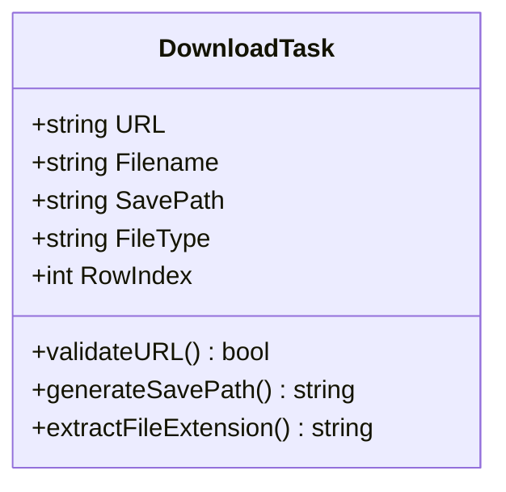
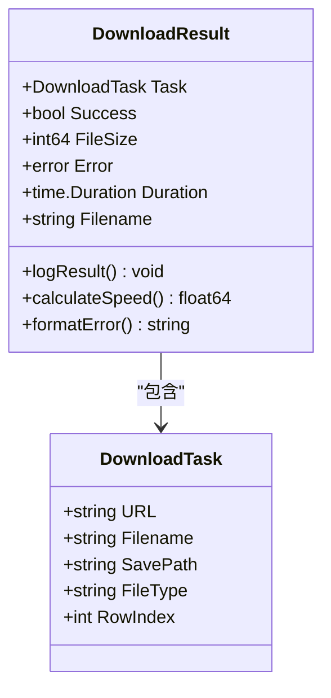
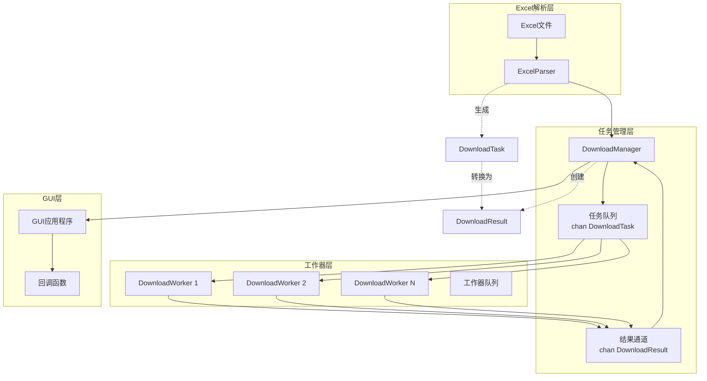
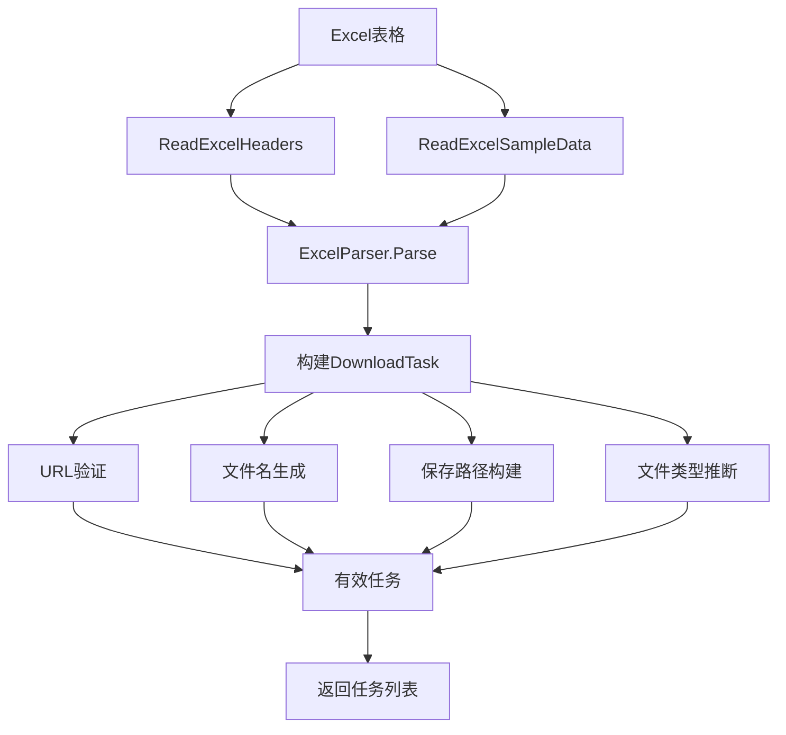
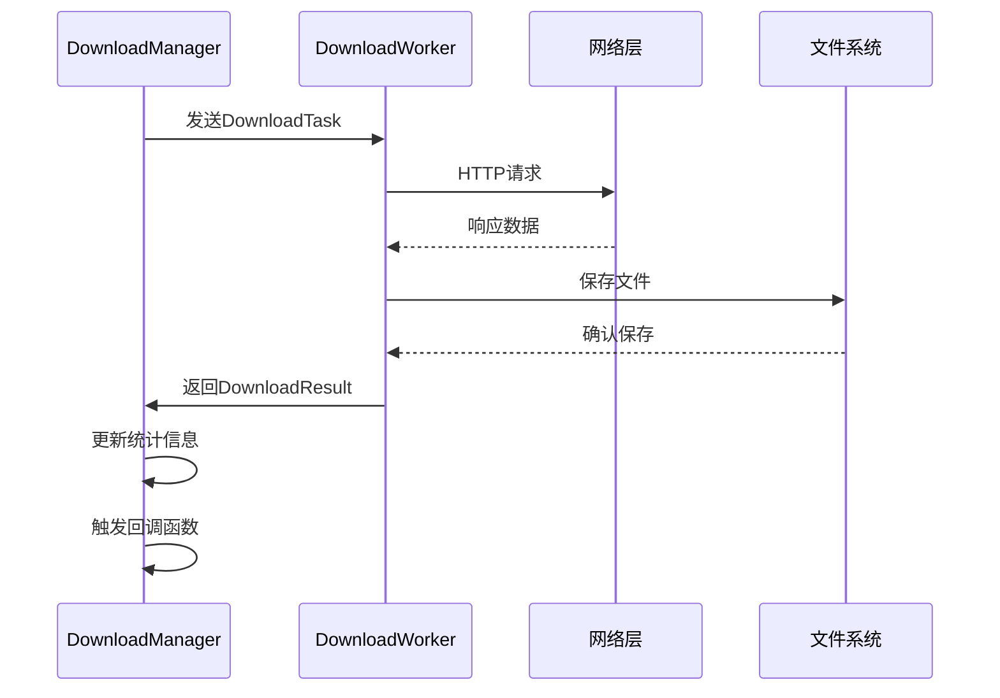
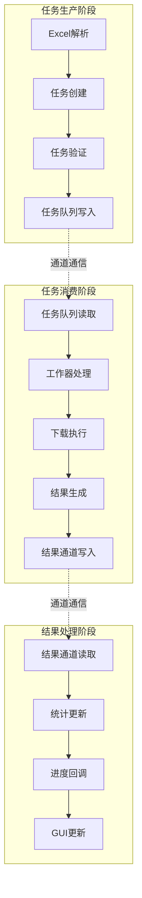
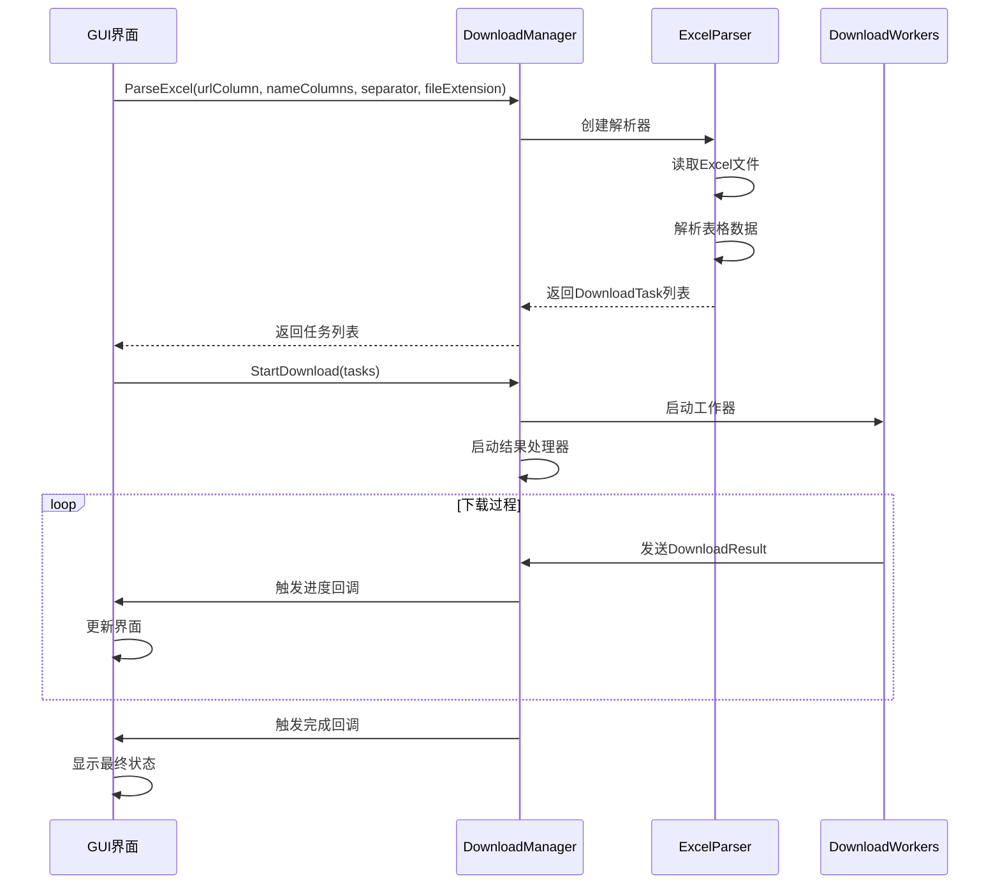
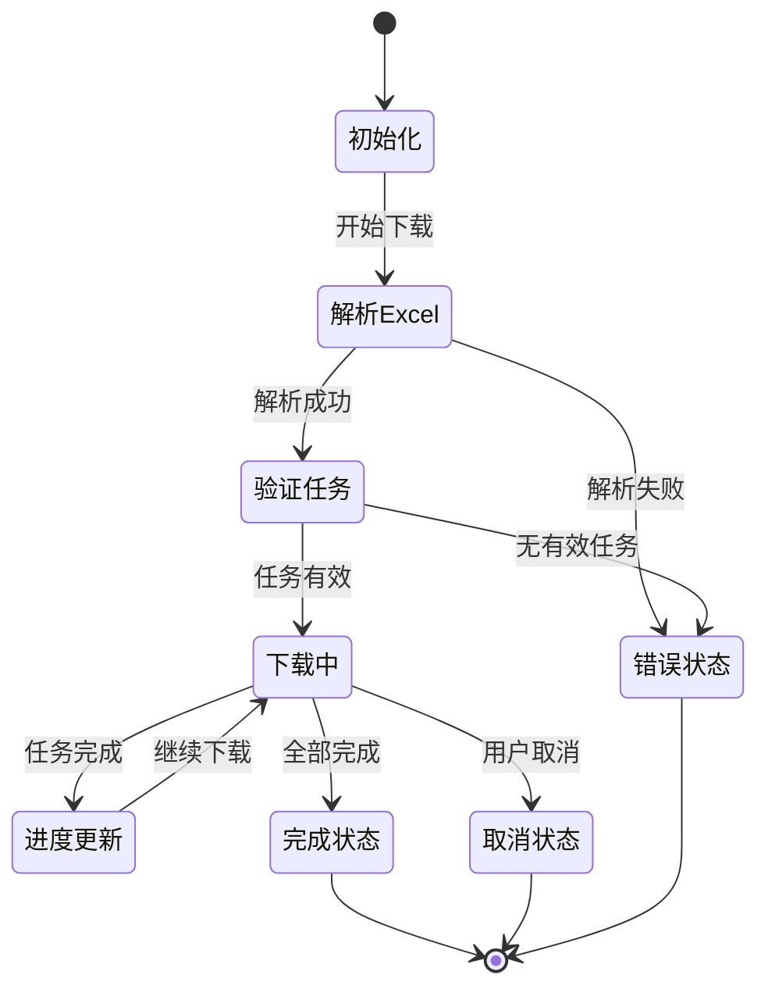

# 核心数据结构

<cite>
**本文档中引用的文件**
- [types.go](file://downloader/types.go)
- [excel_parser.go](file://downloader/excel_parser.go)
- [manager.go](file://downloader/manager.go)
- [worker.go](file://downloader/worker.go)
- [app.go](file://gui/app.go)
</cite>

## 目录
1. [简介](#简介)
2. [DownloadTask 结构体](#downloadtask-结构体)
3. [DownloadResult 结构体](#downloadresult-结构体)
4. [结构体关系图](#结构体关系图)
5. [使用场景分析](#使用场景分析)
6. [序列化行为](#序列化行为)
7. [实例化示例](#实例化示例)
8. [任务流转过程](#任务流转过程)
9. [GUI与下载引擎间的数据契约](#gui与下载引擎间的数据契约)
10. [总结](#总结)

## 简介

本文档详细描述了批量下载器系统中的两个核心数据结构：`DownloadTask` 和 `DownloadResult`。这两个结构体构成了整个下载系统的基础数据模型，在Excel解析、任务调度、结果处理和GUI交互等各个环节发挥着关键作用。

## DownloadTask 结构体

`DownloadTask` 是表示单个下载任务的核心数据结构，包含了执行文件下载所需的所有基本信息。

### 字段定义与业务含义



**图表来源**
- [types.go](file://downloader/types.go#L5-L10)

#### URL 字段 (`json:"url"`)
- **类型**: `string`
- **用途**: 存储要下载文件的完整URL地址
- **业务意义**: 这是下载任务的核心标识，系统根据此字段发起HTTP请求
- **验证**: 在下载过程中会进行URL有效性检查，确保格式正确且协议受支持

#### Filename 字段 (`json:"filename"`)
- **类型**: `string`
- **用途**: 存储下载文件的最终文件名
- **业务意义**: 
  - 由Excel解析器根据配置的命名规则生成
  - 包含用户指定的文件名部分和自动生成的部分
  - 用于文件保存和后续处理
- **特性**: 支持多列组合命名，自动清理非法字符

#### SavePath 字段 (`json:"save_path"`)
- **类型**: `string`
- **用途**: 存储文件的完整保存路径
- **业务意义**: 
  - 基于OutputDir和Filename动态生成
  - 包含完整的文件系统路径
  - 用于文件创建和保存操作
- **实现**: 通过 `buildSavePath` 方法生成，自动添加文件扩展名

#### FileType 字段 (`json:"file_type"`)
- **类型**: `string`
- **用途**: 存储文件的扩展名（不含点号）
- **业务意义**: 
  - 优先使用用户配置的扩展名
  - 如果未配置，则从URL中提取
  - 用于文件分类和过滤
- **处理**: 通过 `determineFileExtension` 方法智能确定

#### RowIndex 字段 (`json:"row_index"`)
- **类型**: `int`
- **用途**: 存储Excel表格中的原始行号
- **业务意义**: 
  - 从1开始计数，便于与Excel表格对应
  - 用于错误定位和日志记录
  - 在结果处理中帮助追踪原始数据

**章节来源**
- [types.go](file://downloader/types.go#L5-L10)
- [excel_parser.go](file://downloader/excel_parser.go#L156-L161)

## DownloadResult 结构体

`DownloadResult` 表示单个下载任务的执行结果，包含了任务执行的完整状态信息。

### 字段定义与业务含义



**图表来源**
- [types.go](file://downloader/types.go#L13-L19)
- [worker.go](file://downloader/worker.go#L213-L219)

#### Task 字段 (`json:"task"`)
- **类型**: `DownloadTask`
- **用途**: 包含完整的任务信息
- **业务意义**: 
  - 引用原始的DownloadTask结构
  - 确保结果与任务的关联性
  - 用于结果追溯和错误处理

#### Success 字段 (`json:"success"`)
- **类型**: `bool`
- **用途**: 标识任务是否成功完成
- **业务意义**: 
  - `true`: 文件成功下载并保存
  - `false`: 下载过程中发生错误
  - 用于统计和进度计算

#### FileSize 字段 (`json:"file_size"`)
- **类型**: `int64`
- **用途**: 存储下载文件的大小（字节）
- **业务意义**: 
  - 精确记录文件大小
  - 用于进度计算和统计
  - 支持大文件处理

#### Error 字段 (`json:"error"`)
- **类型**: `error`
- **用途**: 存储错误信息
- **业务意义**: 
  - 包含具体的错误原因
  - 支持错误类型判断（如空URL、无效URL、网络错误等）
  - 用于故障诊断和用户反馈

#### Duration 字段 (`json:"duration"`)
- **类型**: `time.Duration`
- **用途**: 存储下载耗时
- **业务意义**: 
  - 精确测量下载性能
  - 用于速度计算和统计
  - 支持毫秒级精度

#### Filename 字段 (`json:"filename"`)
- **类型**: `string`
- **用途**: 存储文件名
- **业务意义**: 
  - 与Task.Filename保持一致
  - 用于结果展示和日志记录
  - 支持文件名格式化

**章节来源**
- [types.go](file://downloader/types.go#L13-L19)
- [worker.go](file://downloader/worker.go#L213-L219)

## 结构体关系图



**图表来源**
- [manager.go](file://downloader/manager.go#L13-L38)
- [worker.go](file://downloader/worker.go#L16-L23)
- [excel_parser.go](file://downloader/excel_parser.go#L86-L94)

## 使用场景分析

### Excel解析中的角色

在Excel解析过程中，`DownloadTask` 承担着从表格数据到下载任务的转换职责：



**图表来源**
- [excel_parser.go](file://downloader/excel_parser.go#L96-L171)

### 文件命名中的作用

`DownloadTask` 中的Filename字段在文件命名策略中发挥关键作用：

| 组件 | 功能 | 输出 |
|------|------|------|
| `urlColumn` | 提取URL列数据 | `http://example.com/file.pdf` |
| `nameColumns` | 提取文件名列数据 | `产品说明书`, `用户手册` |
| `separator` | 指定分隔符 | `_` 或 `-` |
| `buildFilename` | 组合逻辑 | `产品说明书_用户手册.pdf` |
| `cleanFilename` | 清理逻辑 | 移除非法字符，限制长度 |

**章节来源**
- [excel_parser.go](file://downloader/excel_parser.go#L174-L198)

### 下载引擎中的处理

在下载引擎中，`DownloadResult` 提供了完整的任务执行状态：



**图表来源**
- [worker.go](file://downloader/worker.go#L66-L75)
- [manager.go](file://downloader/manager.go#L101-L176)

## 序列化行为

两个结构体都实现了JSON序列化功能，支持通过HTTP API或持久化存储进行数据交换。

### DownloadTask 的序列化

```json
{
  "url": "http://example.com/file.pdf",
  "filename": "product_manual.pdf",
  "save_path": "/downloads/product_manual.pdf",
  "file_type": "pdf",
  "row_index": 5
}
```

### DownloadResult 的序列化

```json
{
  "task": {
    "url": "http://example.com/file.pdf",
    "filename": "product_manual.pdf",
    "save_path": "/downloads/product_manual.pdf",
    "file_type": "pdf",
    "row_index": 5
  },
  "success": true,
  "file_size": 1048576,
  "error": null,
  "duration": "2.5s",
  "filename": "product_manual.pdf"
}
```

**章节来源**
- [types.go](file://downloader/types.go#L5-L19)

## 实例化示例

### 有效下载任务的构建

以下展示了如何构建一个有效的下载任务：

```go
// 基础任务构建
task := DownloadTask{
    URL:      "https://example.com/document.pdf",
    Filename: "user_manual_v2.1.pdf",
    SavePath: "/downloads/user_manual_v2.1.pdf",
    FileType: "pdf",
    RowIndex: 15,
}
```

### 错误处理任务的模拟

```go
// 模拟失败任务
failedTask := DownloadTask{
    URL:      "", // 空URL
    Filename: "default_name_20240101_12345.txt",
    SavePath: "/downloads/default_name_20240101_12345.txt",
    FileType: "txt",
    RowIndex: 25,
}
```

### 结果对象的创建

```go
// 成功结果
successResult := DownloadResult{
    Task:     validTask,
    Success:  true,
    FileSize: 2048000, // 2MB
    Error:    nil,
    Duration: 3500 * time.Millisecond,
    Filename: "user_manual_v2.1.pdf",
}

// 失败结果
failureResult := DownloadResult{
    Task:     failedTask,
    Success:  false,
    FileSize: 0,
    Error:    fmt.Errorf("empty URL"),
    Duration: 0,
    Filename: "default_name_20240101_12345.txt",
}
```

**章节来源**
- [excel_parser.go](file://downloader/excel_parser.go#L156-L161)
- [worker.go](file://downloader/worker.go#L110-L115)

## 任务流转过程

### 从Excel到任务队列


**图表来源**
- [manager.go](file://downloader/manager.go#L46-L76)
- [excel_parser.go](file://downloader/excel_parser.go#L96-L171)

### 通道中的数据流动



**图表来源**
- [manager.go](file://downloader/manager.go#L89-L98)
- [worker.go](file://downloader/worker.go#L66-L75)

### 并发处理机制

系统采用多工作器并发处理模式：

| 组件 | 数量 | 作用 |
|------|------|------|
| DownloadManager | 1 | 协调器，管理整个流程 |
| DownloadWorker | N | 工作器，执行具体下载 |
| 任务队列 | 1000 | 缓冲区，解耦生产者消费者 |
| 结果通道 | 1000 | 结果收集，保证顺序性 |

**章节来源**
- [manager.go](file://downloader/manager.go#L79-L86)
- [worker.go](file://downloader/worker.go#L45-L62)

## GUI与下载引擎间的数据契约

### 数据传递接口



**图表来源**
- [app.go](file://gui/app.go#L543-L562)
- [manager.go](file://downloader/manager.go#L46-L76)

### 回调函数契约

系统定义了三种主要的回调函数：

| 回调类型 | 参数 | 用途 |
|----------|------|------|
| ProgressCallback | float64, int, int | 更新下载进度 |
| LogCallback | string | 记录日志信息 |
| CompletionCallback | bool | 通知下载完成 |

### 状态同步机制



**图表来源**
- [manager.go](file://downloader/manager.go#L101-L176)
- [app.go](file://gui/app.go#L578-L588)

**章节来源**
- [app.go](file://gui/app.go#L543-L562)
- [manager.go](file://downloader/manager.go#L221-L230)

## 总结

`DownloadTask` 和 `DownloadResult` 作为批量下载器的核心数据结构，体现了以下设计原则：

### 设计优势

1. **清晰的职责分离**: DownloadTask负责任务定义，DownloadResult负责结果记录
2. **完整的生命周期**: 从Excel解析到结果回传的全流程覆盖
3. **强类型安全**: 使用Go的强类型系统确保数据完整性
4. **良好的可扩展性**: JSON标签支持序列化，便于未来扩展

### 业务价值

- **Excel集成**: 无缝对接Excel表格，支持复杂的文件命名规则
- **并发处理**: 多工作器架构，显著提升下载效率
- **错误处理**: 完善的错误捕获和恢复机制
- **进度监控**: 实时进度反馈，提升用户体验

### 技术特色

- **通道通信**: 基于Go的通道机制实现高效的任务分发
- **原子操作**: 使用原子变量确保并发安全性
- **资源管理**: 自动化的资源清理和错误恢复
- **性能优化**: 指数退避重试机制，网络异常处理

这两个结构体不仅构成了系统的数据基础，更是整个下载流程的控制中心，体现了现代软件工程中关注点分离和模块化设计的最佳实践。