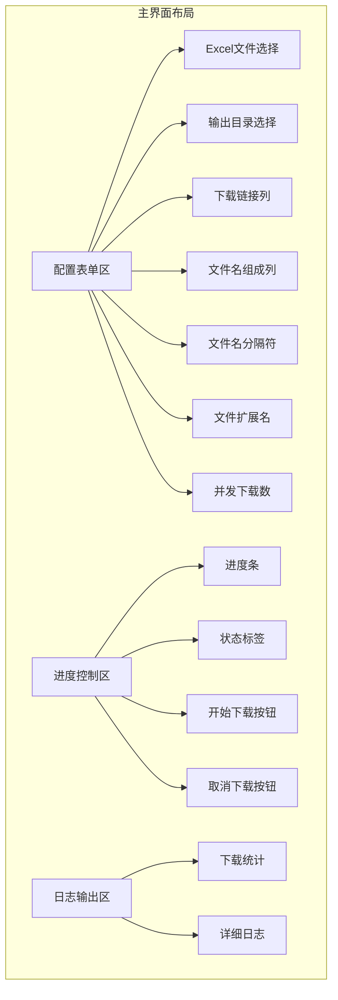
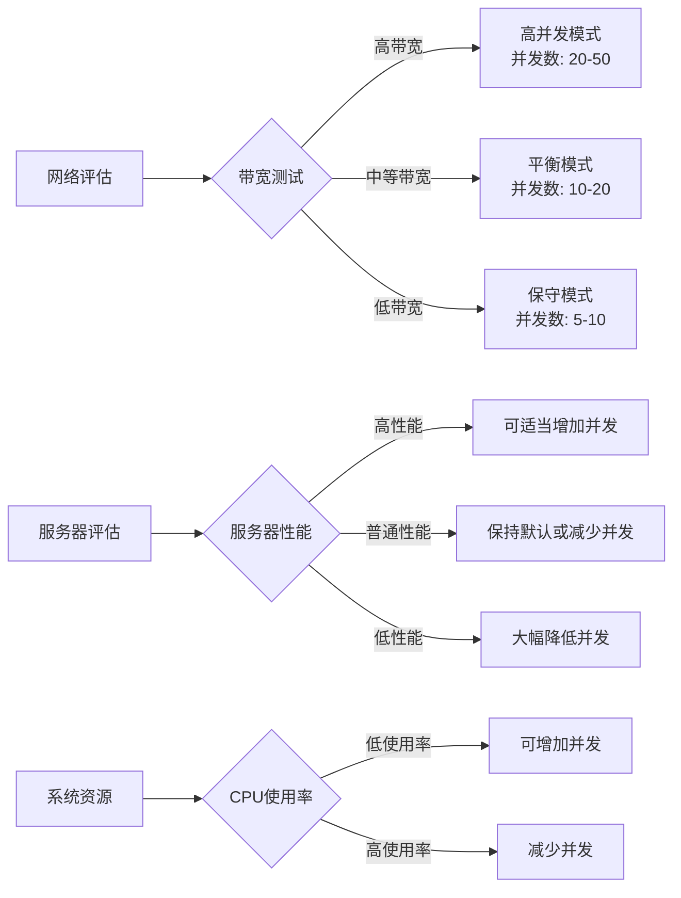

# 批量文件下载器使用说明

<cite>
**本文档中引用的文件**
- [README.md](file://README.md)
- [gui/app.go](file://gui/app.go)
- [downloader/excel_parser.go](file://downloader/excel_parser.go)
- [downloader/manager.go](file://downloader/manager.go)
- [downloader/types.go](file://downloader/types.go)
- [downloader/worker.go](file://downloader/worker.go)
- [config/config.go](file://config/config.go)
</cite>

## 目录
1. [简介](#简介)
2. [系统要求](#系统要求)
3. [快速开始](#快速开始)
4. [Excel文件准备](#excel文件准备)
5. [软件界面详解](#软件界面详解)
6. [操作流程详解](#操作流程详解)
7. [参数配置说明](#参数配置说明)
8. [实际使用场景](#实际使用场景)
9. [性能优化建议](#性能优化建议)
10. [故障排除](#故障排除)
11. [高级功能](#高级功能)

## 简介

批量文件下载器是一个基于Go语言开发的图形界面工具，能够从Excel表格中读取URL并自动下载文件。该工具具有以下核心特性：

- 🖥️ 直观的图形用户界面，操作简便
- 📊 基于Excel表格管理下载任务
- ⚡ 多线程并发下载，显著提升效率
- 📝 自定义文件命名规则，灵活组织文件
- 📈 实时显示下载进度和统计信息
- 🛑 支持随时取消下载任务
- 📁 自动分类保存下载文件

## 系统要求

### 环境要求
- **操作系统**: Windows 10/11（目前仅支持Windows）
- **内存**: 至少512MB可用内存
- **磁盘空间**: 至少100MB可用空间（取决于下载文件大小）
- **网络**: 稳定的互联网连接

### 技术栈
- Go 1.25 或更高版本
- Fyne GUI Toolkit - 跨平台GUI框架
- Excelize - Excel文件处理库

## 快速开始

### 下载与安装

1. **从发布页面下载**
   - 访问 [Releases](https://github.com/LxShine/batch-downloader/releases) 页面
   - 下载最新版本的压缩包
   - 解压到任意目录

2. **运行程序**
   - 双击 `batch-downloader.exe` 即可启动
   - 首次运行可能需要等待短暂初始化

### 界面概览

软件启动后将显示主界面，主要分为三个区域：
- **配置表单区**: 设置Excel文件、输出目录等参数
- **进度控制区**: 显示下载进度和控制按钮
- **日志输出区**: 实时显示下载过程中的详细信息

## Excel文件准备

### 必要列结构

创建Excel文件时，至少需要包含以下列结构：

| URL | 名称1 | 名称2 | 分类 |
|-----|-------|-------|------|
| http://example.com/file1.pdf | 产品A | 说明书 | 用户手册 |
| http://example.com/file2.pdf | 产品B | 说明书 | 用户手册 |

### 列说明

| 列名 | 类型 | 必需 | 描述 |
|------|------|------|------|
| URL | 文本/链接 | 是 | 包含文件下载地址的列 |
| 名称1/名称2/名称3... | 文本 | 否 | 用于组成文件名的列 |
| 分类 | 文本 | 否 | 文件分类信息（可选） |

### 推荐编码格式

- **文件编码**: UTF-8（推荐）
- **文件格式**: .xlsx（推荐），.xls也支持
- **文件大小**: 建议不超过1000行，避免加载缓慢

### 数据质量要求

1. **URL格式**: 必须是完整的URL地址，如 `https://example.com/file.pdf`
2. **文件名列**: 包含有意义的文件名信息
3. **空值处理**: URL列不允许为空，其他列可为空
4. **特殊字符**: 避免使用文件系统禁用的字符

## 软件界面详解

### 主界面布局



**图表来源**
- [gui/app.go](file://gui/app.go#L104-L122)

### UI组件说明

#### 1. Excel文件选择区域
- **输入框**: 显示选中的Excel文件路径
- **浏览按钮**: 弹出文件选择对话框
- **自动加载**: 选择文件后自动读取表头信息

#### 2. 输出目录选择区域
- **输入框**: 显示目标保存目录
- **浏览按钮**: 弹出文件夹选择对话框
- **默认路径**: 程序同目录下的downloads文件夹

#### 3. 下载链接列选择
- **下拉框**: 显示Excel文件的所有列
- **自动识别**: 程序会自动识别最可能的URL列
- **手动选择**: 用户可手动选择正确的列

#### 4. 文件名组成列
- **多选框**: 支持选择多个列
- **横向排列**: 自动换行显示
- **选中顺序**: 按选中顺序拼接文件名

#### 5. 并发下载数设置
- **输入框**: 数字输入，范围1-50
- **默认值**: 10
- **性能影响**: 影响下载速度和系统资源占用

#### 6. 进度控制区域
- **进度条**: 实时显示整体下载进度
- **状态标签**: 显示当前下载状态和统计信息
- **控制按钮**: 开始下载和取消下载

**章节来源**
- [gui/app.go](file://gui/app.go#L124-L188)

## 操作流程详解

### 完整操作步骤

#### 第一步：准备Excel文件
1. 打开Excel软件，创建新的工作簿
2. 按照推荐的列结构输入数据
3. 保存文件为.xlsx格式
4. 确保文件编码为UTF-8

#### 第二步：选择Excel文件
1. 点击主界面上的"📁 浏览"按钮
2. 在弹出的文件选择对话框中定位到Excel文件
3. 选择文件后点击"打开"
4. 系统自动读取文件并显示表头信息

#### 第三步：设置输出目录
1. 点击"📁 浏览"按钮选择输出目录
2. 可以选择现有目录或创建新目录
3. 默认目录为程序所在目录下的downloads文件夹

#### 第四步：指定下载链接列
1. 在"下载链接列"下拉框中选择包含URL的列
2. 系统会自动识别最可能的URL列
3. 如自动识别不准确，可手动选择正确列

#### 第五步：选择文件名组成列
1. 在"文件名组成列"区域勾选需要的列
2. 支持多选，按选中顺序拼接文件名
3. 建议选择包含产品名称、型号等信息的列

#### 第六步：设置文件名分隔符
1. 在"文件名分隔符"输入框中输入分隔符
2. 默认值为下划线（_）
3. 常用分隔符：_（下划线）、-（连字符）、空格

#### 第七步：配置并发数
1. 在"并发下载数"输入框中设置并发数量
2. 范围：1-50，默认：10
3. 根据网络状况和服务器承受能力调整

#### 第八步：启动下载任务
1. 点击"🚀 开始下载"按钮
2. 系统验证所有参数后开始下载
3. 可以在日志区域查看详细进度

#### 第九步：监控下载过程
1. **进度条**: 显示整体完成百分比
2. **状态标签**: 显示当前速度、剩余时间和统计信息
3. **日志区域**: 实时显示每个文件的下载状态

#### 第十步：取消下载（可选）
1. 如需中断下载，点击"❌ 取消下载"按钮
2. 系统会安全停止所有正在进行的任务
3. 已下载的部分文件不会被删除

### 操作流程图


**图表来源**
- [gui/app.go](file://gui/app.go#L451-L575)

**章节来源**
- [gui/app.go](file://gui/app.go#L281-L375)

## 参数配置说明

### 默认配置参数

系统会在首次运行时自动生成配置文件，包含以下默认参数：

| 参数 | 默认值 | 范围 | 描述 |
|------|--------|------|------|
| 最大并发数 | 10 | 1-50 | 同时进行的下载任务数量 |
| 下载超时 | 30秒 | 10-300秒 | 单个文件下载的最大等待时间 |
| 重试次数 | 3次 | 1-10次 | 下载失败后的重试次数 |
| 输出目录 | ./downloads | 任意有效路径 | 下载文件的保存位置 |

### 参数详细说明

#### 1. 并发下载数（MaxConcurrency）
- **作用**: 控制同时进行的下载任务数量
- **影响因素**:
  - 网络带宽：高带宽可设置较高并发数
  - 服务器性能：避免对服务器造成过大压力
  - 系统资源：CPU和内存占用随并发数增加
- **推荐配置**:
  - 家庭网络：5-15
  - 企业网络：10-30
  - 高速网络：20-50

#### 2. 下载超时（Timeout）
- **作用**: 设置单个文件下载的最大等待时间
- **默认值**: 30秒
- **建议范围**: 10-300秒
- **特殊情况**:
  - 大文件下载：可适当增加超时时间
  - 网络不稳定：可增加重试次数

#### 3. 重试次数（RetryCount）
- **作用**: 下载失败后的自动重试次数
- **默认值**: 3次
- **指数退避**: 每次重试间隔逐渐增加
- **适用场景**:
  - 网络波动：建议3-5次
  - 不稳定服务器：建议2-3次

### 配置文件位置

配置文件位于程序运行目录下的 `config.json` 文件中，格式如下：

```json
{
  "excel_path": "",
  "output_dir": "./downloads",
  "max_concurrency": 10,
  "timeout": 30,
  "retry_count": 3
}
```

**章节来源**
- [config/config.go](file://config/config.go#L8-L14)
- [gui/app.go](file://gui/app.go#L25-L33)

## 实际使用场景

### 场景一：批量下载产品说明书

#### 使用场景
公司需要收集大量产品的技术文档，这些文档分布在不同的网站上。

#### Excel文件示例

| URL | 产品名称 | 产品型号 | 文档类型 | 分类 |
|-----|----------|----------|----------|------|
| https://company.com/docs/product-a-manual.pdf | 产品A | A1000 | 说明书 | 技术文档 |
| https://company.com/docs/product-b-manual.pdf | 产品B | B2000 | 说明书 | 技术文档 |
| https://company.com/docs/product-c-manual.pdf | 产品C | C3000 | 说明书 | 技术文档 |

#### 操作步骤
1. **Excel准备**: 按上述格式创建Excel文件
2. **参数设置**:
   - URL列: A
   - 文件名列: B, C
   - 分隔符: _
   - 并发数: 10
3. **执行下载**: 点击"开始下载"，系统将生成文件名为"产品A_A1000.pdf"等

### 场景二：批量下载图片素材

#### 使用场景
设计师需要下载大量图片素材用于项目制作。

#### Excel文件示例

| URL | 素材名称 | 分类 | 尺寸 | 格式 |
|-----|----------|------|------|------|
| https://assets.com/images/photo1.jpg | 风景照片1 | 自然景观 | 1920x1080 | jpg |
| https://assets.com/images/photo2.jpg | 城市街景 | 城市建筑 | 1920x1080 | jpg |
| https://assets.com/images/photo3.jpg | 动物特写 | 动物摄影 | 1920x1080 | jpg |

#### 操作步骤
1. **Excel准备**: 包含图片URL和相关信息
2. **参数设置**:
   - URL列: A
   - 文件名列: B, 分类
   - 分隔符: -
   - 并发数: 15
3. **执行下载**: 系统将生成文件名为"风景照片1-自然景观.jpg"等

### 场景三：批量下载视频教程

#### 使用场景
教育机构需要下载在线课程的视频文件。

#### Excel文件示例

| URL | 课程名称 | 章节 | 文件大小 | 格式 |
|-----|----------|------|----------|------|
| https://videos.com/course1/lesson1.mp4 | Python入门 | 第1章 | 500MB | mp4 |
| https://videos.com/course1/lesson2.mp4 | Python入门 | 第2章 | 450MB | mp4 |
| https://videos.com/course1/lesson3.mp4 | Python入门 | 第3章 | 600MB | mp4 |

#### 操作步骤
1. **Excel准备**: 包含视频URL和章节信息
2. **参数设置**:
   - URL列: A
   - 文件名列: B, 章节
   - 分隔符: _
   - 并发数: 5（视频较大，降低并发）
3. **执行下载**: 系统将生成文件名为"Python入门_第1章.mp4"等

### 场景四：批量下载学术论文

#### 使用场景
研究人员需要下载大量学术论文。

#### Excel文件示例

| URL | 论文标题 | 作者 | 发表年份 | 期刊名称 |
|-----|----------|------|----------|----------|
| https://journals.com/paper1.pdf | 机器学习综述 | 张三 | 2023 | 计算机学报 |
| https://journals.com/paper2.pdf | 深度学习进展 | 李四 | 2022 | 软件学报 |
| https://journals.com/paper3.pdf | 自然语言处理 | 王五 | 2023 | 计算机研究 |

#### 操作步骤
1. **Excel准备**: 包含论文信息和下载链接
2. **参数设置**:
   - URL列: A
   - 文件名列: 作者, 发表年份, 论文标题
   - 分隔符: _
   - 并发数: 8
3. **执行下载**: 系统将生成文件名为"张三_2023_机器学习综述.pdf"等

**章节来源**
- [README.md](file://README.md#L55-L72)

## 性能优化建议

### 并发数配置策略

#### 网络环境评估


#### 推荐配置表

| 网络类型 | 并发数 | 理由 |
|----------|--------|------|
| 家庭宽带（100Mbps） | 5-15 | 避免影响日常网络使用 |
| 办公网络（1Gbps） | 10-25 | 较稳定的网络环境 |
| 高速专线（10Gbps） | 20-50 | 充分利用带宽资源 |
| 移动网络 | 1-5 | 移动网络不稳定且有限制 |

### 系统资源优化

#### 内存使用优化
- **并发数与内存关系**: 每个并发任务约占用5-10MB内存
- **建议内存配置**: 
  - 4GB内存: 并发数不超过10
  - 8GB内存: 并发数不超过20
  - 16GB内存: 并发数不超过30

#### CPU使用优化
- **CPU密集型**: 文件解压、格式转换等操作
- **优化策略**: 
  - 适当降低并发数
  - 在系统负载较低时运行大批量任务
  - 避免同时运行其他CPU密集型程序

### 网络优化建议

#### 服务器友好性
1. **避免频繁请求**: 设置合理的并发数
2. **添加请求间隔**: 可考虑在代码中添加随机延迟
3. **遵守robots.txt**: 确保下载行为符合网站规定

#### 断线重试机制
- **指数退避算法**: 每次重试间隔逐渐增加
- **最大重试次数**: 避免无限重试浪费资源
- **错误分类**: 区分网络错误和服务器错误

### 存储优化

#### 磁盘空间管理
- **临时文件清理**: 下载过程中产生的.tmp文件会被自动清理
- **存储空间监控**: 建议预留至少两倍于预期下载文件总大小的空间
- **分卷下载**: 对于特别大的文件，考虑分卷下载策略

#### 文件命名优化
- **避免过长文件名**: 系统会自动截断超过200字符的文件名
- **字符清理**: 自动移除文件系统禁用的字符
- **冲突处理**: 当文件名冲突时，系统会自动添加时间戳

**章节来源**
- [downloader/manager.go](file://downloader/manager.go#L80-L86)
- [downloader/worker.go](file://downloader/worker.go#L78-L95)

## 故障排除

### 常见问题及解决方案

#### 1. 下载速度很慢

**可能原因**:
- 并发数设置过低
- 网络带宽不足
- 服务器限速
- 文件过大导致传输时间长

**解决方法**:
1. **调整并发数**: 逐步增加并发数（1-50），观察效果
2. **网络优化**: 关闭其他占用带宽的应用程序
3. **服务器选择**: 选择响应更快的服务器
4. **分批下载**: 将大任务拆分为多个小任务

#### 2. 文件名乱码

**可能原因**:
- Excel文件编码不是UTF-8
- 文件名包含特殊字符
- 系统字符集不匹配

**解决方法**:
1. **检查编码**: 确保Excel文件保存为UTF-8编码
2. **清理字符**: 移除文件名中的特殊字符
3. **系统设置**: 检查系统区域设置
4. **手动指定**: 在"文件扩展名"字段中指定正确扩展名

#### 3. 下载中断或失败

**可能原因**:
- 网络连接不稳定
- 服务器限制
- 文件不存在或已删除
- 权限问题

**解决方法**:
1. **检查网络**: 确保网络连接稳定
2. **重试机制**: 系统会自动重试3次
3. **手动验证**: 检查URL是否有效
4. **权限检查**: 确保输出目录有写入权限

#### 4. Excel文件读取失败

**可能原因**:
- 文件格式不支持
- 文件损坏
- 权限不足
- 文件被其他程序占用

**解决方法**:
1. **格式检查**: 确保使用.xlsx格式
2. **文件修复**: 尝试修复Excel文件
3. **权限检查**: 确保有文件读取权限
4. **关闭程序**: 关闭占用Excel文件的程序

### 错误代码说明

| 错误类型 | 错误信息 | 解决方案 |
|----------|----------|----------|
| 文件读取错误 | "打开Excel文件失败" | 检查文件格式和权限 |
| URL格式错误 | "invalid URL" | 验证URL格式的正确性 |
| 网络超时 | "请求失败" | 检查网络连接和服务器状态 |
| 权限错误 | "创建目录失败" | 检查输出目录权限 |
| 空链接错误 | "empty URL" | 检查Excel文件中的URL列 |

### 调试和日志分析

#### 日志查看技巧
1. **实时监控**: 下载过程中实时查看日志
2. **错误定位**: 重点关注红色标记的错误信息
3. **进度跟踪**: 观察蓝色标记的成功信息
4. **性能分析**: 关注下载速度和时间统计

#### 性能分析指标
- **平均下载速度**: 显示为"X.X 个/秒"
- **成功率**: 成功下载的文件比例
- **失败原因**: 统计各类错误的发生频率
- **总耗时**: 整个下载任务的总时间

**章节来源**
- [gui/app.go](file://gui/app.go#L441-L449)
- [downloader/worker.go](file://downloader/worker.go#L146-L154)

## 高级功能

### 文件扩展名自定义

#### 自动识别机制
系统会根据以下优先级自动确定文件扩展名：
1. **用户指定**: 在"文件扩展名"字段中指定
2. **URL分析**: 从URL中提取扩展名
3. **默认值**: 使用.bin作为最后的默认扩展名

#### 扩展名配置
- **统一扩展名**: 在"文件扩展名"字段中输入特定扩展名
- **自动识别**: 留空让系统自动判断
- **格式要求**: 不需要添加点号（正确：pdf，错误：.pdf）

### 文件名生成规则

#### 基本规则
1. **列拼接**: 按选中列的顺序拼接内容
2. **分隔符**: 使用指定的分隔符连接各部分
3. **字符清理**: 自动移除非法字符
4. **长度限制**: 最大200字符

#### 特殊处理
- **空值处理**: 跳过空值列
- **重复字符**: 连续的分隔符会被合并为一个
- **首尾清理**: 移除首尾的空白字符和点号

### 下载统计功能

#### 实时统计信息
- **当前进度**: 百分比和具体数量
- **下载速度**: 实时计算的下载速度
- **剩余时间**: 基于当前速度估算
- **成功率**: 成功下载的比例
- **失败统计**: 各类错误的统计信息

#### 统计报告
下载完成后，系统会生成详细的统计报告：
- **总文件数**: 所有下载任务的数量
- **成功数量**: 成功下载的文件数
- **失败数量**: 下载失败的文件数
- **空链接数量**: URL为空的记录数
- **总耗时**: 下载任务的总时间
- **平均速度**: 整体下载的平均速度

### 多语言支持

#### 当前支持
- **界面语言**: 中文简体（默认）
- **错误提示**: 中英文混合显示
- **日志信息**: 中文为主，技术术语英文

#### 未来规划
- **完全本地化**: 支持更多语言界面
- **国际化**: 多语言错误消息
- **地区适配**: 根据地区设置调整格式

### 扩展功能规划

#### 已规划功能
- **更多文件格式**: 支持CSV、JSON等格式
- **代理设置**: 支持HTTP/HTTPS代理
- **下载历史**: 记录和管理下载历史
- **跨平台支持**: 支持macOS和Linux平台

#### 技术路线图
1. **基础功能完善**: 稳定性和性能优化
2. **用户体验提升**: 界面和交互优化
3. **功能扩展**: 新增高级功能
4. **平台兼容**: 多平台支持

**章节来源**
- [downloader/excel_parser.go](file://downloader/excel_parser.go#L174-L198)
- [downloader/excel_parser.go](file://downloader/excel_parser.go#L218-L243)

## 结论

批量文件下载器是一个功能强大且易于使用的工具，能够显著提高文件下载的效率。通过合理的配置和使用，可以在短时间内完成大量的文件下载任务。

### 使用要点总结

1. **Excel准备**: 确保Excel文件格式正确，编码为UTF-8
2. **参数配置**: 根据网络环境和系统资源合理设置参数
3. **监控进度**: 下载过程中实时监控进度和统计信息
4. **故障处理**: 遇到问题时参考故障排除指南
5. **性能优化**: 根据实际情况调整并发数和其他参数

### 最佳实践建议

1. **小批量测试**: 先用少量文件测试配置是否正确
2. **定期维护**: 定期检查下载目录空间和网络状态
3. **备份配置**: 重要配置可以备份以防丢失
4. **团队协作**: 在团队环境中分享有效的配置模板

通过遵循本文档的指导，用户可以充分发挥批量文件下载器的功能，高效完成各种文件下载任务。