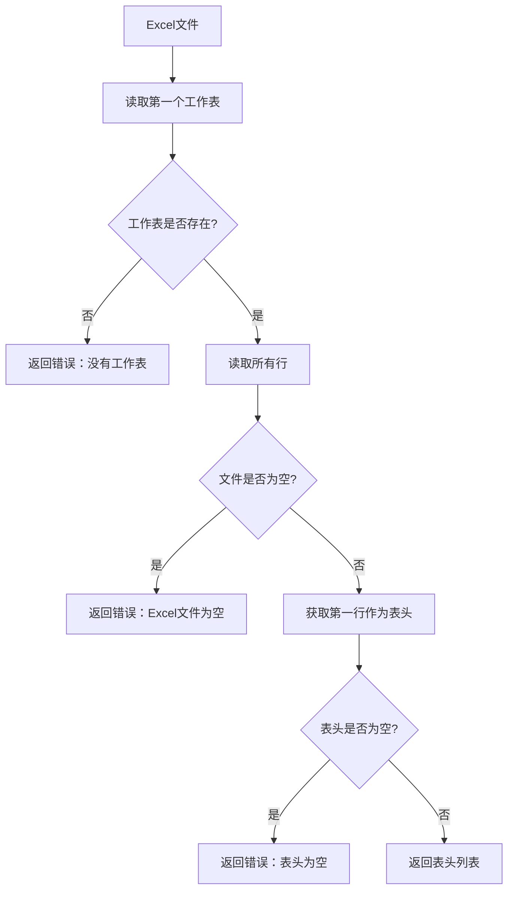
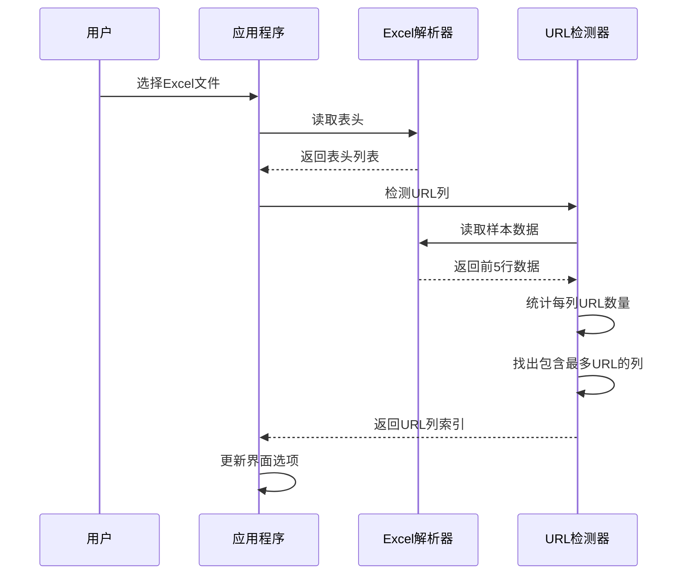
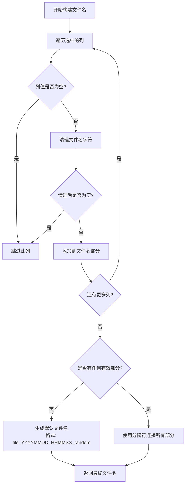
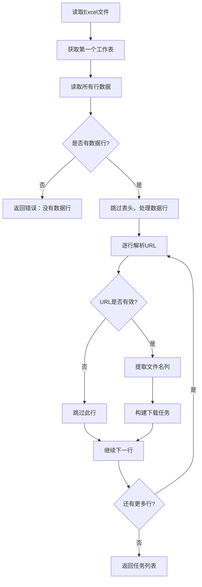

# 准备Excel文件

<cite>
**本文档引用的文件**
- [excel_parser.go](file://downloader/excel_parser.go)
- [types.go](file://downloader/types.go)
- [manager.go](file://downloader/manager.go)
- [app.go](file://gui/app.go)
- [main.go](file://main.go)
- [README.md](file://README.md)
</cite>

## 目录
1. [简介](#简介)
2. [Excel文件基本要求](#excel文件基本要求)
3. [表头行规范](#表头行规范)
4. [必需列说明](#必需列说明)
5. [可选列说明](#可选列说明)
6. [文件编码要求](#文件编码要求)
7. [文件名字符限制](#文件名字符限制)
8. [Excel解析机制](#excel解析机制)
9. [常见问题及解决方案](#常见问题及解决方案)
10. [Excel表格示例](#excel表格示例)
11. [最佳实践建议](#最佳实践建议)

## 简介

本指南详细说明了如何准备符合批量文件下载器要求的Excel文件。该工具通过读取Excel表格中的URL信息来自动下载文件，因此正确组织Excel文件的数据结构至关重要。

## Excel文件基本要求

### 文件格式支持
- **推荐格式**: `.xlsx` (Microsoft Excel 2007+)
- **兼容格式**: `.xls` (Microsoft Excel 97-2003)
- **编码方式**: 必须使用UTF-8编码保存

### 工作表要求
- 工具只会读取Excel文件的第一个工作表
- 如果文件包含多个工作表，只有第一个工作表会被处理
- 确保第一个工作表包含有效的数据

**章节来源**
- [excel_parser.go](file://downloader/excel_parser.go#L16-L46)
- [excel_parser.go](file://downloader/excel_parser.go#L48-L84)

## 表头行规范

### 必需特性
1. **必须包含表头行**: Excel文件的第一行必须是表头行
2. **表头不能为空**: 表头行不能包含空单元格
3. **列名唯一性**: 表头列名应具有唯一性，避免重复名称

### 表头读取机制
系统通过以下函数读取表头：
- [`ReadExcelHeaders`](file://downloader/excel_parser.go#L16-L46): 专门用于读取Excel文件的表头
- [`loadExcelHeaders`](file://gui/app.go#L317-L374): GUI界面中的表头加载功能

**图表来源**
- [excel_parser.go](file://downloader/excel_parser.go#L16-L46)

**章节来源**
- [excel_parser.go](file://downloader/excel_parser.go#L16-L46)
- [app.go](file://gui/app.go#L317-L374)

## 必需列说明

### URL列（下载链接列）

#### 格式要求
- **列名**: 可以是任意名称，系统会自动检测
- **数据格式**: 必须是有效的URL地址
- **支持协议**: HTTP、HTTPS、FTP、FTPS等
- **内容验证**: 包含协议前缀（http://、https://等）

#### 自动识别机制
系统通过[`detectURLColumn`](file://gui/app.go#L377-L415)函数自动识别URL列：

**图表来源**
- [app.go](file://gui/app.go#L377-L415)
- [excel_parser.go](file://downloader/excel_parser.go#L48-L84)

#### URL验证规则
- **协议检查**: 必须以http://、https://、ftp://、ftps://开头
- **域名格式**: 包含"://"的字符串会被视为潜在URL
- **空值处理**: 空URL将被跳过，不会生成下载任务

**章节来源**
- [app.go](file://gui/app.go#L377-L415)
- [excel_parser.go](file://downloader/excel_parser.go#L48-L84)

## 可选列说明

### 文件名列

#### 功能描述
- **用途**: 用于构建下载文件的本地文件名
- **支持多列**: 可以选择多个列组合文件名
- **分隔符**: 可自定义列之间的连接字符

#### 文件名构建规则
系统通过[`buildFilename`](file://downloader/excel_parser.go#L174-L198)函数构建文件名：

**图表来源**
- [excel_parser.go](file://downloader/excel_parser.go#L174-L198)

#### 支持的列
- **名称列**: 产品名称、文件标题等
- **分类列**: 文件类型、文档类别等
- **版本列**: 版本号、修订号等
- **日期列**: 创建日期、发布日期等

### 其他可选列

- **分类列**: 用于文件分类和组织
- **描述列**: 文件内容描述
- **作者列**: 文件创建者信息
- **大小列**: 文件大小信息

**章节来源**
- [excel_parser.go](file://downloader/excel_parser.go#L174-L198)
- [app.go](file://gui/app.go#L331-L374)

## 文件编码要求

### UTF-8编码重要性
- **避免乱码**: 使用UTF-8编码保存Excel文件
- **字符支持**: 支持国际化字符和特殊符号
- **兼容性**: 确保跨平台文件共享

### 保存方法
#### Microsoft Excel (Windows)
1. 点击"文件"菜单
2. 选择"另存为"
3. 在"保存类型"中选择"Excel 工作簿 (*.xlsx)"
4. 点击"工具" → "常规选项"
5. 在"保存属性"中选择"UTF-8"
6. 点击"确定"并保存

#### WPS Office
1. 点击"文件" → "另存为"
2. 选择保存位置
3. 在"文件名"输入框中
4. 在"保存类型"中选择"Excel 工作簿 (*.xlsx)"
5. 点击"工具" → "编码"
6. 选择"UTF-8"
7. 点击"保存"

### 编码检测
如果文件不是UTF-8编码，可能会出现以下问题：
- 中文字符显示为乱码
- 特殊符号无法正确显示
- 文件名生成异常

**章节来源**
- [README.md](file://README.md#L103-L105)

## 文件名字符限制

### 非法字符处理
系统会自动清理文件名中的非法字符：

| 非法字符 | 替换方式 | 说明 |
|---------|---------|------|
| `<` | `_` | 小于号 |
| `>` | `_` | 大于号 |
| `:` | `_` | 冒号 |
| `"` | `_` | 双引号 |
| `/` | `_` | 正斜杠 |
| `\` | `_` | 反斜杠 |
| `\|` | `_` | 竖线 |
| `?` | `_` | 问号 |
| `*` | `_` | 星号 |

### 文件名长度限制
- **最大长度**: 200个字符
- **截断方式**: 超长部分会被截断
- **特殊情况**: 如果所有列都为空，生成时间戳文件名

### 文件名生成策略
1. **优先级**: 按选中列的顺序组合
2. **分隔符**: 可自定义连接字符（默认为下划线`_`）
3. **默认名**: 当所有列都为空时，使用时间戳+随机数生成

**章节来源**
- [excel_parser.go](file://downloader/excel_parser.go#L200-L216)

## Excel解析机制

### 数据读取流程

**图表来源**
- [excel_parser.go](file://downloader/excel_parser.go#L96-L171)

### 列索引解析

系统支持两种列标识方式：
1. **表头名称**: 使用列的实际名称
2. **列编号**: 使用A、B、C等字母表示

#### 列转换机制
- [`columnToIndex`](file://downloader/excel_parser.go#L253-L262): 将列字母转换为数字索引
- [`findColumnIndex`](file://downloader/excel_parser.go#L288-L301): 查找列索引（支持表头名称或列号）

### 错误处理机制
- **空文件**: 检测并提示"Excel文件为空"
- **无工作表**: 提示"Excel文件中没有工作表"
- **无数据行**: 提示"Excel文件没有数据行"
- **无效列**: 提示"无效的URL列"或"无效的文件名列"

**章节来源**
- [excel_parser.go](file://downloader/excel_parser.go#L96-L171)
- [excel_parser.go](file://downloader/excel_parser.go#L253-L316)

## 常见问题及解决方案

### 问题1: Excel文件为空

#### 症状
- 界面提示"Excel文件为空"
- 无法加载表头

#### 原因分析
- Excel文件确实没有数据
- 第一行不是表头行
- 文件损坏或格式不正确

#### 解决方案
1. 确保Excel文件包含有效数据
2. 检查第一行是否为表头行
3. 重新保存Excel文件

### 问题2: 没有表头

#### 症状
- 界面提示"表头为空"
- 无法识别列

#### 原因分析
- 第一行为空
- 表头行包含空单元格
- 文件格式问题

#### 解决方案
1. 确保第一行包含有效的列名
2. 检查表头行是否有空单元格
3. 使用文本编辑器检查文件格式

### 问题3: URL列识别失败

#### 症状
- 自动检测未找到URL列
- 需要手动选择URL列

#### 原因分析
- 数据行中没有有效的URL
- URL格式不符合标准
- 样本数据不足

#### 解决方案
1. 确保URL列包含有效的HTTP/HTTPS地址
2. 检查URL格式是否正确
3. 增加样本数据量

### 问题4: 文件名乱码

#### 症状
- 下载的文件名显示为乱码
- 特殊字符无法正确显示

#### 原因分析
- Excel文件不是UTF-8编码
- 文件名包含非法字符
- 字符编码不匹配

#### 解决方案
1. 使用UTF-8编码保存Excel文件
2. 避免在文件名列中使用特殊字符
3. 检查系统字符编码设置

**章节来源**
- [excel_parser.go](file://downloader/excel_parser.go#L16-L46)
- [app.go](file://gui/app.go#L317-L374)

## Excel表格示例

### 基础示例

| URL | 名称 | 分类 |
|-----|------|------|
| https://example.com/document.pdf | 产品说明书 | 文档 |
| https://example.com/manual.docx | 用户手册 | 文档 |
| https://example.com/image.jpg | 产品图片 | 图片 |

### 完整示例

| URL | 产品名称 | 版本 | 分类 | 描述 | 作者 |
|-----|----------|------|------|------|------|
| https://cdn.example.com/products/p1/doc_v1.0.pdf | 产品A | v1.0 | 用户手册 | 产品A完整使用手册 | 技术部 |
| https://cdn.example.com/products/p1/spec_v1.0.pdf | 产品A | v1.0 | 技术规格 | 产品A技术规格文档 | 研发部 |
| https://cdn.example.com/products/p2/images/v1.0/cover.jpg | 产品B | v1.0 | 产品图片 | 产品B封面图片 | 设计部 |
| https://cdn.example.com/products/p2/images/v1.0/catalog.png | 产品B | v1.0 | 产品图片 | 产品B产品目录 | 设计部 |

### 文件名生成示例

假设选择"产品名称"、"版本"、"分类"三列作为文件名组成部分，分隔符为"_"：

| 原始数据 | 生成的文件名 |
|---------|-------------|
| 产品A, v1.0, 用户手册 | 产品A_v1.0_用户手册.pdf |
| 产品A, v1.0, 技术规格 | 产品A_v1.0_技术规格.pdf |
| 产品B, v1.0, 产品图片 | 产品B_v1.0_产品图片.jpg |

### 空白处理示例

如果某些列为空，系统会自动处理：

| URL | 名称 | 分类 | 结果 |
|-----|------|------|------|
| https://example.com/file.pdf | 产品A | | 产品A.pdf |
| https://example.com/file.pdf | | 文档 | 文档.pdf |
| https://example.com/file.pdf | | | file_20240101_12345.bin |

**章节来源**
- [README.md](file://README.md#L55-L63)
- [excel_parser.go](file://downloader/excel_parser.go#L174-L198)

## 最佳实践建议

### 数据组织建议
1. **保持一致性**: 确保同一列中的数据格式一致
2. **避免空值**: 尽量避免在必需列中留空
3. **合理命名**: 使用清晰、有意义的列名
4. **数据验证**: 在保存Excel文件前检查数据完整性

### 性能优化建议
1. **控制文件大小**: 单个Excel文件建议不超过5000行
2. **减少列数**: 只保留必要的列，避免过多无关信息
3. **使用索引**: 对于大型文件，考虑使用数据库替代Excel

### 维护建议
1. **定期备份**: 保存Excel文件的备份版本
2. **版本控制**: 对重要的Excel文件进行版本管理
3. **文档说明**: 为Excel文件添加使用说明文档

### 安全建议
1. **数据验证**: 在导入前验证URL的有效性
2. **权限控制**: 确保Excel文件的访问权限适当
3. **病毒扫描**: 在处理前扫描Excel文件

通过遵循这些最佳实践，可以确保Excel文件能够被正确解析，提高下载任务的成功率和效率。