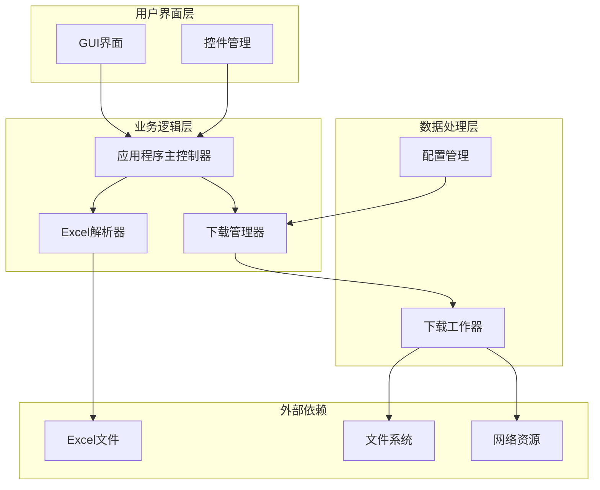
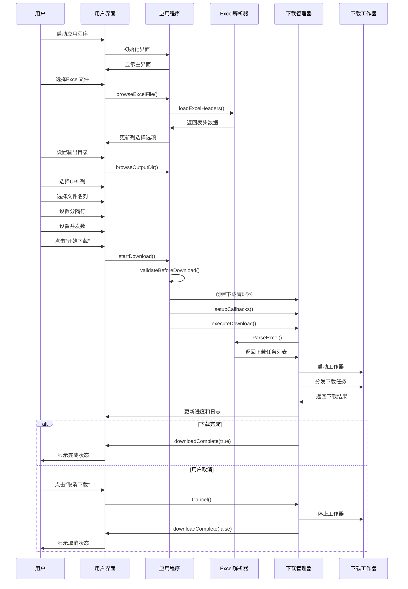

# 操作步骤

<cite>
**本文档中引用的文件**
- [gui/app.go](file://gui/app.go)
- [downloader/excel_parser.go](file://downloader/excel_parser.go)
- [downloader/manager.go](file://downloader/manager.go)
- [downloader/worker.go](file://downloader/worker.go)
- [downloader/types.go](file://downloader/types.go)
- [config/config.go](file://config/config.go)
- [main.go](file://main.go)
- [README.md](file://README.md)
</cite>

## 目录
1. [简介](#简介)
2. [系统架构概览](#系统架构概览)
3. [完整操作流程](#完整操作流程)
4. [详细步骤说明](#详细步骤说明)
5. [代码实现分析](#代码实现分析)
6. [使用场景示例](#使用场景示例)
7. [故障排除指南](#故障排除指南)
8. [总结](#总结)

## 简介

批量文件下载器是一个基于Go语言开发的图形界面应用程序，专门设计用于从Excel表格中读取URL并自动下载相关文件。该工具提供了直观的用户界面，支持多线程并发下载、自定义文件命名规则和实时进度监控等功能。

## 系统架构概览

该应用程序采用模块化架构设计，主要包含以下核心组件：

**图表来源**
- [gui/app.go](file://gui/app.go#L44-L73)
- [downloader/manager.go](file://downloader/manager.go#L13-L31)
- [downloader/excel_parser.go](file://downloader/excel_parser.go#L86-L95)

## 完整操作流程

从启动应用程序到完成下载的完整交互过程如下：

**图表来源**
- [gui/app.go](file://gui/app.go#L281-L300)
- [gui/app.go](file://gui/app.go#L451-L477)
- [downloader/manager.go](file://downloader/manager.go#L41-L44)
- [downloader/manager.go](file://downloader/manager.go#L62-L76)

## 详细步骤说明

### 第一步：选择Excel文件

**操作方式：**
1. 在主界面找到"Excel文件"输入框
2. 点击右侧的"📁 浏览"按钮
3. 在弹出的文件选择对话框中定位并选择目标Excel文件
4. 确认选择后，文件路径会显示在输入框中

**技术实现：**
应用程序通过[`browseExcelFile()`](file://gui/app.go#L281-L290)方法处理文件选择：
- 调用Fyne框架的`dialog.ShowFileOpen()`显示文件选择器
- 读取用户选择的文件路径
- 自动调用[`loadExcelHeaders()`](file://gui/app.go#L318-L374)方法加载Excel表头

**代码逻辑：**
- 验证文件路径有效性
- 调用Excel解析器读取表头信息
- 自动识别URL列和文件名列
- 更新界面控件状态

### 第二步：设置输出目录

**操作方式：**
1. 找到"输出目录"输入框
2. 点击右侧的"📁 浏览"按钮
3. 在文件夹选择对话框中选择目标目录
4. 确认选择后，目录路径会显示在输入框中

**技术实现：**
[`browseOutputDir()`](file://gui/app.go#L293-L300)方法负责处理目录选择：
- 显示文件夹选择对话框
- 获取用户选择的目录路径
- 自动创建目录（如果不存在）

**默认行为：**
- 默认输出目录为程序所在目录下的"downloads"文件夹
- 程序会自动创建该目录（如果不存在）

### 第三步：选择下载链接列

**操作方式：**
1. 在"下载链接列"下拉框中查看可用选项
2. 从下拉菜单中选择包含URL的列
3. 系统会自动验证所选列的有效性

**智能识别功能：**
应用程序具有自动识别URL列的功能：
- [`detectURLColumn()`](file://gui/app.go#L377-L415)方法分析Excel前5行数据
- 统计每列包含URL的数量
- 自动选择包含最多URL的列为默认URL列
- 如果没有明显URL列，选择第一列为默认值

**URL识别算法：**
- 检查字符串是否以"http://"、"https://"、"ftp://"开头
- 检查是否包含"://"模式
- 统计样本中包含URL的行数比例

### 第四步：选择文件名列

**操作方式：**
1. 在"文件名组成列"区域查看可用选项
2. 勾选需要用于组成文件名的列
3. 可以多选，按选中顺序拼接文件名

**默认选择策略：**
- 默认选中非URL列的其他列（通常是第2-4列）
- 至少选择3列（如果有多余列的话）
- 排除URL列本身

**文件名生成规则：**
- 按选中顺序拼接各列内容
- 使用指定的分隔符连接
- 自动清理非法字符
- 限制文件名长度不超过200字符

### 第五步：设置文件名分隔符

**操作方式：**
1. 在"文件名分隔符"输入框中设置连接字符
2. 默认值为"_"
3. 支持任意字符作为分隔符

**注意事项：**
- 分隔符会影响最终文件名的格式
- 建议使用常见字符（如"_", "-", "."）
- 避免使用可能导致文件名冲突的字符

### 第六步：设置并发下载数

**操作方式：**
1. 在"并发下载数"输入框中设置数值
2. 数值范围：1-50
3. 默认值：10

**性能考虑：**
- 较高的并发数可以提高下载速度
- 但过高的并发数可能对服务器造成压力
- 建议根据网络状况和服务器承受能力调整

**技术实现：**
[`getConcurrency()`](file://gui/app.go#L691-L701)方法处理并发数验证：
- 验证输入是否为有效整数
- 确保数值在允许范围内
- 提供默认值（10）作为后备

### 第七步：开始下载

**操作方式：**
1. 确认所有必要字段已正确填写
2. 点击"🚀 开始下载"按钮
3. 系统开始执行下载任务

**验证流程：**
在开始下载前，系统会执行多项验证：
- [`validateBeforeDownload()`](file://gui/app.go#L479-L508)方法检查：
  - Excel文件是否存在且可访问
  - 输出目录是否可写
  - 是否选择了URL列
  - 是否选择了文件名列

**下载过程：**
1. 创建下载管理器实例
2. 设置进度回调、日志回调和完成回调
3. 解析Excel文件生成下载任务
4. 启动多个下载工作器并发执行
5. 实时更新进度和状态信息

### 第八步：监控下载进度

**界面反馈：**
- 进度条实时显示下载进度百分比
- 状态标签显示当前状态和统计信息
- 日志区域显示详细的下载过程

**统计信息包括：**
- 当前完成的任务数
- 总任务数
- 成功下载的数量
- 失败下载的数量
- 空链接的数量
- 下载速度（个/秒）
- 预估剩余时间

### 第九步：取消下载

**操作方式：**
1. 在下载过程中，点击"❌ 取消下载"按钮
2. 系统会安全地中止所有正在进行的下载任务

**技术实现：**
[`cancelDownload()`](file://gui/app.go#L565-L575)方法处理取消操作：
- 禁用取消按钮防止重复点击
- 调用[`Cancel()`](file://downloader/manager.go#L179-L208)方法停止下载
- 停止所有工作器
- 清空任务队列
- 触发完成回调显示最终状态

**图表来源**
- [gui/app.go](file://gui/app.go#L565-L575)
- [downloader/manager.go](file://downloader/manager.go#L179-L208)

## 代码实现分析

### GUI界面控制

应用程序的用户界面由[`App`](file://gui/app.go#L44-L73)结构体管理，包含了所有UI组件和业务逻辑：

**核心组件：**
- [`excelPathEntry`](file://gui/app.go#L50): Excel文件路径输入框
- [`outputDirEntry`](file://gui/app.go#L51): 输出目录输入框  
- [`urlColumnSelect`](file://gui/app.go#L52): URL列选择下拉框
- [`nameColumnsCheck`](file://gui/app.go#L53): 文件名列多选框
- [`separatorEntry`](file://gui/app.go#L54): 分隔符输入框
- [`concurrencyEntry`](file://gui/app.go#L55): 并发数输入框
- [`progressBar`](file://gui/app.go#L58): 进度条
- [`statusLabel`](file://gui/app.go#L59): 状态标签
- [`logText`](file://gui/app.go#L60): 日志文本框

**事件处理机制：**
- 输入框变化时自动验证和更新界面状态
- 按钮点击事件绑定相应的处理函数
- 实时更新进度和状态信息

### Excel解析逻辑

[`ExcelParser`](file://downloader/excel_parser.go#L86-L95)负责解析Excel文件并生成下载任务：

**解析流程：**
1. 读取Excel文件的第一个工作表
2. 提取表头信息
3. 解析每一行数据生成下载任务
4. 构建文件名和保存路径

**文件名生成算法：**
[`buildFilename()`](file://downloader/excel_parser.go#L174-L198)方法实现了智能文件名生成：
- 收集选中列的数据
- 清理非法字符
- 限制文件名长度
- 生成唯一文件名作为后备方案

**图表来源**
- [downloader/excel_parser.go](file://downloader/excel_parser.go#L174-L198)

### 下载管理器

[`DownloadManager`](file://downloader/manager.go#L13-L31)是整个下载过程的核心协调器：

**并发控制：**
- 支持可配置的最大并发数
- 使用通道（channel）管理任务队列
- 通过WaitGroup同步工作器生命周期

**进度跟踪：**
- 原子操作更新完成任务计数
- 实时计算下载进度百分比
- 节流机制防止UI过度刷新

**错误处理：**
- 重试机制处理网络异常
- 详细的错误信息记录
- 空链接检测和处理

**图表来源**
- [downloader/manager.go](file://downloader/manager.go#L13-L31)

### 下载工作器

每个[`DownloadWorker`](file://downloader/worker.go#L16-L23)负责执行具体的下载任务：

**下载流程：**
1. 从任务队列获取下载任务
2. 发送HTTP请求下载文件
3. 验证响应状态和内容
4. 保存文件到本地
5. 返回下载结果

**重试机制：**
- 支持可配置的重试次数
- 指数退避延迟策略
- 详细的错误分类和处理

**图表来源**
- [downloader/worker.go](file://downloader/worker.go#L16-L23)

## 使用场景示例

### 场景：批量下载产品说明书

假设您有一个包含产品信息的Excel文件，其中包含产品名称、型号和下载链接，您希望批量下载这些产品的说明书。

**Excel文件结构：**
| 产品名称 | 产品型号 | 说明书链接 | 分类 |
|----------|----------|------------|------|
| 产品A    | A123     | http://example.com/docs/A123_manual.pdf | 用户手册 |
| 产品B    | B456     | http://example.com/docs/B456_manual.pdf | 用户手册 |
| 产品C    | C789     | http://example.com/docs/C789_manual.pdf | 用户手册 |

**操作步骤：**

1. **准备Excel文件**
   - 确保Excel文件包含产品名称、型号和下载链接
   - 保存文件为.xlsx格式

2. **启动应用程序**
   - 双击运行程序
   - 等待界面完全加载

3. **选择Excel文件**
   - 点击"Excel文件"旁的"📁 浏览"按钮
   - 选择准备好的Excel文件
   - 系统自动识别URL列（通常是第三列）

4. **设置输出目录**
   - 点击"输出目录"旁的"📁 浏览"按钮
   - 选择目标下载目录（如"产品说明书"文件夹）
   - 或接受默认的"downloads"目录

5. **配置文件名列**
   - 在"文件名组成列"区域勾选"产品名称"和"产品型号"
   - 系统会自动选择这两列作为文件名组成部分

6. **设置文件名格式**
   - 在"文件名分隔符"输入框中输入"-"
   - 这样生成的文件名将是"产品名称-产品型号.pdf"的形式

7. **优化下载性能**
   - 在"并发下载数"输入框中设置为20
   - 根据您的网络状况调整此值

8. **开始下载**
   - 点击"🚀 开始下载"按钮
   - 系统开始解析Excel并启动下载任务

9. **监控进度**
   - 观察进度条显示下载进度
   - 查看日志区域了解详细下载信息
   - 状态栏显示当前下载速度和预计时间

10. **完成下载**
    - 下载完成后，系统显示"✅ 下载完成"
    - 您可以在指定目录找到下载的文件
    - 文件名格式为"产品名称-产品型号.pdf"

**预期结果：**
下载完成后，目标目录中会出现以下文件：
- 产品A-A123.pdf
- 产品B-B456.pdf  
- 产品C-C789.pdf

每个文件都是对应产品的说明书，文件名清晰反映了产品信息，便于后续管理和查找。

## 故障排除指南

### 常见问题及解决方案

**问题1：Excel文件无法加载**
- **症状**：选择Excel文件后，界面没有更新列选项
- **原因**：文件格式不正确或文件损坏
- **解决**：确保使用标准的.xlsx格式，检查文件完整性

**问题2：下载速度过慢**
- **症状**：下载进度缓慢，长时间无进展
- **原因**：网络连接不稳定或服务器响应慢
- **解决**：尝试降低并发数，检查网络连接

**问题3：文件名出现乱码**
- **症状**：下载的文件名包含特殊字符或乱码
- **原因**：Excel文件编码问题或列数据包含非法字符
- **解决**：确保Excel文件使用UTF-8编码，清理列数据中的特殊字符

**问题4：部分下载失败**
- **症状**：日志中显示某些文件下载失败
- **原因**：网络中断、文件不存在或权限问题
- **解决**：检查网络连接，确认URL有效性，检查输出目录权限

**问题5：无法取消下载**
- **症状**：点击取消按钮后下载仍在继续
- **原因**：系统正在处理大量任务，取消需要时间
- **解决**：耐心等待，通常几秒钟内会停止

### 性能优化建议

**网络优化：**
- 根据网络带宽调整并发数
- 在网络高峰期避免大量并发下载
- 使用稳定的网络连接

**存储优化：**
- 确保输出目录有足够的磁盘空间
- 避免在系统盘进行大量文件操作
- 定期清理下载的临时文件

**文件管理：**
- 使用有意义的文件名分隔符
- 避免使用过长的文件名
- 定期整理下载的文件

## 总结

批量文件下载器提供了一个完整而高效的解决方案，用于从Excel表格中批量下载文件。通过直观的图形界面和强大的后台处理能力，用户可以轻松管理大量的下载任务。

**主要优势：**
- **易用性**：直观的界面设计，无需编程知识即可使用
- **灵活性**：支持自定义文件命名规则和下载参数
- **可靠性**：完善的错误处理和重试机制
- **性能**：多线程并发下载，显著提高效率
- **可监控**：实时进度显示和详细日志记录

**最佳实践建议：**
1. 在开始下载前仔细检查Excel文件格式和内容
2. 根据实际需求合理设置并发数
3. 定期备份重要的Excel文件
4. 下载完成后及时整理和归档文件
5. 遵守目标网站的使用条款和限制

通过遵循本文档提供的操作指南，用户可以充分发挥该工具的功能，高效完成批量文件下载任务。