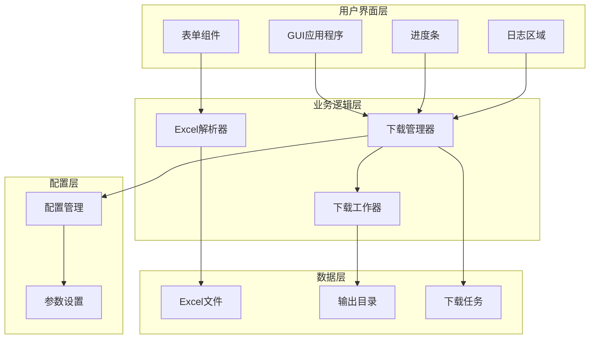
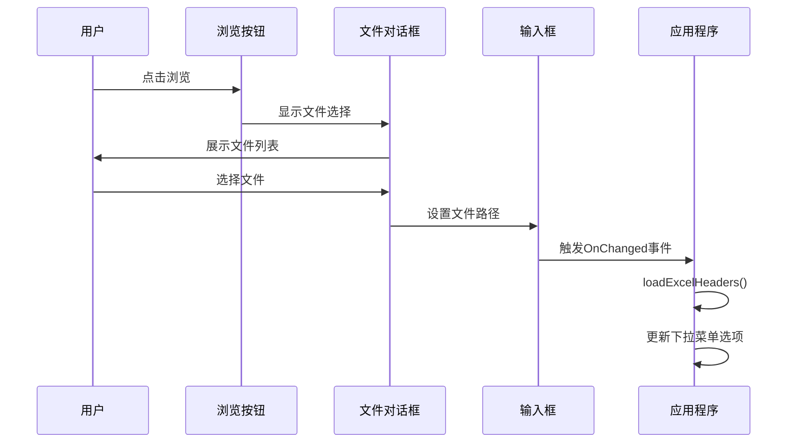
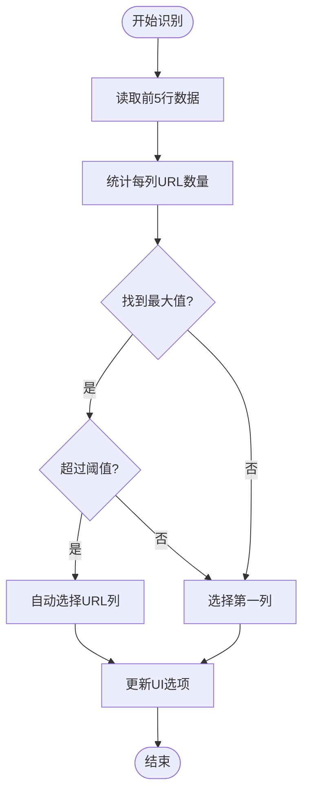
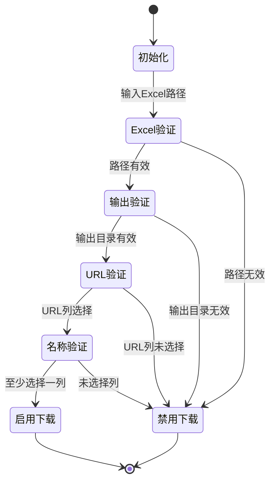
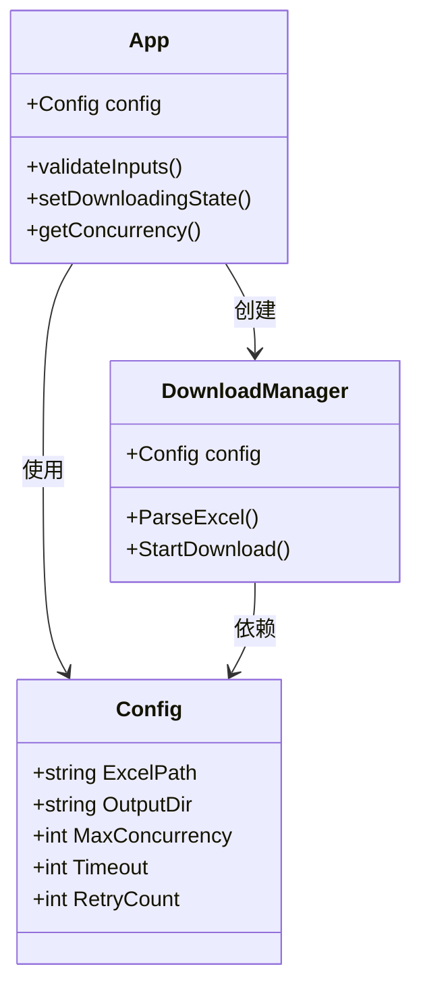
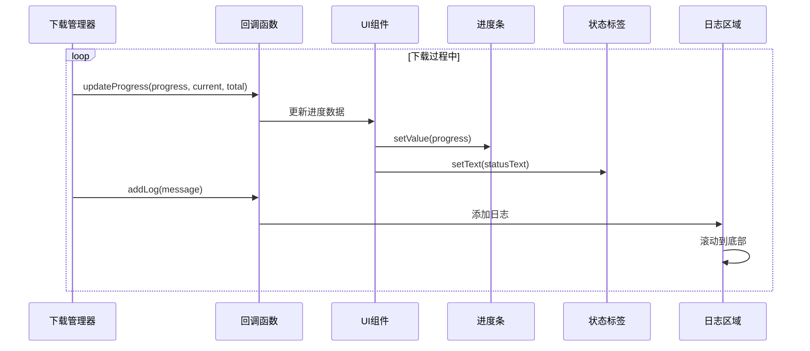
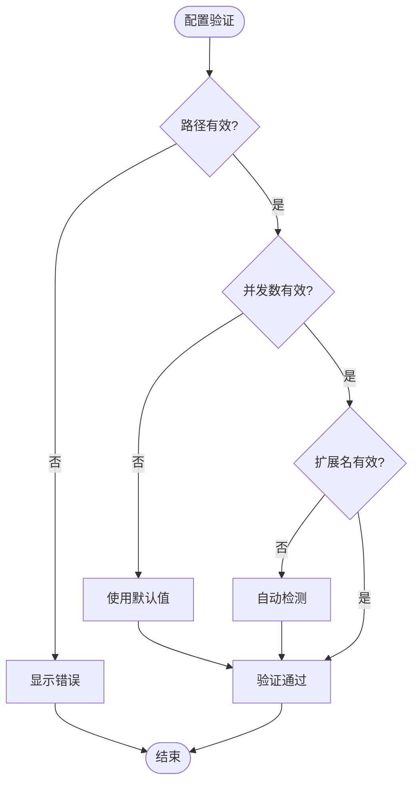
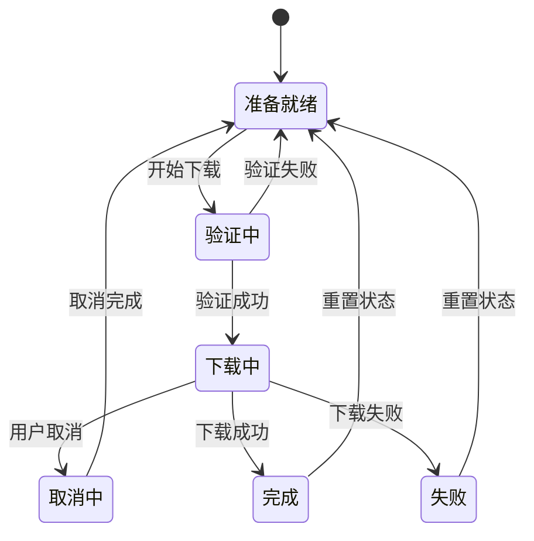
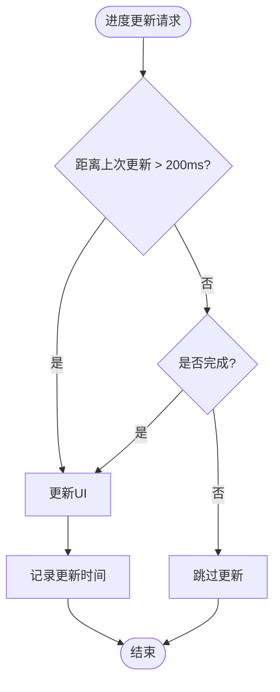

# 界面说明

<cite>
**本文档中引用的文件**
- [gui/app.go](file://gui/app.go)
- [config/config.go](file://config/config.go)
- [downloader/types.go](file://downloader/types.go)
- [downloader/manager.go](file://downloader/manager.go)
- [downloader/excel_parser.go](file://downloader/excel_parser.go)
- [main.go](file://main.go)
- [README.md](file://README.md)
</cite>

## 目录
1. [简介](#简介)
2. [应用程序架构](#应用程序架构)
3. [核心UI组件详解](#核心ui组件详解)
4. [组件交互机制](#组件交互机制)
5. [进度监控系统](#进度监控系统)
6. [配置管理](#配置管理)
7. [错误处理与状态管理](#错误处理与状态管理)
8. [性能优化策略](#性能优化策略)
9. [使用指南](#使用指南)

## 简介

批量文件下载器是一个基于Go语言开发的图形界面应用程序，专门设计用于从Excel表格中读取URL并自动下载相关文件。该应用程序采用Fyne GUI Toolkit构建跨平台用户界面，提供直观的操作体验和强大的下载管理功能。

## 应用程序架构



**图表来源**
- [gui/app.go](file://gui/app.go#L44-L78)
- [downloader/manager.go](file://downloader/manager.go#L13-L39)
- [config/config.go](file://config/config.go#L8-L14)

**章节来源**
- [gui/app.go](file://gui/app.go#L1-L743)
- [main.go](file://main.go#L1-L14)

## 核心UI组件详解

### Excel文件输入框和浏览按钮

#### Excel文件输入框 (excelPathEntry)
- **功能**: 用于显示和编辑Excel文件路径
- **特性**: 
  - 支持拖拽文件
  - 实时验证文件存在性
  - 自动触发表头加载
- **事件处理**: 当文本内容改变时，自动调用`loadExcelHeaders()`方法

#### 浏览按钮 (browseExcelFile)
- **功能**: 弹出文件选择对话框
- **行为**: 
  - 仅允许选择Excel文件(.xls, .xlsx)
  - 自动填充路径到输入框
  - 触发表头自动加载
- **实现**: 使用Fyne的`dialog.ShowFileOpen` API



**图表来源**
- [gui/app.go](file://gui/app.go#L281-L290)

### 输出目录输入框和浏览按钮

#### 输出目录输入框 (outputDirEntry)
- **功能**: 设置下载文件的保存位置
- **特性**: 
  - 支持文件夹选择
  - 自动创建不存在的目录
  - 显示完整路径

#### 浏览按钮 (browseOutputDir)
- **功能**: 弹出文件夹选择对话框
- **行为**: 
  - 仅允许选择文件夹
  - 自动填充路径到输入框
  - 支持相对路径和绝对路径

### 下载链接列下拉框 (urlColumnSelect)

#### 功能特性
- **自动识别**: 基于内容智能识别URL列
- **手动选择**: 支持用户手动选择列
- **动态更新**: Excel文件变更时自动刷新选项

#### 自动识别算法
应用程序通过分析Excel文件前5行数据来自动识别URL列：
1. 统计每列包含URL的数量
2. 选择包含URL最多的列
3. 要求至少50%的样本包含URL才能确认



**图表来源**
- [gui/app.go](file://gui/app.go#L377-L415)

### 文件名组成列多选框 (nameColumnsCheck)

#### 功能特性
- **多选支持**: 支持选择多个列参与文件命名
- **横向布局**: 自动换行显示，便于查看
- **顺序重要**: 按选中顺序拼接文件名

#### 默认行为
- **自动选择**: 默认选中第2-4列（排除URL列）
- **智能过滤**: 自动排除URL列，确保有意义的文件名
- **动态更新**: Excel表头变更时自动同步

#### 文件名生成规则
1. **拼接顺序**: 按多选框中选中的顺序
2. **分隔符**: 使用用户指定的分隔符连接
3. **清理处理**: 移除非法字符，限制文件名长度
4. **默认机制**: 如果所有列都为空，生成时间戳文件名

### 文件名分隔符输入框 (separatorEntry)

#### 功能
- **作用**: 定义文件名各部分之间的连接字符
- **默认值**: `_`（下划线）
- **验证**: 支持自定义分隔符，如 `-`, ` `, `/` 等

### 文件扩展名输入框 (fileExtensionEntry)

#### 功能
- **作用**: 指定统一的文件扩展名
- **优先级**: 高于从URL自动推断的扩展名
- **灵活性**: 留空则完全依赖URL推断

### 并发下载数输入框 (concurrencyEntry)

#### 功能特性
- **范围控制**: 1-50之间，默认10
- **性能影响**: 直接影响下载速度和服务器负载
- **智能建议**: 根据网络状况推荐合理值

#### 性能考虑
- **低值模式**: 1-5，适合网络不稳定环境
- **中值模式**: 6-20，平衡速度和稳定性
- **高值模式**: 21-50，适合高速网络环境

**章节来源**
- [gui/app.go](file://gui/app.go#L124-L189)

## 组件交互机制

### 输入验证系统



**图表来源**
- [gui/app.go](file://gui/app.go#L302-L315)

### 按钮状态管理

#### 开始下载按钮 (downloadBtn)
- **初始状态**: 禁用
- **激活条件**: 所有必填项验证通过
- **功能**: 启动下载流程

#### 取消下载按钮 (cancelBtn)
- **初始状态**: 禁用
- **激活时机**: 开始下载后
- **功能**: 中断正在进行的下载任务

### 配置对象交互

UI组件通过以下方式与配置对象交互：



**图表来源**
- [gui/app.go](file://gui/app.go#L44-L78)
- [config/config.go](file://config/config.go#L8-L14)

**章节来源**
- [gui/app.go](file://gui/app.go#L302-L315)
- [gui/app.go](file://gui/app.go#L451-L477)

## 进度监控系统

### 进度条组件 (progressBar)

#### 功能特性
- **视觉反馈**: 实时显示下载进度百分比
- **状态指示**: 不同状态显示不同图标
  - ❌ 100%完成
  - 🔄 进行中
  - ⏳ 0%准备

#### 文本格式化
进度条支持动态文本格式化，显示当前进度状态。

### 状态标签 (statusLabel)

#### 功能
- **实时状态**: 显示下载过程中的详细状态信息
- **统计信息**: 包含下载速度、剩余时间和完成数量
- **动态更新**: 每200ms更新一次（节流机制）

#### 状态文本格式
```
📊 进度: 45/100 (45.0%) | ⚡ 12.5 个/秒 | ⏱️ 预计剩余: 3分20秒
```

### 日志区域 (logText)

#### 功能特性
- **多行显示**: 支持滚动查看历史记录
- **自动滚动**: 新日志自动滚动到底部
- **行数限制**: 最多显示500行，防止内存溢出
- **只读模式**: 保持启用状态以显示正常颜色

#### 日志格式
- **成功**: `✓ 成功: filename.pdf (2.34 MB)`
- **失败**: `✗ 失败: filename.pdf - timeout`
- **统计**: `📊 已完成: 45/100, 成功: 42, 失败: 3, 空链接: 0, 速度: 12.5 个/秒`

### 实时更新机制



**图表来源**
- [gui/app.go](file://gui/app.go#L591-L616)
- [gui/app.go](file://gui/app.go#L668-L689)

**章节来源**
- [gui/app.go](file://gui/app.go#L154-L171)
- [gui/app.go](file://gui/app.go#L591-L616)
- [gui/app.go](file://gui/app.go#L668-L689)

## 配置管理

### 默认配置参数

| 参数 | 默认值 | 范围 | 说明 |
|------|--------|------|------|
| ExcelPath | "" | 无限制 | Excel文件路径 |
| OutputDir | downloads目录 | 无限制 | 输出目录路径 |
| MaxConcurrency | 10 | 1-50 | 最大并发下载数 |
| Timeout | 30秒 | 10-300秒 | 下载超时时间 |
| RetryCount | 3次 | 1-10次 | 失败重试次数 |

### 配置持久化

应用程序在首次运行时创建默认配置，后续运行时会加载现有配置。

### 配置验证



**图表来源**
- [config/config.go](file://config/config.go#L16-L30)
- [gui/app.go](file://gui/app.go#L691-L700)

**章节来源**
- [config/config.go](file://config/config.go#L1-L31)
- [gui/app.go](file://gui/app.go#L691-L700)

## 错误处理与状态管理

### 错误类型分类

#### 文件相关错误
- **Excel文件不存在**: 提示选择有效文件
- **输出目录权限不足**: 显示权限错误信息
- **文件读取失败**: 显示具体错误原因

#### 网络相关错误
- **连接超时**: 自动重试机制
- **服务器拒绝**: 记录失败原因
- **空链接**: 特殊标记处理

#### 用户输入错误
- **必填项缺失**: 禁用下载按钮
- **无效路径**: 实时验证
- **并发数超出范围**: 自动调整到有效范围

### 状态转换图



**图表来源**
- [gui/app.go](file://gui/app.go#L510-L519)
- [gui/app.go](file://gui/app.go#L578-L589)

### 对话框系统

应用程序使用Fyne的对话框系统提供用户反馈：
- **错误对话框**: 显示红色错误信息
- **信息对话框**: 显示蓝色提示信息
- **警告对话框**: 显示黄色警告信息

**章节来源**
- [gui/app.go](file://gui/app.go#L441-L449)
- [gui/app.go](file://gui/app.go#L578-L589)

## 性能优化策略

### 进度更新节流

为了避免UI过度刷新导致的性能问题，应用程序实现了进度更新节流机制：



**图表来源**
- [gui/app.go](file://gui/app.go#L595-L601)

### 日志行数限制

为防止大量日志导致UI卡顿，实现了行数限制机制：
- **最大行数**: 500行
- **自动截断**: 超出时删除最早的日志
- **内存优化**: 及时释放不再需要的日志内容

### 并发控制

#### 工作器池管理
- **动态创建**: 根据配置的并发数创建相应数量的工作器
- **资源复用**: 工作器在任务间复用，减少创建开销
- **优雅关闭**: 下载完成后优雅关闭所有工作器

#### 任务队列优化
- **缓冲区大小**: 1000个任务的缓冲区
- **异步处理**: 任务发送和结果处理异步进行
- **背压处理**: 当队列满时暂停任务发送

**章节来源**
- [gui/app.go](file://gui/app.go#L595-L601)
- [downloader/manager.go](file://downloader/manager.go#L80-L86)

## 使用指南

### 基本操作流程

1. **准备Excel文件**
   - 创建包含下载链接的Excel表格
   - 确保第一行为表头
   - URL列应包含有效的下载链接

2. **选择Excel文件**
   - 点击"浏览"按钮选择Excel文件
   - 应用程序自动加载表头并识别URL列

3. **设置输出目录**
   - 点击"浏览"按钮选择输出目录
   - 默认为程序同目录下的downloads文件夹

4. **配置下载参数**
   - 选择URL列（自动识别或手动选择）
   - 勾选用于文件名组成的列
   - 设置文件名分隔符（默认为下划线）
   - 配置并发下载数（1-50）

5. **开始下载**
   - 点击"开始下载"按钮
   - 监控进度条和状态信息
   - 查看日志区域了解详细信息

6. **取消下载**
   - 点击"取消下载"按钮
   - 等待所有正在进行的任务完成

### 最佳实践建议

#### 并发数配置
- **低速网络**: 1-5个并发
- **中速网络**: 6-15个并发  
- **高速网络**: 16-30个并发
- **极高网络**: 31-50个并发（谨慎使用）

#### 文件名命名
- **简洁明了**: 避免过长的文件名
- **避免特殊字符**: 使用字母、数字和下划线
- **有意义组合**: 选择能够反映文件内容的列

#### 错误处理
- **检查网络连接**: 确保网络稳定
- **验证URL有效性**: 确保Excel中的URL可访问
- **监控磁盘空间**: 确保输出目录有足够的存储空间

### 故障排除

#### 常见问题及解决方案

| 问题 | 原因 | 解决方案 |
|------|------|----------|
| 下载速度慢 | 并发数过低 | 增加并发下载数 |
| 文件名乱码 | 编码问题 | 使用UTF-8编码保存Excel |
| 下载失败 | 超时设置过短 | 增加超时时间 |
| 内存占用高 | 日志过多 | 清理日志或重启应用 |

**章节来源**
- [README.md](file://README.md#L53-L84)
- [gui/app.go](file://gui/app.go#L451-L477)