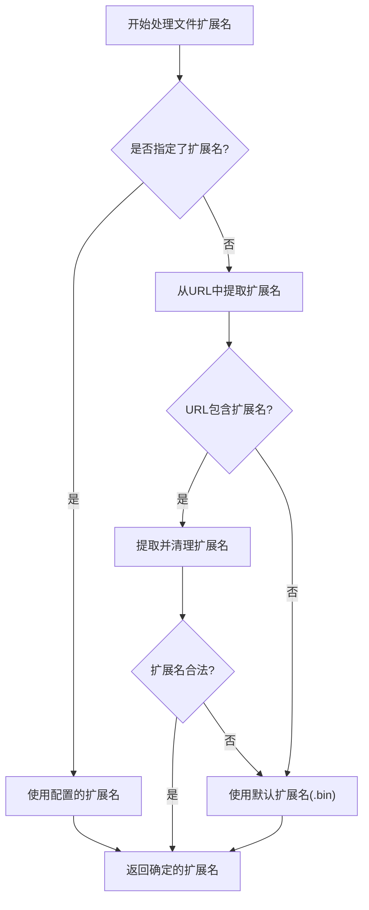
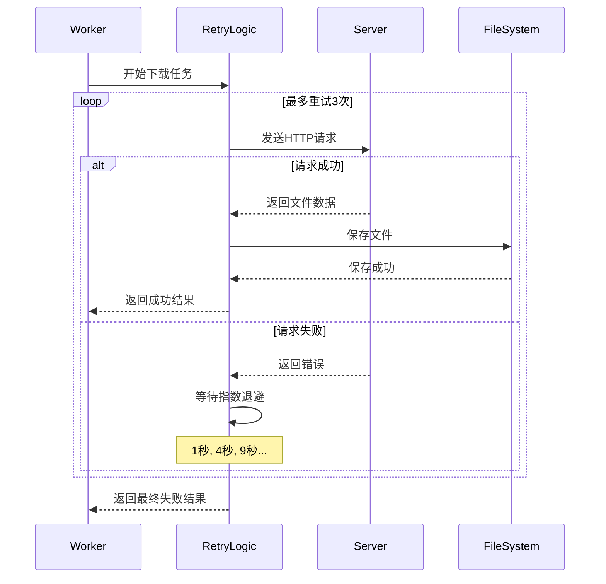
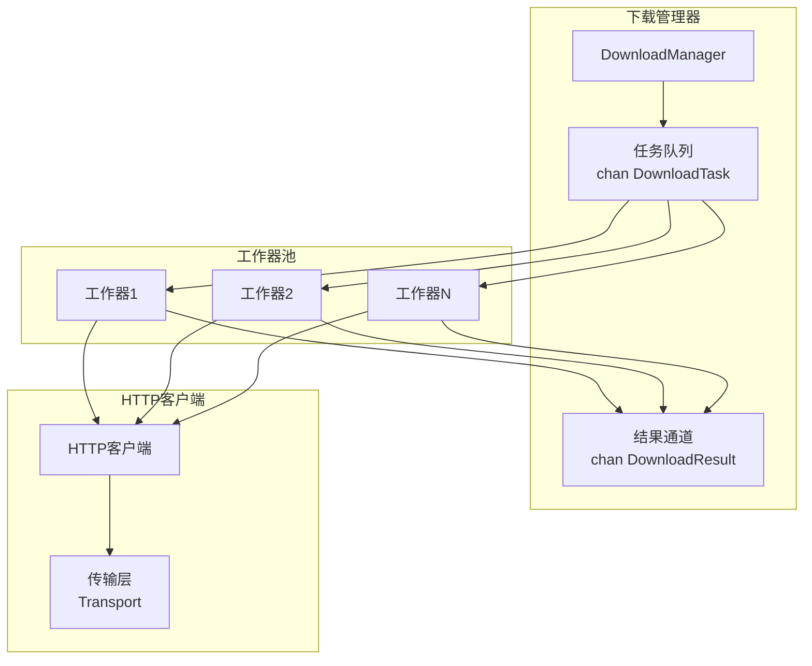
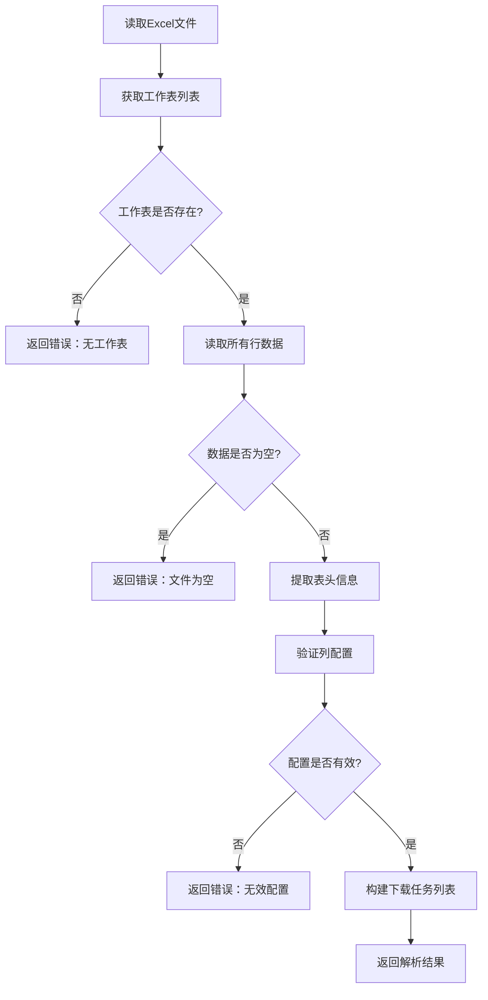
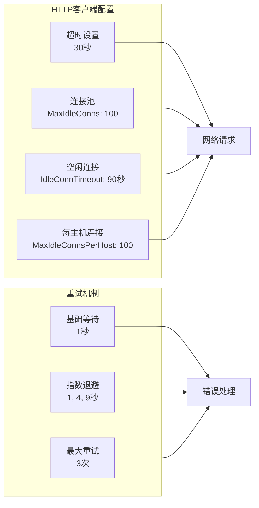
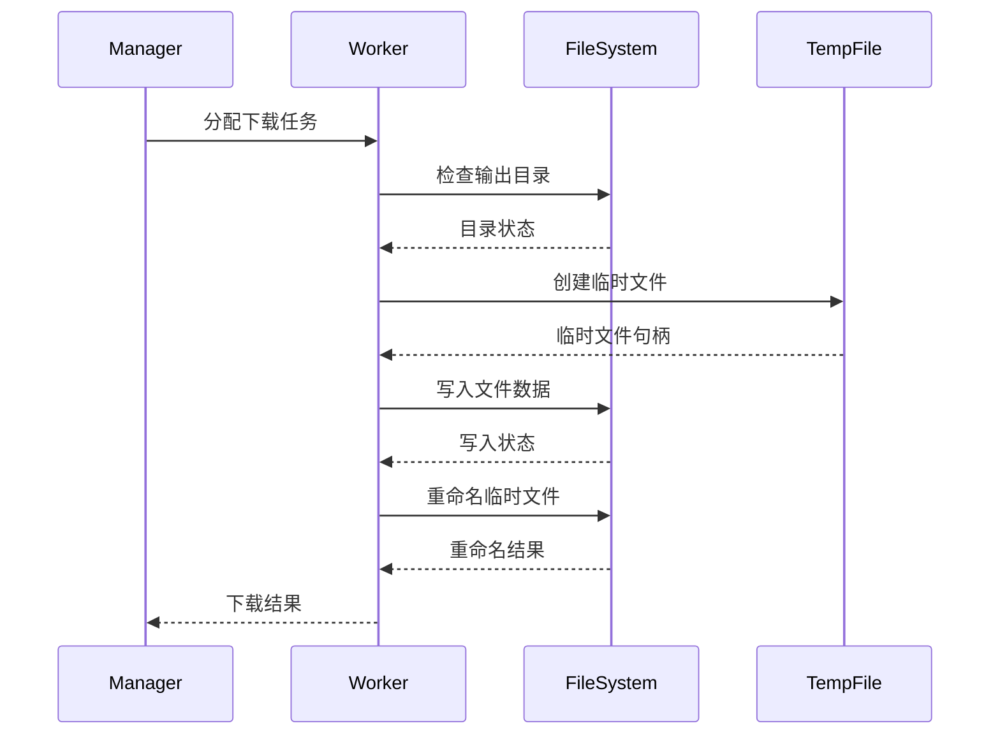
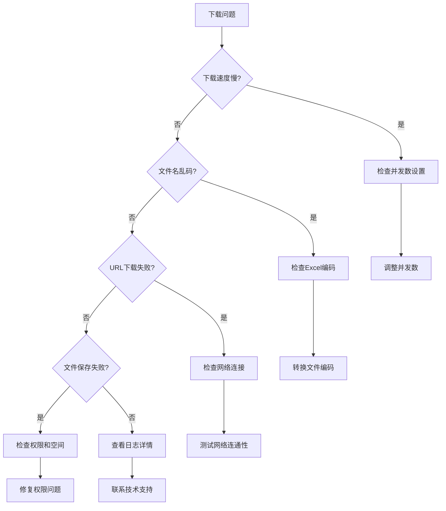

# 常见问题解答

<cite>
**本文档引用的文件**
- [README.md](file://README.md)
- [main.go](file://main.go)
- [downloader/excel_parser.go](file://downloader/excel_parser.go)
- [downloader/manager.go](file://downloader/manager.go)
- [downloader/worker.go](file://downloader/worker.go)
- [downloader/types.go](file://downloader/types.go)
- [config/config.go](file://config/config.go)
- [gui/app.go](file://gui/app.go)
</cite>

## 目录
1. [简介](#简介)
2. [下载速度优化](#下载速度优化)
3. [文件名乱码问题](#文件名乱码问题)
4. [扩展名设置与文件类型处理](#扩展名设置与文件类型处理)
5. [URL下载失败问题](#url下载失败问题)
6. [并发数与性能调优](#并发数与性能调优)
7. [Excel文件处理问题](#excel文件处理问题)
8. [网络与连接问题](#网络与连接问题)
9. [文件存储与权限问题](#文件存储与权限问题)
10. [故障排除指南](#故障排除指南)

## 简介

批量文件下载器是一个基于Go语言开发的图形界面工具，能够从Excel表格中读取URL并自动下载文件。本文档针对用户在使用过程中遇到的常见问题提供详细解答和解决方案。

## 下载速度优化

### 为什么下载速度很慢？

**根本原因分析：**
下载速度受多种因素影响，主要包括网络带宽、服务器响应速度、并发数设置以及系统资源占用。

**技术原理：**
程序采用多线程并发下载架构，每个下载工作器独立处理一个下载任务。下载过程包括：
- HTTP请求建立连接
- 数据传输
- 文件写入磁盘
- 错误重试机制

**解决方案：**

1. **调整并发数设置**
   - 默认并发数为10，可根据网络状况适当增加
   - 最大支持50个并发连接
   - 建议根据网络带宽和服务器承受能力调整

2. **网络优化建议**
   - 确保网络连接稳定
   - 避免在网络高峰期进行大量下载
   - 考虑使用有线网络替代无线网络

3. **服务器端优化**
   - 检查目标服务器的带宽限制
   - 避免对同一服务器发起过多并发请求
   - 注意服务器的访问频率限制

**性能调优建议：**

| 并发数设置 | 适用场景 | 注意事项 |
|------------|----------|----------|
| 5-10 | 宽带充足，服务器稳定 | 适合大多数普通下载需求 |
| 10-20 | 中等带宽，中等服务器负载 | 需要监控服务器响应 |
| 20-30 | 带宽有限，服务器较弱 | 可能导致服务器拒绝连接 |
| 30-50 | 带宽受限，服务器压力大 | 建议谨慎使用，可能被封禁 |

**节源码分析**
- [downloader/manager.go](file://downloader/manager.go#L80-L86) - 工作器初始化
- [downloader/worker.go](file://downloader/worker.go#L25-L42) - HTTP客户端配置

## 文件名乱码问题

### 为什么下载的文件名出现乱码？

**根本原因：**
文件名乱码的主要原因是Excel文件编码格式与程序处理方式不匹配。具体来说：

1. **Excel编码问题**
   - Windows版Excel默认使用ANSI编码保存文件
   - 非UTF-8编码可能导致中文字符乱码

2. **文件名字符集转换**
   - 程序内部使用UTF-8处理文件名
   - 从Excel读取的文件名需要正确解码

**解决方案：**

1. **确保Excel文件使用UTF-8编码**
   - 在Excel中另存为UTF-8格式
   - 具体操作步骤：
     1. 打开Excel文件
     2. 点击"文件" → "另存为"
     3. 选择保存类型为"CSV (逗号分隔) (*.csv)"
     4. 在"工具"菜单中选择"Web选项"
     5. 在"编码"选项卡中选择"UTF-8"
     6. 点击"确定"并保存

2. **使用兼容性更好的文件格式**
   - 推荐使用.xlsx格式而非.xls格式
   - 确保Excel版本支持UTF-8编码

3. **文件名清理机制**
   - 程序内置文件名清理功能，移除非法字符
   - 但仍建议确保原始文件名清晰可读

**技术实现分析：**
- [downloader/excel_parser.go](file://downloader/excel_parser.go#L174-L216) - 文件名构建和清理逻辑
- [downloader/excel_parser.go](file://downloader/excel_parser.go#L200-L216) - cleanFilename函数处理非法字符

## 扩展名设置与文件类型处理

### 如何自定义文件扩展名？

**功能说明：**
程序支持两种文件扩展名处理方式：

1. **自动推断模式**
   - 从URL中提取扩展名
   - 支持常见的文件类型（pdf、jpg、png、doc等）

2. **手动指定模式**
   - 在"文件扩展名"字段中指定统一扩展名
   - 适用于批量下载相同类型的文件

**扩展名处理流程：**

**图表来源**
- [downloader/excel_parser.go](file://downloader/excel_parser.go#L218-L244) - determineFileExtension函数

**使用建议：**

| 使用场景 | 推荐设置 | 说明 |
|----------|----------|------|
| PDF文档下载 | 留空（自动推断） | URL通常包含.pdf扩展名 |
| 图片文件下载 | jpg/png | 批量下载同一类型图片 |
| 文档文件下载 | doc/docx | 统一文档格式 |
| 未知文件类型 | bin | 使用二进制扩展名 |

**技术细节：**
- [downloader/excel_parser.go](file://downloader/excel_parser.go#L218-L244) - 扩展名确定逻辑
- [downloader/types.go](file://downloader/types.go#L5-L10) - DownloadTask结构定义

## URL下载失败问题

### 为什么某些URL下载失败？

**可能原因分析：**

1. **目标服务器限制**
   - IP地址被封禁
   - 访问频率过高触发防护
   - 需要登录认证才能访问

2. **网络不稳定**
   - 网络连接中断
   - DNS解析失败
   - 网络延迟过高

3. **URL格式问题**
   - URL格式不正确
   - 包含特殊字符未编码
   - 链接已失效或被删除

4. **文件类型问题**
   - 目标文件不存在
   - 文件大小超过限制
   - 文件类型不受支持

**重试机制工作原理：**

**图表来源**
- [downloader/worker.go](file://downloader/worker.go#L78-L102) - downloadWithRetry函数
- [downloader/worker.go](file://downloader/worker.go#L81-L95) - 指数退避算法

**解决方案：**

1. **检查URL有效性**
   - 在浏览器中手动测试URL
   - 确认链接仍然有效
   - 检查是否需要登录认证

2. **调整重试策略**
   - 当前配置：最大重试3次
   - 指数退避间隔：1s, 4s, 9s
   - 可根据网络情况调整

3. **分批处理**
   - 将大任务拆分为小批次
   - 避免一次性请求过多URL
   - 降低被服务器限制的风险

**错误类型识别：**
- [downloader/worker.go](file://downloader/worker.go#L108-L115) - 空URL检测
- [downloader/worker.go](file://downloader/worker.go#L142-L161) - HTTP状态码检查
- [downloader/manager.go](file://downloader/manager.go#L121-L126) - 错误统计

## 并发数与性能调优

### 并发数设置的最佳实践

**技术架构分析：**

程序采用生产者-消费者模型，通过通道实现任务调度：

**图表来源**
- [downloader/manager.go](file://downloader/manager.go#L13-L30) - DownloadManager结构
- [downloader/worker.go](file://downloader/worker.go#L16-L23) - DownloadWorker结构

**性能调优指南：**

1. **并发数选择原则**
   - **低并发（1-5）**：网络带宽有限，服务器压力小
   - **中等并发（6-20）**：平衡速度和稳定性
   - **高并发（21-50）**：充分利用带宽，需监控服务器状态

2. **系统资源评估**
   - CPU使用率：监控CPU占用情况
   - 内存使用：并发数过高可能导致内存不足
   - 网络接口：确保网卡能够处理并发连接

3. **监控指标**
   - 下载成功率
   - 平均下载速度
   - 错误率统计
   - 服务器响应时间

**配置参数说明：**

| 参数 | 默认值 | 范围 | 说明 |
|------|--------|------|------|
| MaxConcurrency | 10 | 1-50 | 最大并发下载数 |
| Timeout | 30 | 10-300 | 单次下载超时时间（秒） |
| RetryCount | 3 | 1-10 | 下载失败重试次数 |

**节源码分析**
- [config/config.go](file://config/config.go#L8-L14) - 配置结构定义
- [downloader/manager.go](file://downloader/manager.go#L80-L86) - 工作器创建逻辑

## Excel文件处理问题

### Excel文件读取失败怎么办？

**常见问题及解决方案：**

1. **文件格式不支持**
   - **问题**：使用.xlsx格式时出现问题
   - **解决方案**：确保使用标准Excel格式
   - **推荐格式**：.xlsx（Office Open XML）

2. **文件损坏**
   - **症状**：读取时提示文件损坏
   - **解决**：修复Excel文件
   - **方法**：打开Excel，选择"另存为"，尝试不同格式

3. **编码问题**
   - **症状**：中文字符显示异常
   - **解决方案**：确保文件使用UTF-8编码
   - **操作**：另存为CSV格式，选择UTF-8编码

**Excel解析流程：**

**图表来源**
- [downloader/excel_parser.go](file://downloader/excel_parser.go#L16-L46) - ReadExcelHeaders函数
- [downloader/excel_parser.go](file://downloader/excel_parser.go#L96-L172) - Parse函数

**自动识别功能：**

程序具备智能列识别功能：
- [gui/app.go](file://gui/app.go#L377-L415) - detectURLColumn函数
- [gui/app.go](file://gui/app.go#L417-L433) - isLikelyURL函数

**使用建议：**
- Excel文件应包含明确的表头
- URL列应包含明显的URL特征
- 文件大小建议控制在10MB以内

## 网络与连接问题

### 网络连接不稳定怎么办？

**网络问题诊断：**

1. **连接超时**
   - **表现**：下载任务长时间无响应
   - **原因**：网络延迟过高或服务器无响应
   - **解决方案**：增加超时时间或更换服务器

2. **DNS解析失败**
   - **表现**：无法建立TCP连接
   - **原因**：DNS服务器不可用
   - **解决方案**：更换DNS服务器或使用IP直连

3. **防火墙拦截**
   - **表现**：部分URL无法访问
   - **原因**：本地防火墙或网络防火墙阻止
   - **解决方案**：检查防火墙设置

**网络优化配置：**

**图表来源**
- [downloader/worker.go](file://downloader/worker.go#L26-L33) - HTTP客户端配置
- [downloader/worker.go](file://downloader/worker.go#L78-L102) - 重试逻辑

**故障排除步骤：**

1. **网络连通性测试**
   - 使用ping命令测试目标服务器
   - 检查本地网络连接状态
   - 验证DNS解析是否正常

2. **代理设置检查**
   - 确认是否需要代理服务器
   - 检查代理服务器配置
   - 测试代理连接

3. **防火墙配置**
   - 检查本地防火墙设置
   - 确认出站连接允许
   - 验证端口开放状态

## 文件存储与权限问题

### 文件保存失败怎么办？

**常见权限问题：**

1. **目录权限不足**
   - **表现**：无法创建子目录或保存文件
   - **原因**：输出目录权限不够
   - **解决方案**：选择有写入权限的目录

2. **磁盘空间不足**
   - **表现**：文件创建失败
   - **解决方案**：清理磁盘空间或选择其他位置

3. **文件名冲突**
   - **表现**：文件覆盖失败
   - **解决方案**：修改文件名或清理已有文件

**文件保存流程：**

**图表来源**
- [downloader/worker.go](file://downloader/worker.go#L118-L209) - downloadFile函数

**权限检查清单：**

| 检查项目 | 检查方法 | 解决方案 |
|----------|----------|----------|
| 目录存在性 | 尝试创建目录 | 选择现有目录 |
| 写入权限 | 尝试创建文件 | 更改目录权限 |
| 磁盘空间 | 检查可用空间 | 清理磁盘或选择其他位置 |
| 文件名合法性 | 检查特殊字符 | 使用合法文件名 |

**技术实现：**
- [downloader/worker.go](file://downloader/worker.go#L118-L127) - 目录创建逻辑
- [downloader/worker.go](file://downloader/worker.go#L129-L139) - 临时文件创建
- [downloader/worker.go](file://downloader/worker.go#L200-L209) - 文件重命名

## 故障排除指南

### 自助排查路径

**问题分类与诊断流程：**

**详细排查步骤：**

1. **下载速度问题**
   - 检查网络带宽使用情况
   - 调整并发数设置
   - 监控系统资源占用

2. **文件名问题**
   - 验证Excel文件编码
   - 检查文件名字符集
   - 确认文件名长度限制

3. **URL下载问题**
   - 手动测试URL有效性
   - 检查服务器访问限制
   - 验证网络连接稳定性

4. **文件保存问题**
   - 检查输出目录权限
   - 确认磁盘空间充足
   - 验证文件名合法性

**日志分析技巧：**

程序提供详细的下载日志，包含：
- [gui/app.go](file://gui/app.go#L668-L689) - 日志管理功能
- [downloader/manager.go](file://downloader/manager.go#L101-L177) - 结果处理和统计

**日志关键词：**
- "成功"：表示下载成功的文件
- "失败"：表示下载失败的文件
- "空链接"：表示URL为空的任务
- "取消"：表示被取消的下载

**性能监控指标：**

| 指标 | 正常范围 | 异常表现 | 解决方案 |
|------|----------|----------|----------|
| 下载速度 | 1-10个/秒 | 低于0.1个/秒 | 调整并发数 |
| 成功率 | 80%-100% | 低于50% | 检查URL有效性 |
| 错误率 | 0-20% | 高于30% | 检查网络连接 |
| 平均响应时间 | 1-5秒 | 超过10秒 | 检查服务器状态 |

**紧急恢复措施：**

1. **立即停止下载**
   - 点击"取消下载"按钮
   - 等待所有工作器停止

2. **清理临时文件**
   - 删除下载目录中的临时文件（.tmp后缀）
   - 清理已完成的文件

3. **重启程序**
   - 关闭程序后重新启动
   - 重新加载Excel文件

**预防措施：**

1. **定期备份配置**
   - 保存Excel文件副本
   - 记录重要配置参数

2. **分批处理任务**
   - 避免一次性处理过多文件
   - 监控下载进度和状态

3. **网络环境优化**
   - 使用稳定的网络连接
   - 避免网络高峰时段

**节源码分析**
- [downloader/manager.go](file://downloader/manager.go#L179-L208) - Cancel函数实现
- [gui/app.go](file://gui/app.go#L565-L575) - 取消下载逻辑

通过以上详细的故障排除指南，用户可以快速定位和解决大部分常见问题，减少对技术支持的依赖。如果问题仍然存在，建议收集详细的错误日志并联系开发者团队。