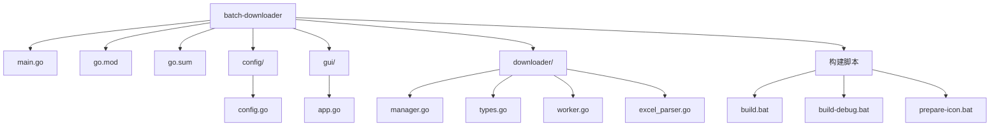
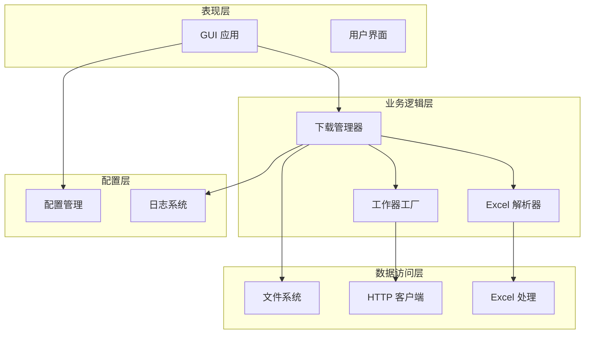
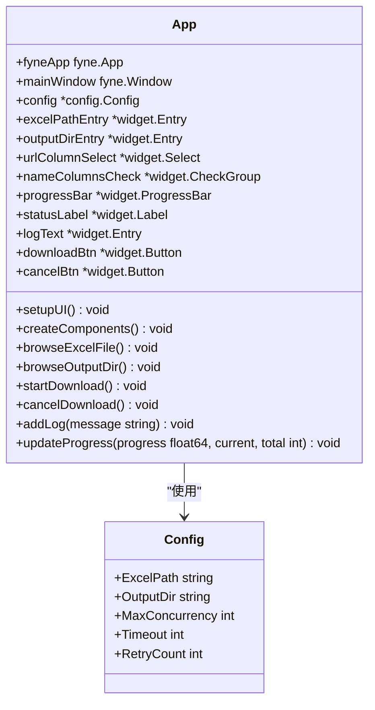
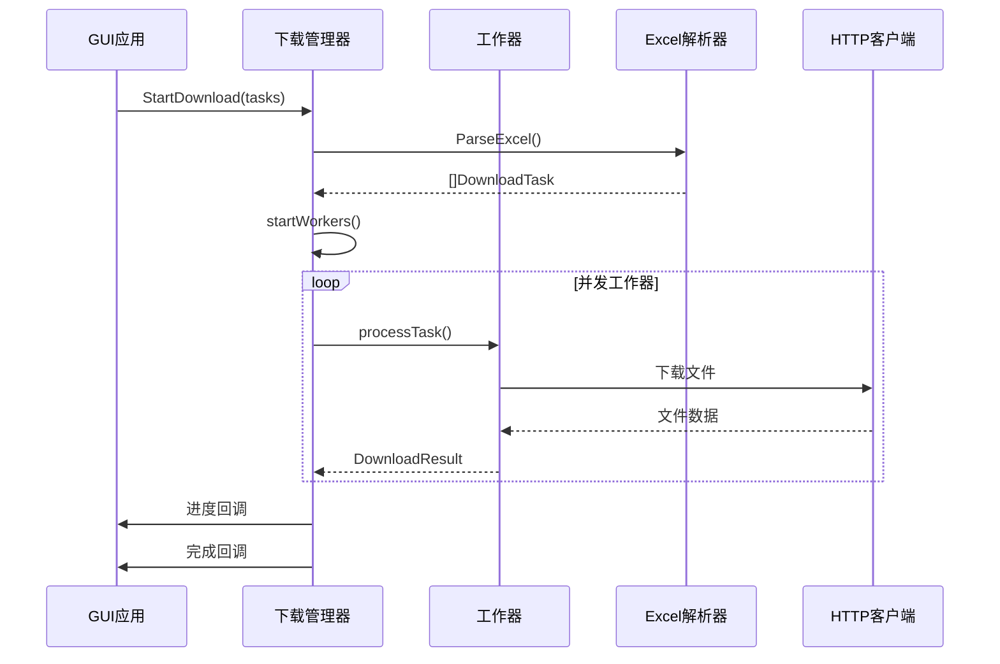
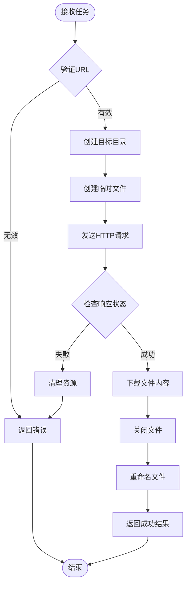
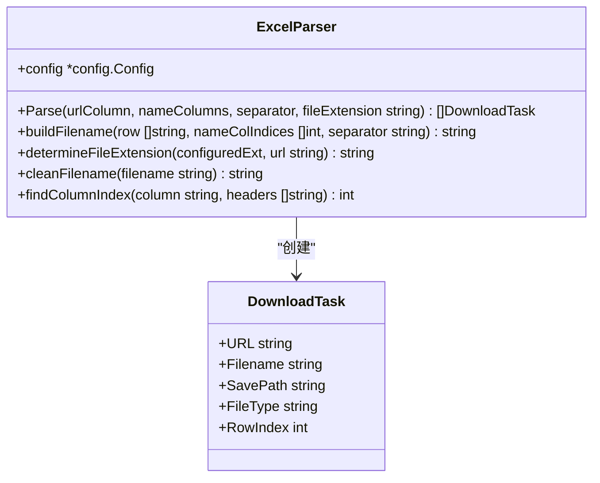
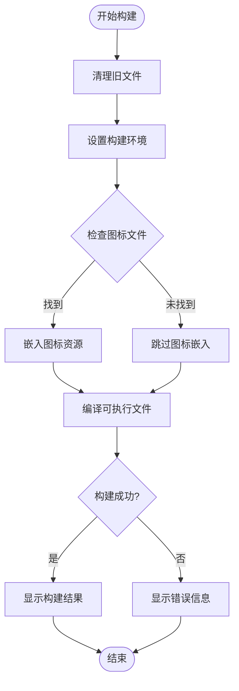
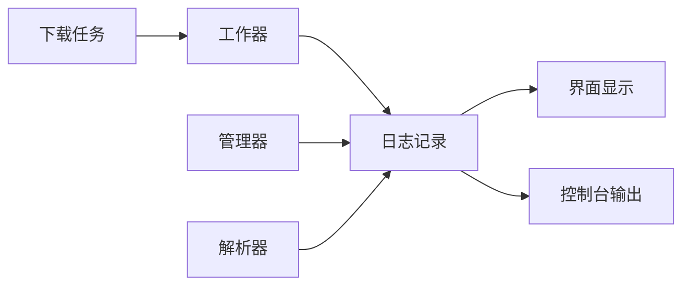

# 批量文件下载器开发者指南

<cite>
**本文档引用的文件**
- [main.go](file://main.go)
- [go.mod](file://go.mod)
- [README.md](file://README.md)
- [build.bat](file://build.bat)
- [build-debug.bat](file://build-debug.bat)
- [prepare-icon.bat](file://prepare-icon.bat)
- [config/config.go](file://config/config.go)
- [gui/app.go](file://gui/app.go)
- [downloader/manager.go](file://downloader/manager.go)
- [downloader/types.go](file://downloader/types.go)
- [downloader/worker.go](file://downloader/worker.go)
- [downloader/excel_parser.go](file://downloader/excel_parser.go)
</cite>

## 目录
1. [项目概述](#项目概述)
2. [项目结构](#项目结构)
3. [核心组件](#核心组件)
4. [架构概览](#架构概览)
5. [详细组件分析](#详细组件分析)
6. [构建流程](#构建流程)
7. [调试方法](#调试方法)
8. [代码风格规范](#代码风格规范)
9. [测试策略](#测试策略)
10. [贡献指南](#贡献指南)
11. [故障排除](#故障排除)

## 项目概述

批量文件下载器是一个基于 Go 语言开发的图形界面应用程序，专门用于从 Excel 表格中读取 URL 并自动下载文件。该项目采用模块化设计，支持多线程并发下载、实时进度监控和灵活的文件命名规则。

### 主要特性
- 🖥️ 基于 Fyne GUI Toolkit 的跨平台图形界面
- 📊 通过 Excel 表格管理下载任务
- ⚡ 多线程并发下载，提高效率
- 📝 自定义文件命名规则
- 📈 实时显示下载进度和统计信息
- 🛑 支持随时取消下载任务
- 📁 自动分类保存下载文件

**章节来源**
- [README.md](file://README.md#L1-L125)

## 项目结构

项目采用清晰的模块化结构，每个目录负责特定的功能领域：



**图表来源**
- [main.go](file://main.go#L1-L14)
- [config/config.go](file://config/config.go#L1-L31)
- [gui/app.go](file://gui/app.go#L1-L743)
- [downloader/manager.go](file://downloader/manager.go#L1-L243)

### 目录说明

| 目录 | 功能描述 | 主要文件 |
|------|----------|----------|
| `/` | 项目根目录 | `main.go`, `go.mod`, 构建脚本 |
| `/config` | 配置管理模块 | `config.go` - 应用配置定义 |
| `/gui` | 图形界面模块 | `app.go` - Fyne GUI 应用实现 |
| `/downloader` | 下载核心模块 | `manager.go`, `types.go`, `worker.go`, `excel_parser.go` |

**章节来源**
- [main.go](file://main.go#L1-L14)
- [go.mod](file://go.mod#L1-L50)

## 核心组件

### 应用入口点 (main.go)
应用的入口点非常简洁，主要负责初始化 GUI 应用程序并启动事件循环。

### 配置管理 (config/)
配置模块提供了应用程序的核心配置结构，包括：
- Excel 文件路径
- 输出目录
- 并发下载数
- 超时设置
- 重试次数

### 图形界面 (gui/)
GUI 模块基于 Fyne 框架构建，提供完整的用户交互界面：
- Excel 文件选择和解析
- 输出目录配置
- 下载参数设置
- 实时进度监控
- 下载日志显示

### 下载引擎 (downloader/)
下载引擎是项目的核心，实现了复杂的并发下载逻辑：
- 任务管理器 (DownloadManager)
- 工作器 (DownloadWorker)
- Excel 解析器 (ExcelParser)
- 数据类型定义

**章节来源**
- [main.go](file://main.go#L1-L14)
- [config/config.go](file://config/config.go#L1-L31)
- [gui/app.go](file://gui/app.go#L1-L743)
- [downloader/manager.go](file://downloader/manager.go#L1-L243)

## 架构概览

项目采用分层架构设计，各层职责明确，耦合度低：



**图表来源**
- [gui/app.go](file://gui/app.go#L44-L743)
- [downloader/manager.go](file://downloader/manager.go#L13-L243)
- [downloader/excel_parser.go](file://downloader/excel_parser.go#L1-L317)

### 设计模式

项目采用了多种设计模式：

1. **观察者模式**: 用于进度回调和日志通知
2. **工厂模式**: 用于创建工作器实例
3. **单例模式**: 配置管理器
4. **生产者-消费者模式**: 任务队列和结果处理

**章节来源**
- [downloader/manager.go](file://downloader/manager.go#L13-L243)
- [downloader/worker.go](file://downloader/worker.go#L16-L225)

## 详细组件分析

### GUI 应用组件 (gui/app.go)

GUI 应用是整个应用程序的用户界面核心，基于 Fyne 框架构建：



**图表来源**
- [gui/app.go](file://gui/app.go#L44-L743)
- [config/config.go](file://config/config.go#L8-L14)

#### 核心功能

1. **界面布局**: 采用 Fyne 的容器系统构建复杂的用户界面
2. **事件处理**: 处理用户交互事件，如文件选择、参数配置等
3. **进度监控**: 实时更新下载进度和状态信息
4. **日志管理**: 提供详细的下载日志记录

**章节来源**
- [gui/app.go](file://gui/app.go#L1-L743)

### 下载管理器 (downloader/manager.go)

下载管理器是并发下载的核心控制器：



**图表来源**
- [downloader/manager.go](file://downloader/manager.go#L46-L243)
- [downloader/worker.go](file://downloader/worker.go#L45-L225)

#### 关键特性

1. **并发控制**: 支持可配置的最大并发数
2. **任务调度**: 高效的任务队列管理
3. **错误处理**: 完善的重试机制和错误恢复
4. **进度跟踪**: 实时的进度和统计信息

**章节来源**
- [downloader/manager.go](file://downloader/manager.go#L1-L243)

### 工作器组件 (downloader/worker.go)

工作器负责具体的文件下载任务：



**图表来源**
- [downloader/worker.go](file://downloader/worker.go#L66-L225)

#### 重试机制

工作器实现了智能的重试机制：
- 指数退避算法
- 可配置的重试次数
- 错误分类和处理

**章节来源**
- [downloader/worker.go](file://downloader/worker.go#L1-L225)

### Excel 解析器 (downloader/excel_parser.go)

Excel 解析器负责从 Excel 文件中提取下载任务：



**图表来源**
- [downloader/excel_parser.go](file://downloader/excel_parser.go#L86-L317)
- [downloader/types.go](file://downloader/types.go#L5-L20)

#### 文件名生成规则

1. **多列组合**: 支持从多个 Excel 列组合生成文件名
2. **自定义分隔符**: 可配置的列间分隔符
3. **自动清理**: 移除非法字符，确保文件名有效性
4. **默认策略**: 当所有列都为空时生成时间戳文件名

**章节来源**
- [downloader/excel_parser.go](file://downloader/excel_parser.go#L1-L317)

## 构建流程

### 环境要求

项目构建需要以下环境：

| 组件 | 版本要求 | 用途 |
|------|----------|------|
| Go | 1.25+ | 主要编程语言 |
| Windows | 10+ | 目标操作系统 |
| GCC | 最新版本 | C 语言编译器 |

### 构建脚本详解

项目提供了三个构建脚本，分别用于不同的构建需求：

#### 生产构建 (build.bat)


**图表来源**
- [build.bat](file://build.bat#L1-L100)

#### 调试构建 (build-debug.bat)
调试构建版本包含控制台窗口，便于开发调试：

- 无 `-H=windowsgui` 标志
- 包含标准输出和错误输出
- 更适合开发环境使用

#### 图标准备 (prepare-icon.bat)
该脚本帮助开发者准备应用图标：

- 检查必需的图标文件
- 提供图标制作指导
- 支持 PNG 和 ICO 格式

**章节来源**
- [build.bat](file://build.bat#L1-L100)
- [build-debug.bat](file://build-debug.bat#L1-L39)
- [prepare-icon.bat](file://prepare-icon.bat#L1-L78)

### 交叉编译注意事项

当前项目仅支持 Windows 平台构建：

1. **CGO 要求**: 必须启用 CGO (`CGO_ENABLED=1`)
2. **平台特定**: 目标架构固定为 `amd64`
3. **操作系统**: 强制设置为 `windows`

## 调试方法

### 使用 build-debug.bat

项目提供了专门的调试构建脚本，生成带有控制台窗口的可执行文件：

```bash
build-debug.bat
```

调试版本的特点：
- 显示标准输出和错误输出
- 包含详细的日志信息
- 便于开发过程中的问题诊断

### 性能分析

虽然项目当前未集成 Go 的 pprof 工具，但可以通过以下方式添加：

1. **导入 pprof 包**: 在 main.go 中导入 `net/http/pprof`
2. **启动 HTTP 服务器**: 添加监听端口
3. **收集性能数据**: 使用浏览器或 curl 工具

### 日志系统

项目内置了完善的日志系统：



**图表来源**
- [downloader/manager.go](file://downloader/manager.go#L101-L177)
- [gui/app.go](file://gui/app.go#L668-L689)

**章节来源**
- [build-debug.bat](file://build-debug.bat#L1-L39)
- [downloader/manager.go](file://downloader/manager.go#L101-L177)
- [gui/app.go](file://gui/app.go#L668-L689)

## 代码风格规范

### Go 语言约定

项目严格遵循 Go 语言的最佳实践：

#### 命名规范
- **包名**: 全部小写，简短且有意义
- **函数名**: 使用 PascalCase 或 camelCase
- **变量名**: 使用 camelCase
- **常量**: 使用 UPPER_SNAKE_CASE

#### 代码组织
- **导入分组**: 标准库、第三方库、本地包
- **接口定义**: 放在 types.go 文件中
- **错误处理**: 使用标准的 error 类型

#### 注释规范
- **包注释**: 每个包的第一行提供说明
- **函数注释**: 说明函数目的和参数
- **复杂逻辑**: 添加必要的解释性注释

### 项目特定规范

1. **GUI 组件**: 使用 Fyne 框架的标准命名
2. **并发安全**: 使用原子操作和互斥锁
3. **错误传播**: 保持错误信息的上下文
4. **配置管理**: 使用结构体标签进行序列化

**章节来源**
- [config/config.go](file://config/config.go#L1-L31)
- [downloader/types.go](file://downloader/types.go#L1-L21)

## 测试策略

### 当前状况

项目目前尚未包含单元测试文件，这是一个重要的改进机会。

### 建议的测试策略

#### 单元测试 (推荐)
```go
// 示例测试结构
func TestDownloadManager_ParseExcel(t *testing.T) {
    // 测试 Excel 解析功能
}

func TestDownloadWorker_DownloadFile(t *testing.T) {
    // 测试文件下载功能
}
```

#### 集成测试
- GUI 界面测试
- 完整下载流程测试
- 错误场景测试

#### 性能测试
- 并发下载性能测试
- 大文件下载测试
- 内存使用监控

### 测试框架建议

推荐使用 Go 标准测试包：
```go
import "testing"
```

或者更强大的第三方框架：
```go
import "github.com/stretchr/testify/assert"
```

## 贡献指南

### 提交 Pull Request 流程

1. **Fork 项目**: 在 GitHub 上 Fork 项目仓库
2. **创建分支**: 为新功能或修复创建专用分支
3. **编写代码**: 遵循项目的代码风格规范
4. **添加测试**: 为新功能添加相应的测试
5. **本地测试**: 确保所有测试通过
6. **提交更改**: 提交清晰的提交信息
7. **创建 PR**: 在 GitHub 上创建 Pull Request

### 提交信息规范

使用清晰、描述性的提交信息：
```
<类型>(<范围>): <简短描述>

<详细描述>

<相关问题>
```

示例：
```
feat(downloader): 添加文件扩展名自动检测功能

- 实现从 URL 中自动提取文件扩展名
- 支持常见文件类型的识别
- 添加相应的单元测试

Fixes #123
```

### 代码审查要点

1. **功能正确性**: 确保新功能按预期工作
2. **性能影响**: 避免引入性能回归
3. **兼容性**: 保持向后兼容性
4. **文档更新**: 更新相关文档
5. **测试覆盖**: 确保有足够的测试覆盖

## 故障排除

### 常见构建问题

#### 1. GCC 编译器缺失
**症状**: 构建失败，提示找不到 GCC
**解决方案**: 
- 安装 MinGW 或 TDM-GCC
- 确保 GCC 在 PATH 环境变量中

#### 2. 图标嵌入失败
**症状**: EXE 文件使用默认图标
**解决方案**:
- 运行 `prepare-icon.bat` 检查图标文件
- 确保 icon.ico 和 icon.png 存在

#### 3. 依赖包问题
**症状**: 构建过程中出现包导入错误
**解决方案**:
- 运行 `go mod tidy` 清理依赖
- 检查网络连接，重新下载依赖

### 运行时问题

#### 1. Excel 文件读取失败
**症状**: 无法解析 Excel 文件
**解决方案**:
- 确保 Excel 文件格式正确
- 检查文件权限和路径
- 验证文件编码格式

#### 2. 下载速度慢
**症状**: 下载速度明显低于预期
**解决方案**:
- 增加并发下载数（1-50）
- 检查网络连接质量
- 考虑使用代理服务器

#### 3. 文件名乱码
**症状**: 下载的文件名包含乱码字符
**解决方案**:
- 确保 Excel 文件以 UTF-8 编码保存
- 检查文件名中的特殊字符
- 使用简单的 ASCII 字符作为文件名

### 调试技巧

1. **使用调试版本**: 运行 `build-debug.bat` 获取详细日志
2. **检查系统资源**: 监控 CPU 和内存使用情况
3. **网络诊断**: 使用网络工具检查连接状态
4. **日志分析**: 仔细阅读下载日志中的错误信息

**章节来源**
- [build.bat](file://build.bat#L85-L97)
- [gui/app.go](file://gui/app.go#L324-L333)
- [downloader/worker.go](file://downloader/worker.go#L108-L115)

## 结论

本开发者指南为新贡献者提供了全面的项目理解和开发指导。通过遵循本指南中的最佳实践，您可以：

- 快速理解项目的整体架构和代码组织
- 掌握构建、调试和测试的方法
- 遵循项目的代码风格和规范
- 有效地参与项目的开发和维护

随着项目的不断发展，我们鼓励社区贡献者积极参与代码审查、测试改进和功能扩展，共同推动项目的进步。