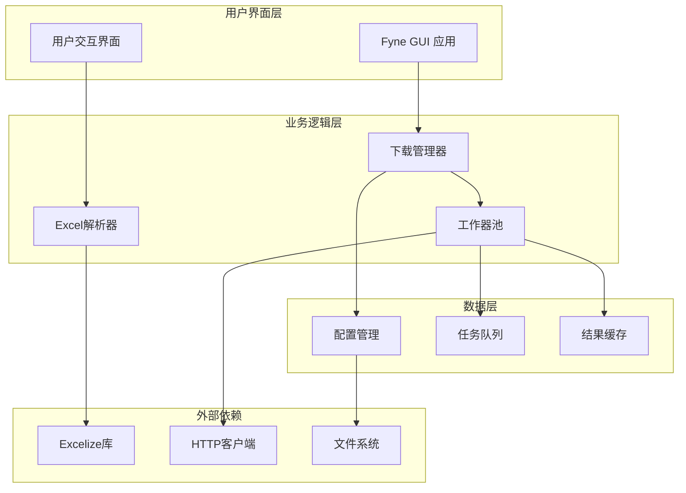
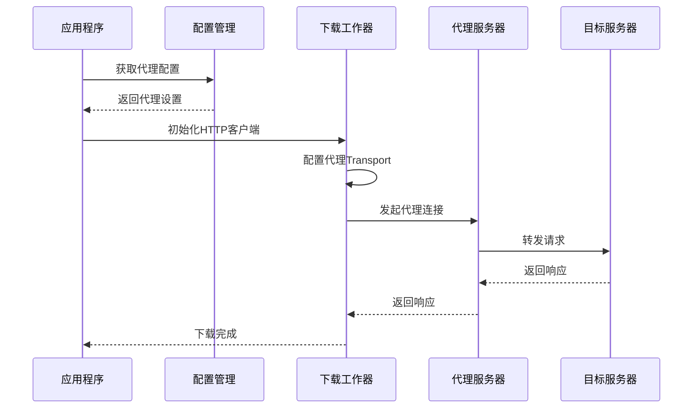
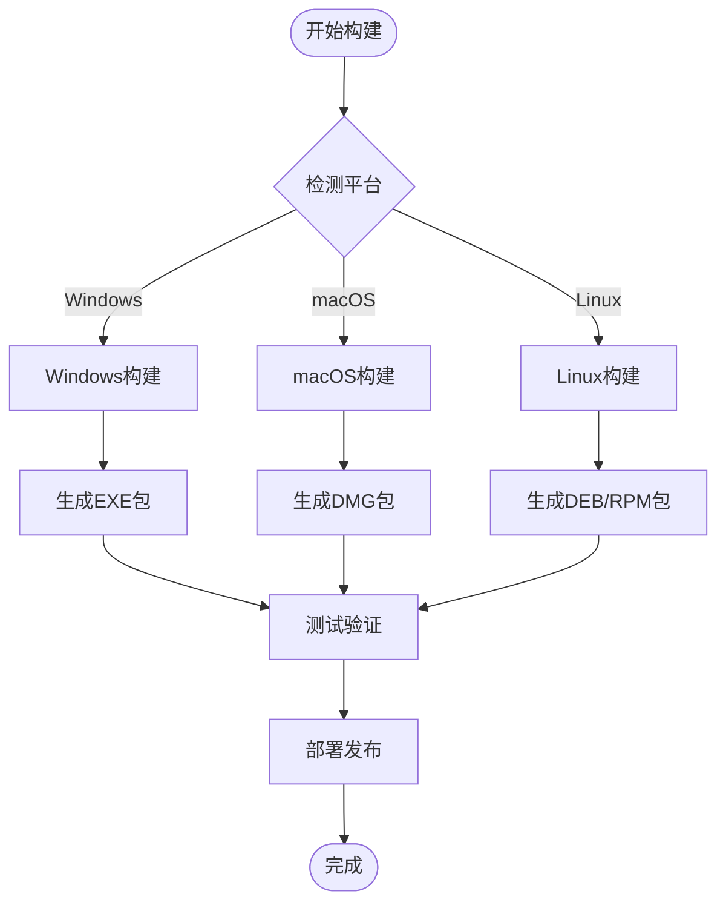

# 开发计划

<cite>
**本文档引用的文件**
- [README.md](file://README.md)
- [main.go](file://main.go)
- [downloader/types.go](file://downloader/types.go)
- [downloader/excel_parser.go](file://downloader/excel_parser.go)
- [downloader/manager.go](file://downloader/manager.go)
- [downloader/worker.go](file://downloader/worker.go)
- [gui/app.go](file://gui/app.go)
- [config/config.go](file://config/config.go)
- [go.mod](file://go.mod)
</cite>

## 目录
1. [概述](#概述)
2. [当前技术架构](#当前技术架构)
3. [待办功能分析](#待办功能分析)
4. [技术挑战与解决方案](#技术挑战与解决方案)
5. [社区贡献指南](#社区贡献指南)
6. [路线图规划](#路线图规划)
7. [总结](#总结)

## 概述

本文档基于项目README中列出的开发计划，详细分析了批量文件下载器项目的未来发展方向。项目采用Go语言开发，基于Fyne GUI框架构建跨平台桌面应用程序，目前主要支持Excel格式的批量下载任务管理。

项目的核心功能包括：
- 基于Excel表格的批量下载任务管理
- 多线程并发下载机制
- 自定义文件命名规则
- 实时进度监控
- 错误处理与重试机制

## 当前技术架构

### 系统架构概览



**图表来源**
- [gui/app.go](file://gui/app.go#L44-L73)
- [downloader/manager.go](file://downloader/manager.go#L13-L31)
- [downloader/excel_parser.go](file://downloader/excel_parser.go#L86-L94)

### 核心组件分析

#### 1. 下载管理器 (DownloadManager)
负责协调整个下载流程，管理任务队列和工作器池。

#### 2. Excel解析器 (ExcelParser)
专门处理Excel文件的解析，支持列索引查找、URL检测和文件名构建。

#### 3. 工作器池 (DownloadWorker)
实现多线程并发下载，每个工作器独立处理下载任务。

#### 4. 配置系统 (Config)
管理应用程序的全局配置参数。

**章节来源**
- [downloader/manager.go](file://downloader/manager.go#L13-L31)
- [downloader/excel_parser.go](file://downloader/excel_parser.go#L86-L94)
- [downloader/worker.go](file://downloader/worker.go#L16-L42)
- [config/config.go](file://config/config.go#L8-L14)

## 待办功能分析

### 1. 支持更多文件格式（CSV、JSON等）

#### 技术挑战
- **格式解析复杂性**：不同文件格式具有不同的结构和语义
- **数据验证**：需要确保解析后的数据符合下载任务要求
- **性能优化**：大型文件的内存管理和解析效率
- **错误处理**：格式错误和数据缺失的优雅处理

#### 预期收益
- 提高工具的通用性和适用场景
- 减少用户转换文件格式的工作量
- 增强与其他系统的集成能力

#### 实现策略
```mermaid
classDiagram
    class FileParser {
        <<interface>>
        +Parse(filePath string) []DownloadTask
        +Validate(data interface{}) error
    }
    class ExcelParser {
        +Parse(urlColumn, nameColumns, separator, fileExtension string) []DownloadTask
        +ReadExcelHeaders(excelPath string) []string
        +ReadExcelSampleData(excelPath string, maxRows int) [][]string
    }
    class CSVParser {
        +Parse(csvPath string, delimiter rune) []DownloadTask
        +ReadHeaders(csvPath string) []string
        +ValidateCSV(data [][]string) error
    }
    class JSONParser {
        +Parse(jsonPath string, template string) []DownloadTask
        +ExtractTasks(data interface{}) []DownloadTask
        +ValidateJSON(data interface{}) error
    }
    FileParser <|-- ExcelParser
    FileParser <|-- CSVParser
    FileParser <|-- JSONParser
```

**图表来源**
- [downloader/excel_parser.go](file://downloader/excel_parser.go#L86-L94)
- [downloader/types.go](file://downloader/types.go#L5-L20)

### 2. 增加代理设置功能

#### 技术挑战
- **HTTP客户端配置**：需要修改现有的HTTP客户端初始化
- **认证机制**：支持基本认证、NTLM等代理认证方式
- **连接池管理**：确保代理连接的复用和性能
- **错误处理**：代理连接失败的降级策略

#### 预期收益
- 提升在受限网络环境下的可用性
- 增强下载速度和稳定性
- 支持企业内部网络部署

#### 实现方案


**图表来源**
- [downloader/worker.go](file://downloader/worker.go#L26-L33)
- [config/config.go](file://config/config.go#L8-L14)

### 3. 添加下载历史记录

#### 技术挑战
- **持久化存储**：选择合适的存储方案（文件、数据库）
- **数据结构设计**：历史记录的数据模型
- **性能考虑**：大量历史记录的查询和管理
- **隐私保护**：敏感信息的存储和访问控制

#### 预期收益
- 提高用户体验和工作效率
- 支持任务重放和恢复
- 提供下载统计和分析功能

#### 数据模型设计
| 字段名 | 类型 | 描述 | 约束 |
|--------|------|------|------|
| id | UUID | 历史记录唯一标识 | 主键 |
| task_id | String | 对应的任务ID | 外键 |
| status | Enum | 下载状态：成功/失败/进行中 | 非空 |
| start_time | DateTime | 开始时间 | 非空 |
| end_time | DateTime | 结束时间 | 可空 |
| file_size | Int64 | 文件大小（字节） | 可空 |
| error_msg | Text | 错误信息 | 可空 |
| retry_count | Int | 重试次数 | 默认0 |
| metadata | JSON | 扩展元数据 | 可空 |

### 4. 支持macOS和Linux平台

#### 技术挑战
- **Fyne框架兼容性**：确保GUI组件在不同平台的一致性
- **文件系统差异**：处理不同操作系统的文件路径和权限
- **构建系统**：CI/CD管道的跨平台构建配置
- **打包分发**：不同平台的应用包格式

#### 预期收益
- 扩大用户群体
- 提高工具的便携性
- 增强企业级部署能力

#### 平台适配策略


**章节来源**
- [README.md](file://README.md#L112-L116)
- [go.mod](file://go.mod#L1-L36)

## 技术挑战与解决方案

### 支持CSV/JSON格式的技术挑战

#### 挑战1：格式多样性处理
不同CSV文件可能使用不同的分隔符、编码和结构，需要提供灵活的配置选项。

#### 解决方案：
- 实现智能格式检测算法
- 提供手动配置选项
- 支持自定义解析模板

#### 挑战2：大数据集处理
大型CSV/JSON文件可能导致内存溢出和性能问题。

#### 解决方案：
- 实现流式解析算法
- 添加分页和增量加载功能
- 提供内存使用监控

### 代理设置的技术挑战

#### 挑战1：认证机制复杂性
不同代理服务器支持不同的认证方式。

#### 解决方案：
- 实现标准HTTP认证机制
- 提供插件化的认证扩展
- 添加认证失败的重试机制

#### 挑战2：连接稳定性
代理连接可能不稳定，需要优雅的错误处理。

#### 解决方案：
- 实现连接池和健康检查
- 添加自动重连机制
- 提供代理切换功能

### 下载历史记录的技术挑战

#### 挑战1：数据一致性
历史记录的增删改查需要保证数据一致性。

#### 解决方案：
- 使用事务处理关键操作
- 实现乐观锁机制
- 添加数据校验和修复功能

#### 挑战2：查询性能
随着历史记录增长，查询性能可能成为瓶颈。

#### 解决方案：
- 实现索引优化
- 添加查询缓存机制
- 提供分页和过滤功能

### 跨平台支持的技术挑战

#### 挑战1：GUI组件差异
不同平台的GUI组件行为可能存在差异。

#### 解决方案：
- 使用Fyne框架的跨平台抽象
- 添加平台特定的适配层
- 进行全面的跨平台测试

#### 挑战2：文件系统差异
不同操作系统的文件路径和权限模型不同。

#### 解决方案：
- 使用Go的标准路径处理库
- 实现平台无关的文件操作接口
- 添加权限检查和提示功能

## 社区贡献指南

### 可参与的功能方向

#### 1. 格式解析器开发
- **CSV解析器**：实现基于流式的CSV解析
- **JSON解析器**：支持嵌套结构的JSON数据提取
- **通用接口**：设计统一的文件解析接口

#### 2. 代理功能增强
- **认证支持**：添加多种代理认证方式
- **连接管理**：优化代理连接池
- **故障转移**：实现多代理自动切换

#### 3. 历史记录系统
- **数据存储**：选择合适的持久化方案
- **查询接口**：提供高效的查询API
- **可视化**：添加历史记录的图表展示

#### 4. 跨平台优化
- **平台适配**：解决特定平台的问题
- **构建脚本**：完善CI/CD流程
- **打包工具**：制作平台特定的安装包

### 贡献流程


### 代码规范

- 使用Go官方的代码风格指南
- 添加充分的单元测试
- 提供清晰的文档注释
- 遵循Git提交消息规范

### Issue提交指南

当遇到问题或有改进建议时，请：
1. 搜索现有Issue，避免重复
2. 提供详细的环境信息
3. 包含重现步骤和预期行为
4. 使用适当的标签分类

## 路线图规划

### 短期目标（1-3个月）

#### 第一阶段：核心功能扩展
- [ ] CSV格式支持开发
- [ ] JSON格式支持开发
- [ ] 基础代理功能实现
- [ ] Windows平台优化

#### 第二阶段：用户体验改进
- [ ] 下载历史记录界面
- [ ] 批量任务管理功能
- [ ] 自定义主题支持
- [ ] 快捷键和命令行支持

### 中期目标（3-6个月）

#### 第三阶段：企业级功能
- [ ] 多用户支持
- [ ] 权限管理系统
- [ ] 任务调度功能
- [ ] 监控和报警系统

#### 第四阶段：跨平台完善
- [ ] macOS原生支持
- [ ] Linux桌面集成
- [ ] 移动端适配
- [ ] Web版本开发

### 长期目标（6-12个月）

#### 第五阶段：生态建设
- [ ] 插件系统开发
- [ ] API开放平台
- [ ] 第三方集成
- [ ] 开源社区建设

#### 第六阶段：技术创新
- [ ] AI辅助任务分析
- [ ] 智能下载优化
- [ ] 区块链溯源
- [ ] 边缘计算支持

## 总结

批量文件下载器项目正处于快速发展阶段，通过实现README中列出的各项开发计划，项目将能够：
- 扩展文件格式支持，提高工具的通用性
- 增强网络适应能力，支持更复杂的网络环境
- 完善功能体系，提供更好的用户体验
- 实现跨平台部署，扩大用户基础

这些改进不仅能够满足当前用户的需求，还将为未来的功能扩展奠定坚实的基础。我们诚挚邀请社区贡献者参与这些重要功能的开发，共同推动项目的持续发展。

通过保持路线图的透明度和积极参与社区讨论，我们将能够更好地协调开发资源，确保项目的长期成功。让我们携手打造一个功能强大、用户友好的批量下载工具，为用户提供卓越的下载体验。