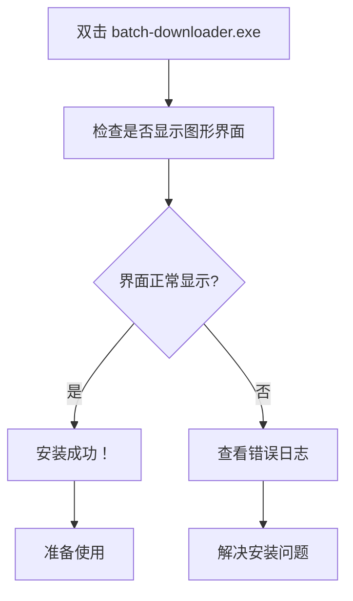
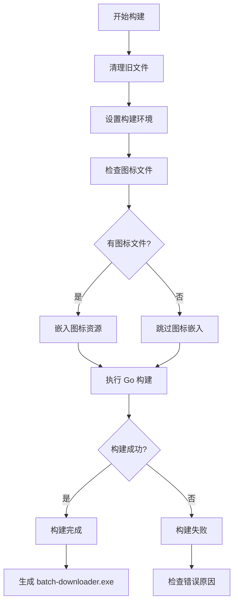
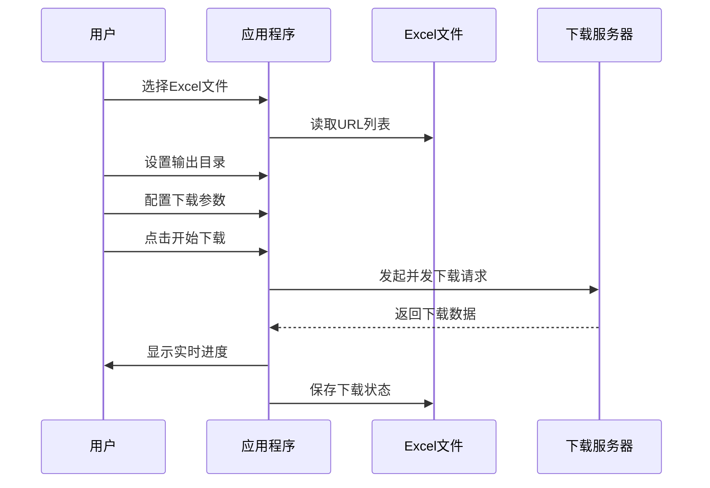

# 快速开始

<cite>
**本文档中引用的文件**
- [README.md](file://README.md)
- [build.bat](file://build.bat)
- [build-debug.bat](file://build-debug.bat)
- [go.mod](file://go.mod)
- [main.go](file://main.go)
- [prepare-icon.bat](file://prepare-icon.bat)
</cite>

## 目录
1. [简介](#简介)
2. [下载安装方式](#下载安装方式)
3. [本地构建方式](#本地构建方式)
4. [环境要求](#环境要求)
5. [构建步骤详解](#构建步骤详解)
6. [运行程序](#运行程序)
7. [调试模式](#调试模式)
8. [常见问题](#常见问题)
9. [总结](#总结)

## 简介

批量文件下载器是一个基于 Go 语言开发的图形界面工具，可以从 Excel 表格中读取 URL 并自动下载文件。它提供了直观的用户界面，支持多线程并发下载、自定义文件命名规则和实时进度监控等功能。

**核心特性：**
- 🖥️ 图形用户界面，易于操作
- 📊 通过 Excel 表格管理下载任务
- ⚡ 多线程并发下载，提高效率
- 📝 自定义文件命名规则
- 📈 实时显示下载进度和统计信息
- 🛑 支持随时取消下载任务
- 📁 自动分类保存下载文件

## 下载安装方式

这是最简单的方式，适合不需要修改源代码的用户。

### 步骤 1：访问 Releases 页面

1. 打开浏览器，访问项目的 GitHub Releases 页面：
   ```
   https://github.com/LxShine/batch-downloader/releases
   ```

2. 在最新版本发布页面中，找到适用于 Windows 系统的预编译二进制文件。

### 步骤 2：下载并解压

1. 点击下载对应版本的 `.zip` 文件
2. 将下载的压缩包解压到您希望安装的位置

### 步骤 3：运行程序

1. 双击解压后的 `batch-downloader.exe` 文件
2. 程序启动后会显示图形界面

### 验证安装

程序启动后，您应该能看到类似以下的界面（截图预览）：



**图表来源**
- [main.go](file://main.go#L8-L12)

## 本地构建方式

如果您需要修改源代码或希望获得最新的开发版本，可以选择本地构建。

### 环境要求

在开始构建之前，请确保您的系统满足以下要求：

| 要求项 | 版本要求 | 说明 |
|--------|----------|------|
| Go 语言版本 | 1.25 或更高版本 | 必须安装 Go 1.25+ |
| 操作系统 | Windows 系统 | 目前仅支持 Windows 平台 |
| 编译器 | MinGW-w64 GCC | 用于编译 C 依赖项 |
| 内存 | 至少 512MB | 用于编译过程 |

### 获取源代码

1. 打开命令提示符（CMD）或 PowerShell
2. 克隆项目仓库：

```cmd
git clone https://github.com/LxShine/batch-downloader.git
cd batch-downloader
```

### 构建过程详解

项目提供了两个构建脚本，分别用于不同场景：

#### 标准构建（build.bat）

标准构建脚本会创建一个不带控制台窗口的可执行文件，适合最终用户使用。

**构建流程：**



**图表来源**
- [build.bat](file://build.bat#L1-L100)

#### 调试构建（build-debug.bat）

调试构建脚本创建一个带有控制台窗口的可执行文件，便于开发和调试。

**主要区别：**
- 显示控制台窗口用于输出调试信息
- 不添加 `-H=windowsgui` 标志
- 更容易捕获运行时错误

### 构建命令

1. **标准构建：**
   ```cmd
   build.bat
   ```

2. **调试构建：**
   ```cmd
   build-debug.bat
   ```

### 构建输出

构建完成后，您将在当前目录看到以下输出：

```
========================================
    Batch File Downloader - Build
========================================

[1/5] Cleaning old files...
[2/5] Setting build environment...
[3/5] Checking for icon files...
[OK] icon.ico found - will embed in EXE
[OK] icon.png found - will be used for window icon
[4/5] Embedding icon resource...
[5/5] Building (no console window)...

========================================
    Build Success!
========================================

Output: batch-downloader.exe
Size: 1234567 bytes

Icons:
   [OK] EXE icon embedded (icon.ico)
   [OK] Window icon available (icon.png)

Run batch-downloader.exe to start
No console window will be shown
```

**节来源**
- [build.bat](file://build.bat#L56-L82)

## 环境要求

### Go 语言环境

项目使用 Go 1.25 作为开发语言，确保您的系统已正确安装：

1. **检查 Go 版本：**
   ```cmd
   go version
   ```

2. **安装 Go 1.25+：**
   - 访问 Go 官方网站：https://golang.org/
   - 下载对应 Windows 系统的安装包
   - 按照安装向导完成安装

### Windows 系统要求

- **操作系统：** Windows 10 或更高版本
- **架构：** x64（AMD64）
- **权限：** 需要管理员权限进行某些操作

### 依赖库

项目依赖以下主要库：

| 库名称 | 版本 | 用途 |
|--------|------|------|
| fyne.io/fyne/v2 | v2.7.1 | 图形用户界面框架 |
| github.com/xuri/excelize/v2 | v2.10.0 | Excel 文件处理 |

**节来源**
- [go.mod](file://go.mod#L3-L8)

## 构建步骤详解

### 第一步：克隆项目

```cmd
git clone https://github.com/LxShine/batch-downloader.git
cd batch-downloader
```

### 第二步：准备图标文件（可选）

为了获得更好的用户体验，您可以准备自定义图标：

1. **下载图标工具：**
   ```cmd
   prepare-icon.bat
   ```

2. **图标文件要求：**
   - `icon.ico`：用于 Windows 资源管理器中的文件图标
   - `icon.png`：用于应用程序窗口标题栏图标

3. **图标规格：**
   - ICO 文件：推荐 256x256 像素
   - PNG 文件：推荐 256x256 像素

### 第三步：执行构建

```cmd
build.bat
```

### 第四步：验证构建结果

构建完成后，检查以下内容：

1. **文件存在性：**
   - `batch-downloader.exe` 应该出现在当前目录

2. **文件大小：**
   - 正常大小应在 10MB 到 20MB 之间

3. **图标状态：**
   - 如果提供了图标文件，应该看到图标嵌入成功的消息

**节来源**
- [prepare-icon.bat](file://prepare-icon.bat#L1-L78)

## 运行程序

### 启动应用程序

1. **标准方式：**
   ```cmd
   batch-downloader.exe
   ```

2. **快捷方式：**
   - 创建桌面快捷方式
   - 双击快捷方式启动

### 程序界面

首次启动时，您将看到以下界面元素：

- **Excel 文件选择区域**：浏览并选择包含下载链接的 Excel 文件
- **输出目录设置**：指定下载文件的保存位置
- **下载配置选项**：设置下载参数
- **控制按钮**：开始下载和取消下载

### 基本使用流程



**图表来源**
- [main.go](file://main.go#L8-L12)

## 调试模式

### 何时使用调试模式

调试模式特别适合以下场景：

1. **开发阶段**：修改源代码后测试新功能
2. **问题排查**：遇到运行时错误需要查看详细信息
3. **性能分析**：监控程序运行状态

### 使用方法

1. **执行调试构建：**
   ```cmd
   build-debug.bat
   ```

2. **运行调试版本：**
   ```cmd
   batch-downloader-debug.exe
   ```

### 调试模式特点

- **控制台窗口**：显示详细的运行时信息
- **错误报告**：更清晰的错误堆栈跟踪
- **日志输出**：实时输出程序执行状态

### 调试输出示例

```cmd
[INFO] 应用程序启动
[DEBUG] 加载配置文件
[INFO] 读取Excel文件: example.xlsx
[DEBUG] 发现10个下载任务
[INFO] 开始下载任务...
[PROGRESS] 下载完成: 5/10 (50%)
```

**节来源**
- [build-debug.bat](file://build-debug.bat#L16-L30)

## 常见问题

### 构建失败问题

**问题：GCC 编译器未找到**
```
error: C compiler cannot create executables
```

**解决方案：**
1. 安装 MinGW-w64 GCC 编译器
2. 将 GCC 添加到系统 PATH
3. 重新运行构建脚本

**问题：Go 模块下载失败**
```
go: module download failed
```

**解决方案：**
1. 检查网络连接
2. 设置 GOPROXY：
   ```cmd
   go env -w GOPROXY=https://proxy.golang.org,direct
   ```
3. 清理模块缓存：
   ```cmd
   go clean -modcache
   ```

### 运行时问题

**问题：程序启动后无响应**
- 检查是否有防火墙阻止
- 尝试以管理员身份运行
- 查看事件查看器中的错误日志

**问题：下载速度过慢**
- 增加并发下载数（1-50）
- 检查网络连接质量
- 确认目标服务器支持并发连接

### 图标问题

**问题：图标未正确显示**
- 确保图标文件位于项目根目录
- 检查图标文件格式是否正确
- 重新运行构建脚本

## 总结

通过本指南，您已经掌握了批量文件下载器的两种安装方式：

### 下载安装方式（推荐给普通用户）
- 从 Releases 页面获取预编译版本
- 直接运行，无需额外配置
- 适合日常使用和基本下载需求

### 本地构建方式（推荐给开发者）
- 克隆源代码进行自定义
- 使用构建脚本生成可执行文件
- 支持调试模式进行问题排查

### 关键要点

1. **环境准备**：确保 Go 1.25+ 和 Windows 系统
2. **构建选择**：根据需求选择标准或调试构建
3. **图标准备**：可选但能提升用户体验
4. **运行验证**：检查文件存在性和功能正常性

### 下一步建议

1. **熟悉界面**：花几分钟时间了解各个功能按钮的作用
2. **准备测试文件**：创建一个简单的 Excel 测试文件
3. **尝试基本功能**：先进行小规模的下载测试
4. **探索高级功能**：研究自定义命名规则和并发设置

通过以上步骤，您应该能够在 5 分钟内完成环境搭建并成功启动程序。如果在使用过程中遇到任何问题，请参考常见问题部分或查阅项目的 GitHub Issues 页面获取帮助。