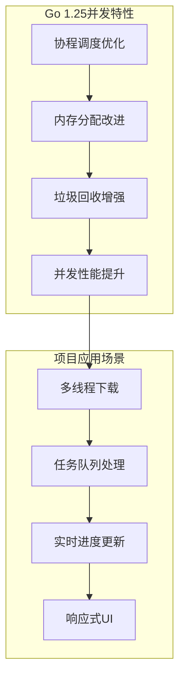
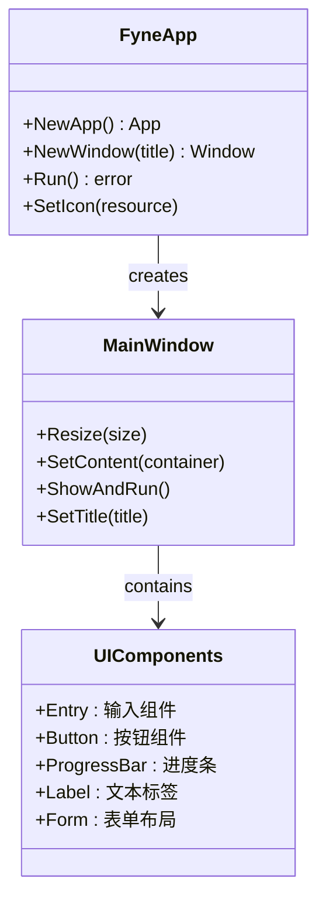
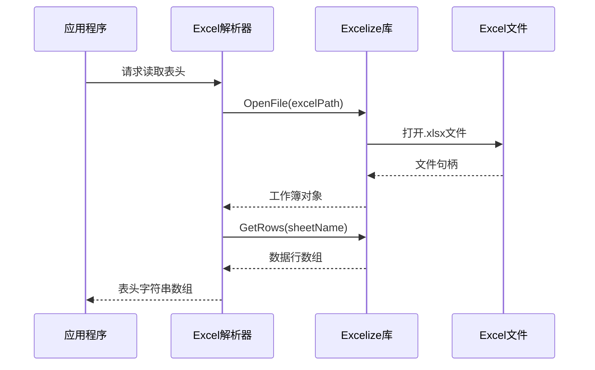
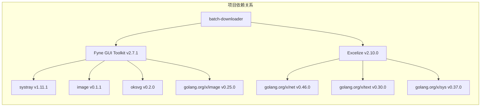
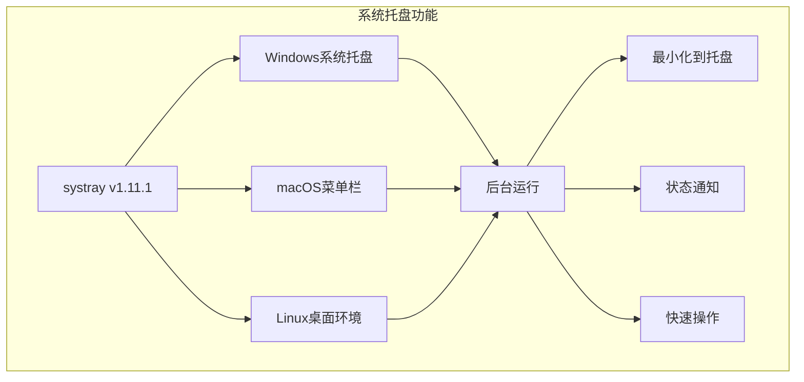
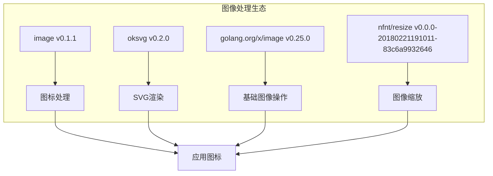

# 技术栈与依赖

<cite>
**本文档引用的文件**
- [go.mod](file://go.mod)
- [go.sum](file://go.sum)
- [main.go](file://main.go)
- [gui/app.go](file://gui/app.go)
- [downloader/excel_parser.go](file://downloader/excel_parser.go)
- [downloader/manager.go](file://downloader/manager.go)
- [downloader/worker.go](file://downloader/worker.go)
- [downloader/types.go](file://downloader/types.go)
- [config/config.go](file://config/config.go)
- [README.md](file://README.md)
</cite>

## 目录
1. [项目概述](#项目概述)
2. [Go语言版本与并发处理](#go语言版本与并发处理)
3. [Fyne GUI Toolkit详解](#fyne-gui-toolkit详解)
4. [Excelize库应用](#excelize库应用)
5. [依赖关系分析](#依赖关系分析)
6. [间接依赖作用范围](#间接依赖作用范围)
7. [依赖管理建议](#依赖管理建议)
8. [总结](#总结)

## 项目概述

本项目是一个基于Go语言开发的批量文件下载工具，采用现代化的技术栈构建，具备跨平台GUI界面和高效的并发下载能力。项目的核心目标是通过图形化界面简化批量文件下载流程，支持从Excel表格中读取下载任务并自动执行下载。

**章节来源**
- [README.md](file://README.md#L1-L10)

## Go语言版本与并发处理

### Go 1.25版本特性

项目采用Go 1.25作为主要开发语言，这一版本在并发处理方面具有显著优势：



**图表来源**
- [downloader/manager.go](file://downloader/manager.go#L13-L31)
- [downloader/worker.go](file://downloader/worker.go#L16-L42)

### 并发处理架构

项目实现了完整的并发下载架构，充分利用Go语言的并发特性：

#### 下载管理器设计
- **工作器池**：支持动态调整的工作器数量（1-50个）
- **任务队列**：无界缓冲通道，支持大量并发任务
- **结果聚合**：异步处理下载结果，实时更新进度

#### 工作器模式
每个工作器独立处理下载任务：
- **HTTP客户端配置**：支持超时控制和连接池管理
- **重试机制**：指数退避算法，最大重试3次
- **资源清理**：自动清理临时文件和网络连接

**章节来源**
- [downloader/manager.go](file://downloader/manager.go#L46-L76)
- [downloader/worker.go](file://downloader/worker.go#L25-L42)

## Fyne GUI Toolkit详解

### 跨平台能力

Fyne是一个现代化的Go GUI框架，为本项目提供了强大的跨平台支持：



**图表来源**
- [gui/app.go](file://gui/app.go#L44-L95)

### 组件模型

Fyne采用声明式的组件模型，项目中的核心UI组件包括：

#### 主要组件类型
- **输入组件**：文件路径选择、目录选择、文本输入
- **交互组件**：按钮、下拉选择框、复选框组
- **展示组件**：进度条、标签、多行文本框
- **布局组件**：边框布局、容器、滚动视图

#### 特色功能
- **主题支持**：内置暗色/亮色主题切换
- **图标集成**：支持PNG和ICO格式图标
- **国际化**：内置多语言支持框架
- **系统托盘**：后台运行支持

### 在项目中的具体应用

项目在GUI层面的应用体现了Fyne的强大功能：

#### 界面布局
- **三区域布局**：表单区域、进度区域、日志区域
- **响应式设计**：自适应窗口大小变化
- **组件状态管理**：动态启用/禁用按钮状态

#### 用户体验
- **实时反馈**：下载进度百分比、速度统计
- **错误处理**：友好的错误提示对话框
- **操作确认**：取消下载前的确认机制

**章节来源**
- [gui/app.go](file://gui/app.go#L104-L263)
- [gui/app.go](file://gui/app.go#L267-L290)

## Excelize库应用

### Excel文件处理能力

Excelize是项目中处理Excel文件的核心库，支持.xlsx格式的完整读写功能：



**图表来源**
- [downloader/excel_parser.go](file://downloader/excel_parser.go#L15-L46)

### 具体应用方式

#### 表头读取功能
项目实现了智能的表头读取机制：
- **自动识别**：根据Excel文件结构自动识别表头
- **列映射**：支持列名和列号两种引用方式
- **数据验证**：确保表头的有效性和完整性

#### Excel解析流程
- **文件验证**：检查文件是否存在和可读
- **工作表遍历**：自动选择第一个工作表
- **数据提取**：提取指定范围的数据行
- **格式转换**：将Excel数据转换为内部数据结构

#### 高级功能
- **列自动识别**：智能识别包含URL的列
- **多列组合**：支持多个列组合生成文件名
- **数据清洗**：自动清理非法字符和空白
- **扩展名推断**：从URL自动推断文件扩展名

**章节来源**
- [downloader/excel_parser.go](file://downloader/excel_parser.go#L48-L83)
- [downloader/excel_parser.go](file://downloader/excel_parser.go#L96-L171)

## 依赖关系分析

### 直接依赖

项目的主要直接依赖包括两个核心库：



**图表来源**
- [go.mod](file://go.mod#L5-L8)

#### Fyne GUI Toolkit (v2.7.1)
- **版本选择依据**：稳定性和功能完整性
- **核心功能**：跨平台GUI框架，提供丰富的UI组件
- **特性支持**：现代UI设计、主题系统、国际化

#### Excelize (v2.10.0)
- **版本选择依据**：成熟度和社区支持
- **核心功能**：Excel文件读写，支持.xlsx格式
- **特性支持**：公式计算、图表生成、样式设置

### 版本选择策略

#### Fyne v2.7.1
- **稳定性**：经过充分测试的稳定版本
- **兼容性**：与Go 1.25完美兼容
- **功能完整性**：包含所有必要的GUI功能

#### Excelize v2.10.0
- **成熟度**：活跃维护的成熟库
- **性能**：优化的内存使用和处理速度
- **功能覆盖**：完整的Excel格式支持

**章节来源**
- [go.mod](file://go.mod#L5-L8)
- [go.sum](file://go.sum#L1-L2)

## 间接依赖作用范围

### 系统托盘支持



**图表来源**
- [go.mod](file://go.mod#L10-L12)

### 国际化支持

项目集成了国际化框架，支持多语言界面：

- **go-i18n/v2 v2.5.1**：提供翻译管理和本地化支持
- **语言包管理**：支持动态语言切换
- **文本本地化**：界面文本的多语言适配

### 图像处理能力



**图表来源**
- [go.mod](file://go.mod#L17-L30)

### 网络和安全

- **golang.org/x/net v0.46.0**：网络协议和安全支持
- **golang.org/x/text v0.30.0**：文本处理和编码支持
- **golang.org/x/sys v0.37.0**：系统调用接口
- **golang.org/x/crypto v0.43.0**：加密和安全功能

**章节来源**
- [go.mod](file://go.mod#L10-L48)

## 依赖管理建议

### 版本更新策略

#### 定期更新原则
1. **稳定性优先**：优先考虑稳定版本而非最新版本
2. **兼容性测试**：每次更新后进行全面的功能测试
3. **渐进式升级**：逐步升级依赖，避免大规模重构

#### 关键依赖更新
- **Fyne**：关注新版本的UI改进和性能优化
- **Excelize**：跟进Excel格式支持和bug修复
- **Go语言**：及时升级到最新的稳定版本

### 兼容性处理

#### 版本锁定策略
```go
// go.mod中的版本约束示例
require (
    fyne.io/fyne/v2 v2.7.1
    github.com/xuri/excelize/v2 v2.10.0
)
```

#### 向后兼容性
- **API稳定性**：优先选择API稳定的版本
- **废弃功能**：及时迁移废弃的功能
- **测试覆盖**：确保更新后的功能测试覆盖率

### 依赖优化

#### 减少间接依赖
- **定期审查**：使用`go mod graph`分析依赖关系
- **移除冗余**：清理不再使用的间接依赖
- **版本统一**：协调相同功能的不同库版本

#### 性能优化
- **编译优化**：利用Go的编译缓存机制
- **模块化**：按需引入功能模块
- **资源管理**：合理配置内存和CPU使用

**章节来源**
- [go.mod](file://go.mod#L1-L50)

## 总结

本项目的技术栈展现了现代Go应用程序的最佳实践：

### 技术优势
- **Go 1.25**：提供了强大的并发处理能力和优秀的性能表现
- **Fyne GUI**：实现了真正的跨平台GUI解决方案，用户体验优秀
- **Excelize**：专业化的Excel处理库，功能完整且稳定可靠

### 架构特点
- **模块化设计**：清晰的分层架构，便于维护和扩展
- **并发优化**：充分利用Go语言的并发特性，实现高效的批量下载
- **用户体验**：直观的图形界面和实时的进度反馈

### 发展方向
项目的技术栈为未来的功能扩展奠定了坚实基础，支持进一步的功能增强和平台扩展。通过合理的依赖管理和持续的优化，项目能够保持技术先进性和竞争力。