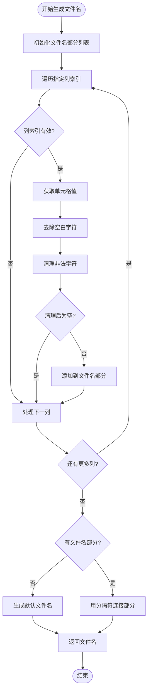

# Excel解析器设计

<cite>
**本文档引用的文件**
- [downloader/excel_parser.go](file://downloader/excel_parser.go)
- [downloader/types.go](file://downloader/types.go)
- [downloader/manager.go](file://downloader/manager.go)
- [gui/app.go](file://gui/app.go)
- [config/config.go](file://config/config.go)
</cite>

## 目录
1. [简介](#简介)
2. [项目结构概述](#项目结构概述)
3. [核心组件分析](#核心组件分析)
4. [架构概览](#架构概览)
5. [详细组件分析](#详细组件分析)
6. [依赖关系分析](#依赖关系分析)
7. [性能考虑](#性能考虑)
8. [故障排除指南](#故障排除指南)
9. [结论](#结论)

## 简介

Excel解析器是批量文件下载器系统的核心组件之一，负责从Excel文件中提取下载任务信息。该模块以`downloader/excel_parser.go`为核心，利用excelize库实现对Excel文件的读取、解析和任务生成。解析器提供了灵活的文件名生成策略、健壮的错误处理机制，以及智能的列标识转换功能。

## 项目结构概述

批量文件下载器采用分层架构设计，主要包含以下核心模块：

**图表来源**
- [gui/app.go](file://gui/app.go#L44-L77)
- [downloader/manager.go](file://downloader/manager.go#L13-L31)
- [downloader/excel_parser.go](file://downloader/excel_parser.go#L86-L94)

**章节来源**
- [gui/app.go](file://gui/app.go#L1-L743)
- [downloader/manager.go](file://downloader/manager.go#L1-L59)
- [downloader/excel_parser.go](file://downloader/excel_parser.go#L1-L317)

## 核心组件分析

### ExcelParser结构体

ExcelParser是整个解析器的核心结构体，负责协调Excel文件的读取、解析和任务生成过程。

**图表来源**
- [downloader/excel_parser.go](file://downloader/excel_parser.go#L86-L94)
- [config/config.go](file://config/config.go#L8-L14)
- [downloader/types.go](file://downloader/types.go#L5-L11)

**章节来源**
- [downloader/excel_parser.go](file://downloader/excel_parser.go#L86-L94)
- [config/config.go](file://config/config.go#L8-L14)

## 架构概览

Excel解析器的整体架构遵循单一职责原则，将不同功能模块清晰分离：

**图表来源**
- [downloader/manager.go](file://downloader/manager.go#L41-L44)
- [downloader/excel_parser.go](file://downloader/excel_parser.go#L96-L171)

## 详细组件分析

### Parse方法执行流程

Parse方法是Excel解析器的核心入口，实现了完整的任务解析流程：

**图表来源**
- [downloader/excel_parser.go](file://downloader/excel_parser.go#L96-L171)

#### 列标识转换机制

解析器提供了强大的列标识转换功能，支持多种输入格式：

**图表来源**
- [downloader/excel_parser.go](file://downloader/excel_parser.go#L288-L301)
- [downloader/excel_parser.go](file://downloader/excel_parser.go#L303-L316)

**章节来源**
- [downloader/excel_parser.go](file://downloader/excel_parser.go#L96-L171)
- [downloader/excel_parser.go](file://downloader/excel_parser.go#L288-L316)

### 文件名生成策略

buildFilename方法实现了灵活的文件名生成策略，支持多列组合和自定义分隔符：

**图表来源**
- [downloader/excel_parser.go](file://downloader/excel_parser.go#L174-L198)

**章节来源**
- [downloader/excel_parser.go](file://downloader/excel_parser.go#L174-L198)

### 错误处理机制

解析器实现了多层次的错误处理机制，确保系统的健壮性：

| 错误类型 | 处理策略 | 示例场景 |
|---------|---------|---------|
| 文件级错误 | 立即返回，提供详细错误信息 | Excel文件不存在、权限不足 |
| 工作表错误 | 提示用户检查文件结构 | 文件中没有工作表 |
| 数据错误 | 跳过无效行，继续处理 | 空行、格式错误的数据 |
| 列标识错误 | 返回具体列名错误信息 | 无效的URL列、空的文件名列 |
| 任务生成错误 | 返回无有效任务错误 | 所有行都缺少URL或文件名 |

**章节来源**
- [downloader/excel_parser.go](file://downloader/excel_parser.go#L96-L171)

### GUI集成功能

GUI模块提供了自动识别URL列的功能，通过ReadExcelHeaders和ReadExcelSampleData两个辅助函数实现：

**图表来源**
- [gui/app.go](file://gui/app.go#L317-L374)
- [gui/app.go](file://gui/app.go#L377-L415)

**章节来源**
- [gui/app.go](file://gui/app.go#L317-L374)
- [gui/app.go](file://gui/app.go#L377-L415)

## 依赖关系分析

Excel解析器的依赖关系体现了良好的分层架构设计：

**图表来源**
- [downloader/excel_parser.go](file://downloader/excel_parser.go#L3-L13)
- [downloader/manager.go](file://downloader/manager.go#L3-L12)

**章节来源**
- [downloader/excel_parser.go](file://downloader/excel_parser.go#L3-L13)
- [downloader/manager.go](file://downloader/manager.go#L3-L12)

## 性能考虑

### 内存优化策略

1. **延迟加载**: 只在需要时才打开Excel文件
2. **流式处理**: 逐行处理数据，避免一次性加载整个文件
3. **资源管理**: 使用defer确保文件句柄及时释放

### 并发安全

解析器在多线程环境下的安全性体现在：
- 配置对象的不可变性
- 线程安全的错误处理
- 原子操作的状态管理

### 缓存机制

GUI层实现了智能缓存：
- 表头信息缓存
- 自动识别结果缓存
- 用户输入验证缓存

## 故障排除指南

### 常见问题及解决方案

| 问题描述 | 可能原因 | 解决方案 |
|---------|---------|---------|
| Excel文件读取失败 | 文件损坏或格式不支持 | 检查文件完整性，确认使用.xlsx格式 |
| 列标识无效 | 输入格式错误 | 支持表头名称或列号(A,B,C...) |
| 文件名生成异常 | 包含非法字符 | 系统自动清理非法字符 |
| 下载任务为空 | 缺少URL或文件名 | 检查Excel数据格式和列设置 |

### 调试技巧

1. **启用详细日志**: 在GUI中查看详细的解析过程日志
2. **验证输入**: 确保Excel文件格式正确，列标识有效
3. **检查配置**: 验证输出目录权限和并发设置

**章节来源**
- [downloader/excel_parser.go](file://downloader/excel_parser.go#L96-L171)
- [gui/app.go](file://gui/app.go#L451-L552)

## 结论

Excel解析器设计体现了现代软件开发的最佳实践：

1. **模块化设计**: 清晰的职责分离和接口定义
2. **健壮性**: 完善的错误处理和边界条件检查
3. **灵活性**: 支持多种输入格式和配置选项
4. **用户体验**: 智能的自动识别和直观的错误提示
5. **性能优化**: 合理的内存使用和并发处理

该解析器不仅满足了批量下载的基本需求，还通过灵活的文件名生成策略和智能的列识别功能，为用户提供了强大而易用的Excel数据处理能力。其设计模式和实现技巧可以作为类似项目的参考范例。