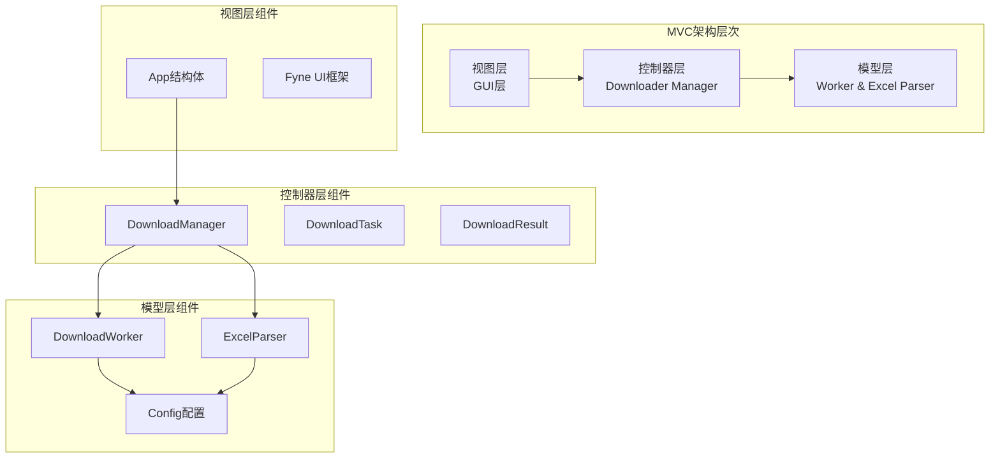
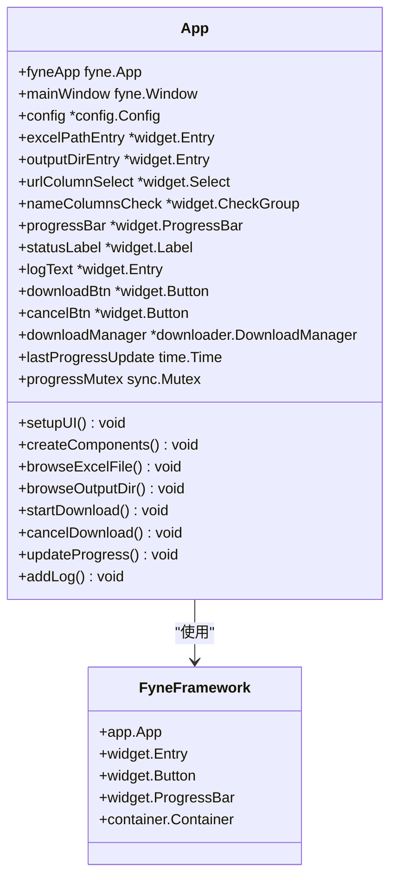
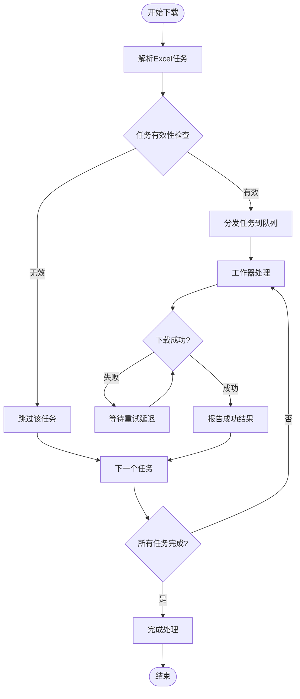
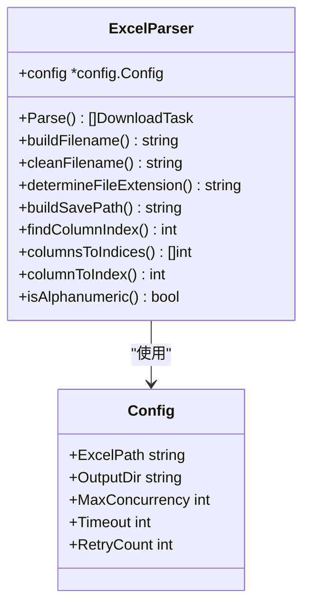
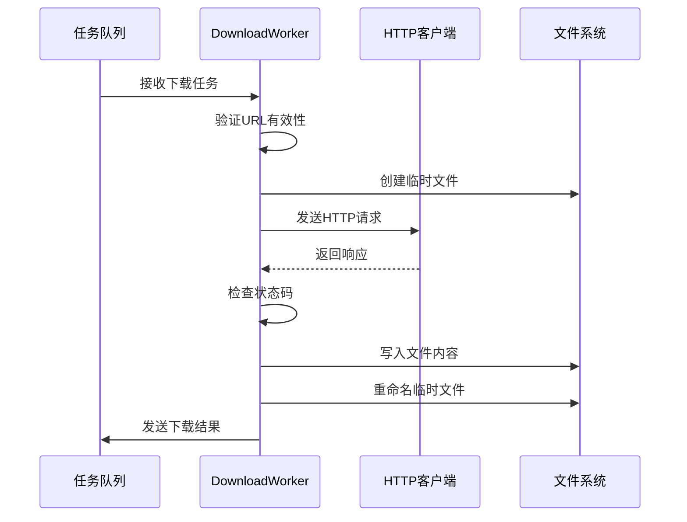
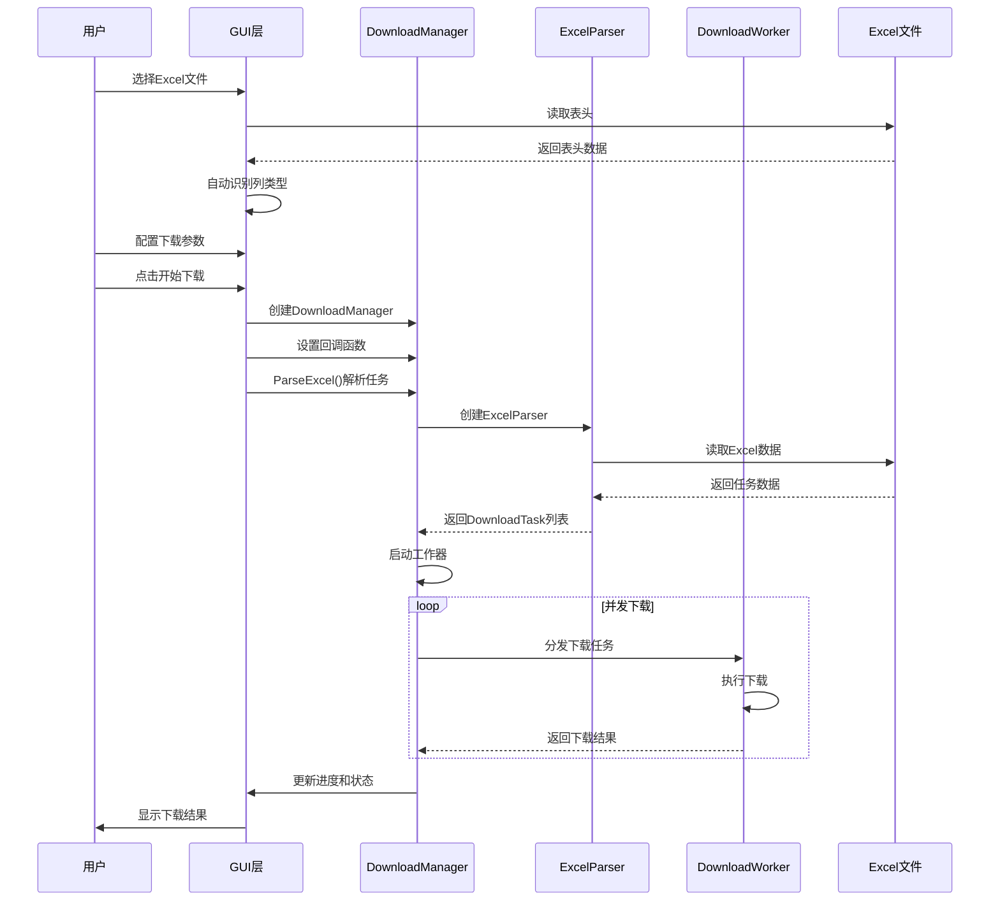

# MVC架构设计

<cite>
**本文档引用的文件**
- [main.go](file://main.go)
- [gui/app.go](file://gui/app.go)
- [downloader/manager.go](file://downloader/manager.go)
- [downloader/worker.go](file://downloader/worker.go)
- [downloader/excel_parser.go](file://downloader/excel_parser.go)
- [downloader/types.go](file://downloader/types.go)
- [config/config.go](file://config/config.go)
</cite>

## 目录
1. [项目概述](#项目概述)
2. [MVC架构概览](#mvc架构概览)
3. [视图层（View Layer）](#视图层view-layer)
4. [控制器层（Controller Layer）](#控制器层controller-layer)
5. [模型层（Model Layer）](#模型层model-layer)
6. [组件交互流程](#组件交互流程)
7. [数据流分析](#数据流分析)
8. [架构优势](#架构优势)
9. [总结](#总结)

## 项目概述

本项目是一个基于Go语言开发的批量文件下载器，采用改进的MVC（Model-View-Controller）架构模式。该系统通过分离关注点的方式实现了清晰的职责划分，提高了代码的可维护性和可测试性。

### 核心功能
- **Excel文件解析**：自动识别下载链接和文件名组成列
- **并发下载管理**：支持多线程并发下载
- **智能重试机制**：具备指数退避重试策略
- **实时进度监控**：提供详细的下载进度和状态信息

## MVC架构概览

本项目采用了经典的MVC架构变体，通过三层分离实现了良好的代码组织结构：



**图表来源**
- [gui/app.go](file://gui/app.go#L44-L78)
- [downloader/manager.go](file://downloader/manager.go#L13-L31)
- [downloader/worker.go](file://downloader/worker.go#L16-L23)
- [downloader/excel_parser.go](file://downloader/excel_parser.go#L86-L94)

## 视图层（View Layer）

视图层负责用户界面的展示和用户交互处理，主要由Fyne框架实现。

### 核心组件

#### App结构体
App结构体是视图层的核心，包含了所有UI组件和状态管理：



**图表来源**
- [gui/app.go](file://gui/app.go#L44-L78)

#### UI组件管理
视图层通过以下方式管理UI组件：

1. **输入验证**：实时验证用户输入的有效性
2. **状态控制**：根据下载状态动态更新UI元素
3. **进度显示**：提供详细的下载进度和统计信息
4. **日志记录**：实时显示下载过程中的详细信息

#### 用户交互处理
- **文件浏览**：支持Excel文件和输出目录的选择
- **配置设置**：允许用户自定义下载参数
- **下载控制**：提供开始和取消下载的功能
- **实时反馈**：通过进度条和状态标签提供即时反馈

**章节来源**
- [gui/app.go](file://gui/app.go#L1-L743)

## 控制器层（Controller Layer）

控制器层是系统的协调中心，负责管理下载任务的调度和资源分配。

### DownloadManager核心功能

```mermaid
classDiagram
class DownloadManager {
+config *config.Config
+workers []*DownloadWorker
+taskQueue chan DownloadTask
+resultChan chan DownloadResult
+progressCallback func(float64, int, int)
+logCallback func(string)
+completionCallback func(bool)
+isRunning atomic.Bool
+isCancelled atomic.Bool
+totalTasks int
+completedTasks int32
+wg sync.WaitGroup
+ParseExcel() []DownloadTask
+StartDownload() void
+Cancel() void
+SetProgressCallback() void
+SetLogCallback() void
+SetCompletionCallback() void
+updateProgress() void
}
class DownloadWorker {
+id int
+config *config.Config
+taskQueue <-chan DownloadTask
+resultChan chan<- DownloadResult
+client *http.Client
+stopChan chan struct{}
+Start() void
+run() void
+processTask() void
+downloadWithRetry() DownloadResult
+downloadFile() DownloadResult
+Stop() void
}
DownloadManager --> DownloadWorker : "管理"
DownloadManager --> ExcelParser : "使用"
```

**图表来源**
- [downloader/manager.go](file://downloader/manager.go#L13-L31)
- [downloader/worker.go](file://downloader/worker.go#L16-L23)

### 任务调度机制

控制器层实现了高效的并发任务调度：

1. **任务分发**：将Excel解析得到的任务分发到工作器队列
2. **并发控制**：通过配置的最大并发数限制同时工作的下载器数量
3. **结果聚合**：收集所有工作器的下载结果并进行汇总处理
4. **状态同步**：维护全局的下载状态和进度信息

### 错误处理和重试机制



**图表来源**
- [downloader/manager.go](file://downloader/manager.go#L67-L177)
- [downloader/worker.go](file://downloader/worker.go#L66-L103)

**章节来源**
- [downloader/manager.go](file://downloader/manager.go#L1-L243)

## 模型层（Model Layer）

模型层负责实际的数据处理和业务逻辑执行，包含两个核心组件。

### ExcelParser组件

ExcelParser专门负责Excel文件的解析和任务生成：



**图表来源**
- [downloader/excel_parser.go](file://downloader/excel_parser.go#L86-L94)
- [config/config.go](file://config/config.go#L8-L14)

#### 解析功能特性

1. **智能列识别**：自动识别包含下载链接的列
2. **文件名构建**：根据配置的列组合生成文件名
3. **扩展名推断**：从URL或配置中确定文件扩展名
4. **数据清洗**：清理和标准化Excel中的数据

### DownloadWorker组件

DownloadWorker负责具体的文件下载操作：



**图表来源**
- [downloader/worker.go](file://downloader/worker.go#L66-L220)

#### 下载功能特性

1. **并发安全**：每个工作器独立运行，互不干扰
2. **重试机制**：支持指数退避重试策略
3. **进度跟踪**：记录下载速度和预计完成时间
4. **错误处理**：完善的错误分类和处理机制

**章节来源**
- [downloader/excel_parser.go](file://downloader/excel_parser.go#L1-L317)
- [downloader/worker.go](file://downloader/worker.go#L1-L225)

## 组件交互流程

系统各层之间的交互遵循严格的调用关系和数据流向：



**图表来源**
- [gui/app.go](file://gui/app.go#L451-L562)
- [downloader/manager.go](file://downloader/manager.go#L41-L67)
- [downloader/excel_parser.go](file://downloader/excel_parser.go#L96-L171)

### 数据流向分析

1. **输入阶段**：用户通过GUI输入配置，GUI层验证后传递给控制器
2. **解析阶段**：控制器调用ExcelParser解析Excel文件，生成下载任务列表
3. **执行阶段**：控制器将任务分发给多个工作器并行执行
4. **监控阶段**：工作器定期向控制器报告进度，控制器更新UI状态
5. **完成阶段**：所有任务完成后，控制器通知GUI显示最终结果

**章节来源**
- [gui/app.go](file://gui/app.go#L451-L562)
- [downloader/manager.go](file://downloader/manager.go#L41-L177)

## 数据流分析

系统中的数据流体现了清晰的单向流动原则：

### 输入数据流
- **用户配置**：Excel路径、输出目录、列配置、并发数等
- **Excel数据**：原始的URL和文件名数据
- **系统配置**：超时时间、重试次数等全局设置

### 处理数据流
- **任务对象**：DownloadTask封装了单个下载任务的所有信息
- **结果对象**：DownloadResult记录了下载的执行结果
- **状态信息**：进度百分比、统计信息、错误详情

### 输出数据流
- **UI更新**：进度条、状态标签、日志文本的实时更新
- **统计报告**：下载成功率、平均速度、总耗时等统计信息
- **错误通知**：异常情况的用户提示

**章节来源**
- [downloader/types.go](file://downloader/types.go#L1-L21)

## 架构优势

### 可维护性

1. **职责分离**：每层都有明确的职责边界，便于单独维护
2. **接口清晰**：层间通过明确定义的接口通信，降低耦合度
3. **模块化设计**：各组件可以独立开发和测试

### 可测试性

1. **单元测试友好**：每个组件都可以独立进行单元测试
2. **模拟支持**：可以通过接口模拟实现进行集成测试
3. **状态隔离**：组件状态相互独立，便于测试各种场景

### 可扩展性

1. **插件化架构**：新的下载源或解析器可以轻松添加
2. **配置驱动**：通过配置文件调整行为，无需修改代码
3. **并发扩展**：支持动态调整并发数以适应不同硬件环境

### 性能优化

1. **并发处理**：充分利用多核CPU进行并行下载
2. **异步通信**：使用通道实现高效的异步消息传递
3. **资源池化**：HTTP连接复用和文件句柄管理

## 总结

本项目通过精心设计的MVC架构变体，成功实现了以下目标：

### 架构特点总结

1. **清晰的分层**：视图层、控制器层、模型层职责分明
2. **高效的并发**：通过工作器模式实现真正的并行下载
3. **健壮的错误处理**：完善的重试机制和错误恢复策略
4. **优秀的用户体验**：实时进度反馈和详细的日志信息

### 设计亮点

- **Fyne框架集成**：提供了跨平台的原生桌面应用体验
- **智能Excel解析**：自动识别列类型和文件名生成规则
- **灵活的配置系统**：支持多种下载参数的自定义配置
- **优雅的错误处理**：区分不同类型的错误并提供相应的处理策略

### 应用价值

该架构设计不仅适用于当前的批量下载器项目，还可以作为其他类似系统的参考模板。其模块化的设计理念、清晰的职责划分和高效的并发处理机制，为构建高质量的企业级应用程序提供了宝贵的实践经验。

通过这种MVC变体架构，开发者可以更容易地维护代码、添加新功能、优化性能，同时确保系统的稳定性和可扩展性。