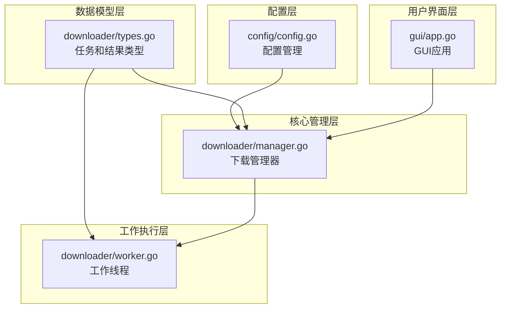
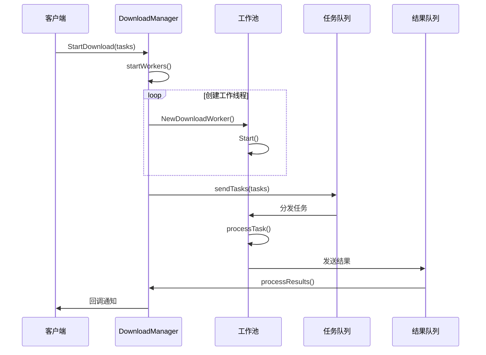
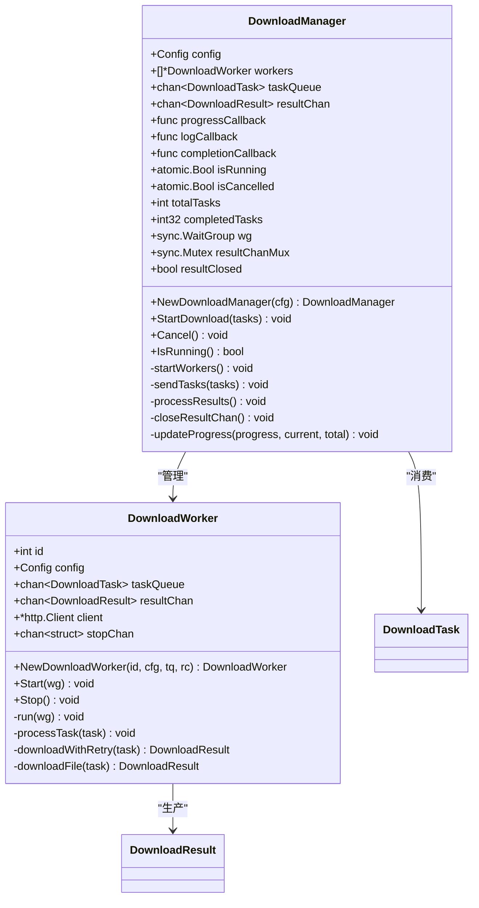
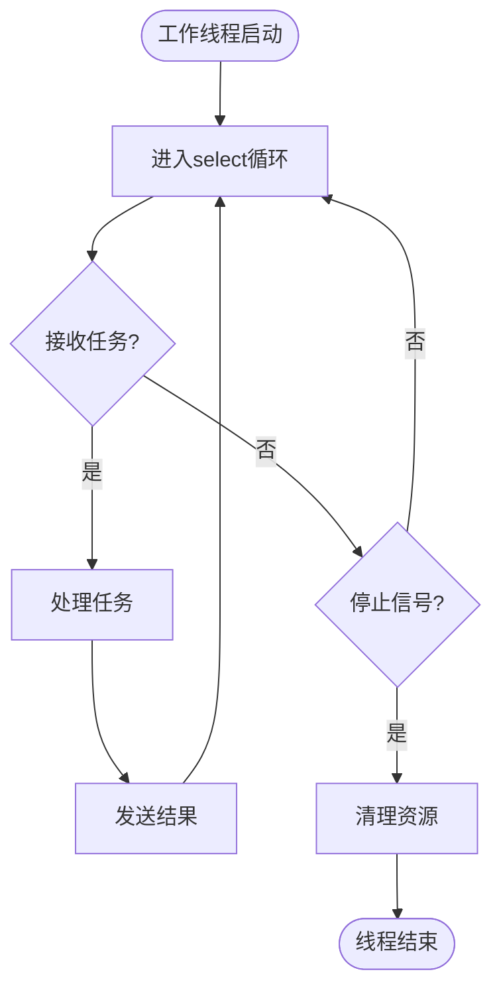
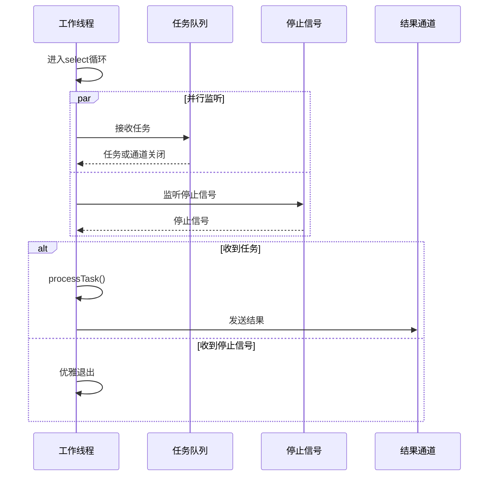
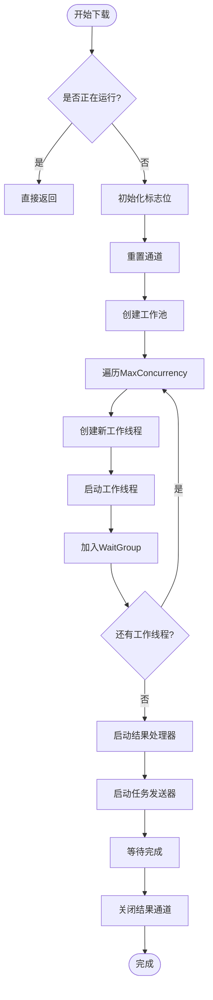
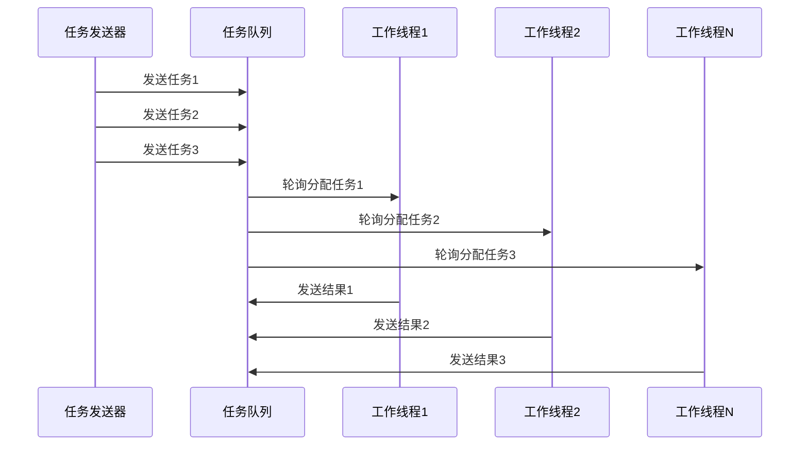
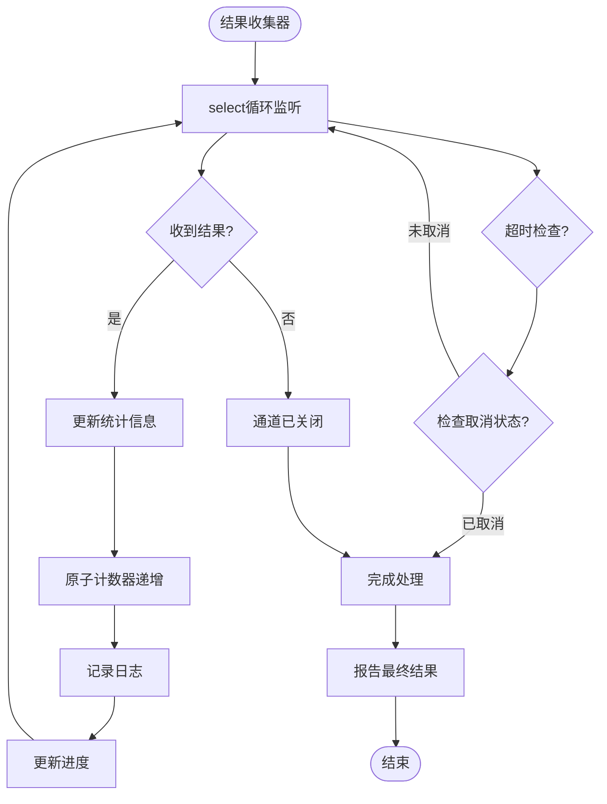

# 工作池模式实现

<cite>
**本文档中引用的文件**
- [downloader/manager.go](file://downloader/manager.go)
- [downloader/worker.go](file://downloader/worker.go)
- [downloader/types.go](file://downloader/types.go)
- [config/config.go](file://config/config.go)
</cite>

## 目录
1. [简介](#简介)
2. [项目结构概览](#项目结构概览)
3. [核心组件分析](#核心组件分析)
4. [架构概览](#架构概览)
5. [详细组件分析](#详细组件分析)
6. [工作池实现机制](#工作池实现机制)
7. [性能优化与调优](#性能优化与调优)
8. [故障排除指南](#故障排除指南)
9. [总结](#总结)

## 简介

本文档深入分析了批处理下载器中工作池模式的具体实现。该系统采用经典的生产者-消费者模式，通过多个工作线程并发处理下载任务，显著提升了下载效率。工作池模式的核心优势在于能够动态管理并发数量，避免资源过度消耗，同时提供优雅的任务取消和错误处理机制。

## 项目结构概览

该项目采用模块化设计，主要包含以下核心模块：

**图表来源**
- [config/config.go](file://config/config.go#L1-L31)
- [downloader/types.go](file://downloader/types.go#L1-L21)
- [downloader/manager.go](file://downloader/manager.go#L1-L243)
- [downloader/worker.go](file://downloader/worker.go#L1-L225)

**章节来源**
- [downloader/manager.go](file://downloader/manager.go#L1-L50)
- [downloader/worker.go](file://downloader/worker.go#L1-L50)
- [config/config.go](file://config/config.go#L1-L31)

## 核心组件分析

### DownloadManager - 下载管理器

DownloadManager是整个工作池的核心控制器，负责协调任务分发、结果收集和生命周期管理。

**关键特性：**
- **任务队列管理**：维护固定容量的任务通道，防止内存溢出
- **结果通道管理**：安全地收集和处理工作线程的结果
- **并发控制**：通过MaxConcurrency参数精确控制工作线程数量
- **优雅关闭**：支持任务取消和资源清理

### DownloadWorker - 工作线程

每个DownloadWorker代表一个独立的下载线程，负责执行具体的下载任务。

**关键特性：**
- **任务处理**：从任务队列接收并处理下载任务
- **重试机制**：内置指数退避重试策略
- **错误处理**：完善的错误捕获和报告机制
- **优雅停止**：通过stopChan实现安全的任务终止

**章节来源**
- [downloader/manager.go](file://downloader/manager.go#L13-L31)
- [downloader/worker.go](file://downloader/worker.go#L16-L23)

## 架构概览

系统采用多层架构设计，实现了清晰的职责分离：

**图表来源**
- [downloader/manager.go](file://downloader/manager.go#L46-L76)
- [downloader/manager.go](file://downloader/manager.go#L79-L86)
- [downloader/worker.go](file://downloader/worker.go#L45-L48)

## 详细组件分析

### DownloadManager详细分析

DownloadManager作为系统的核心控制器，其设计体现了工作池模式的最佳实践：

**图表来源**
- [downloader/manager.go](file://downloader/manager.go#L13-L31)
- [downloader/worker.go](file://downloader/worker.go#L16-L23)

#### 任务队列和结果通道的设计

系统使用两个缓冲通道实现生产者-消费者模式：

| 通道类型 | 缓冲区大小 | 用途 | 方向 |
|---------|-----------|------|------|
| taskQueue | 1000 | 存储待处理的下载任务 | 生产者 → 消费者 |
| resultChan | 1000 | 存储已完成的下载结果 | 消费者 → 生产者 |

这种设计的优势：
- **背压控制**：缓冲区防止生产者过快导致消费者无法及时处理
- **内存保护**：固定大小的缓冲区避免内存无限增长
- **异步处理**：生产者和消费者可以独立运行

**章节来源**
- [downloader/manager.go](file://downloader/manager.go#L33-L38)
- [downloader/manager.go](file://downloader/manager.go#L46-L76)

### DownloadWorker详细分析

工作线程的设计体现了Go语言并发编程的最佳实践：

**图表来源**
- [downloader/worker.go](file://downloader/worker.go#L50-L63)

#### select语句的优雅处理

工作线程的run方法使用select语句实现优雅的任务处理和停止机制：

**图表来源**
- [downloader/worker.go](file://downloader/worker.go#L53-L63)

**章节来源**
- [downloader/worker.go](file://downloader/worker.go#L50-L63)
- [downloader/worker.go](file://downloader/worker.go#L66-L76)

## 工作池实现机制

### 工作池的创建和初始化

工作池的创建过程体现了系统的设计精妙之处：

**图表来源**
- [downloader/manager.go](file://downloader/manager.go#L46-L76)
- [downloader/manager.go](file://downloader/manager.go#L79-L86)

### 任务分发机制

任务分发采用单向通道通信，确保数据流向的清晰性：

**图表来源**
- [downloader/manager.go](file://downloader/manager.go#L89-L98)
- [downloader/worker.go](file://downloader/worker.go#L55-L58)

### 结果收集机制

结果收集采用异步处理方式，通过专门的goroutine处理：

**图表来源**
- [downloader/manager.go](file://downloader/manager.go#L101-L177)

**章节来源**
- [downloader/manager.go](file://downloader/manager.go#L46-L76)
- [downloader/manager.go](file://downloader/manager.go#L101-L177)

## 工作池大小对性能的影响

### MaxConcurrency参数的作用

MaxConcurrency参数是影响系统性能的关键因素：

| 并发度 | 适用场景 | 性能特点 | 资源消耗 |
|--------|----------|----------|----------|
| 1-5 | 单机测试、低带宽环境 | CPU利用率高，网络利用率低 | 低 |
| 6-20 | 普通下载场景 | CPU和网络资源平衡利用 | 中等 |
| 21-50 | 高速网络、批量下载 | 网络带宽充分利用，CPU可能成为瓶颈 | 高 |
| 50+ | 专用服务器、极限性能 | 可能导致连接超限或系统不稳定 | 很高 |

### 性能调优建议

#### 1. 网络环境优化
- **带宽评估**：根据网络带宽调整MaxConcurrency
- **连接池配置**：合理设置HTTP客户端连接池参数
- **超时设置**：根据网络延迟调整请求超时时间

#### 2. 系统资源优化
- **内存管理**：监控内存使用，避免OOM
- **CPU负载**：平衡并发度与CPU利用率
- **磁盘I/O**：考虑磁盘写入性能对整体速度的影响

#### 3. 错误处理优化
- **重试策略**：合理设置重试次数和退避时间
- **超时控制**：避免长时间阻塞影响整体性能
- **资源清理**：及时释放临时文件和网络连接

**章节来源**
- [config/config.go](file://config/config.go#L10-L12)
- [downloader/worker.go](file://downloader/worker.go#L25-L42)

## 故障排除指南

### 常见问题及解决方案

#### 1. 工作线程阻塞
**症状**：下载任务长时间无响应
**原因**：任务队列满或工作线程异常
**解决方案**：
- 检查MaxConcurrency设置是否合理
- 监控任务队列长度
- 查看工作线程日志

#### 2. 内存泄漏
**症状**：程序运行一段时间后内存持续增长
**原因**：通道未正确关闭或资源未释放
**解决方案**：
- 确保所有通道在适当时候关闭
- 使用defer语句保证资源释放
- 监控goroutine数量

#### 3. 任务丢失
**症状**：部分任务未被执行
**原因**：任务发送过程中发生错误
**解决方案**：
- 检查任务发送逻辑
- 验证任务队列容量
- 添加任务重试机制

### 调试技巧

#### 1. 日志分析
系统提供了详细的日志回调功能，可以通过设置logCallback来监控系统运行状态。

#### 2. 进度监控
通过progressCallback可以实时监控下载进度，及时发现异常情况。

#### 3. 统计信息
系统自动收集成功、失败、空链接等统计信息，有助于性能分析。

**章节来源**
- [downloader/manager.go](file://downloader/manager.go#L178-L208)
- [downloader/manager.go](file://downloader/manager.go#L225-L237)

## 总结

本下载器的工作池模式实现展现了Go语言并发编程的强大能力。通过精心设计的生产者-消费者模式，系统实现了高效的任务分发和结果收集。关键设计亮点包括：

1. **优雅的关闭机制**：通过原子操作和通道通信实现安全的任务取消
2. **灵活的并发控制**：可配置的最大并发度适应不同场景需求
3. **完善的错误处理**：多层次的错误捕获和重试机制
4. **高效的资源管理**：合理的缓冲区大小和资源清理策略

这种设计不仅保证了系统的稳定性和性能，还为后续的功能扩展提供了良好的基础。对于需要处理大量并发任务的应用场景，这套工作池模式提供了值得借鉴的实现方案。