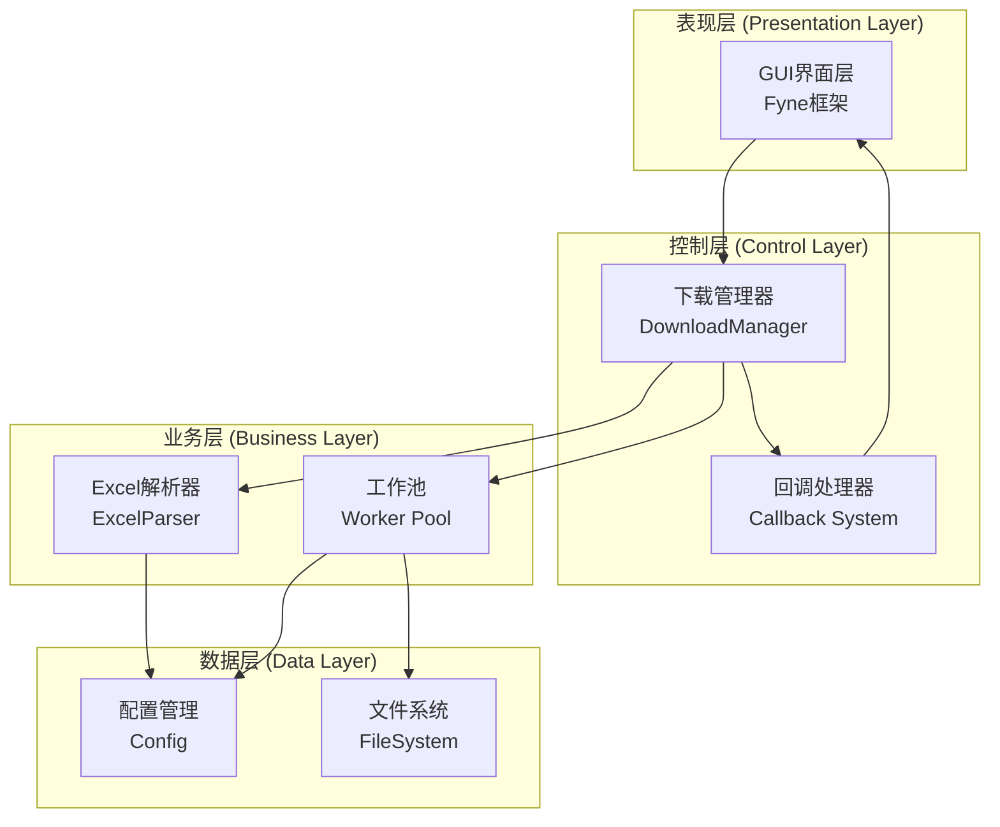
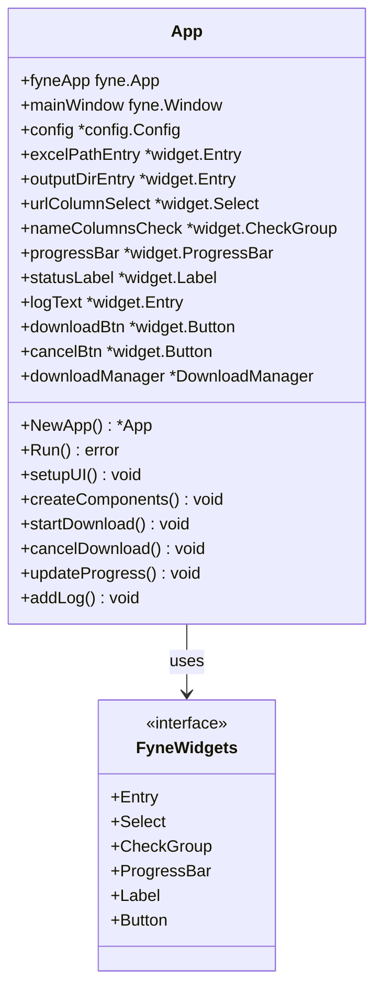
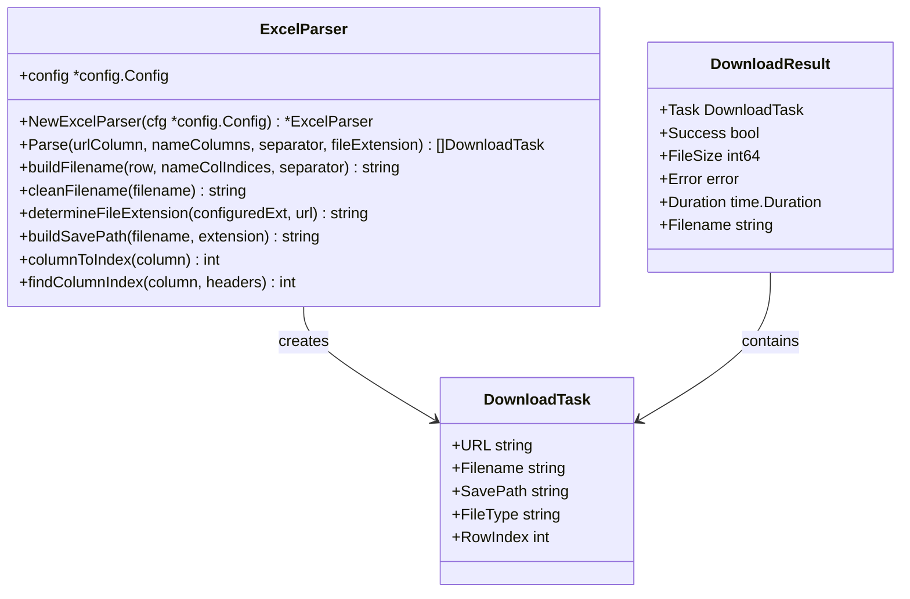
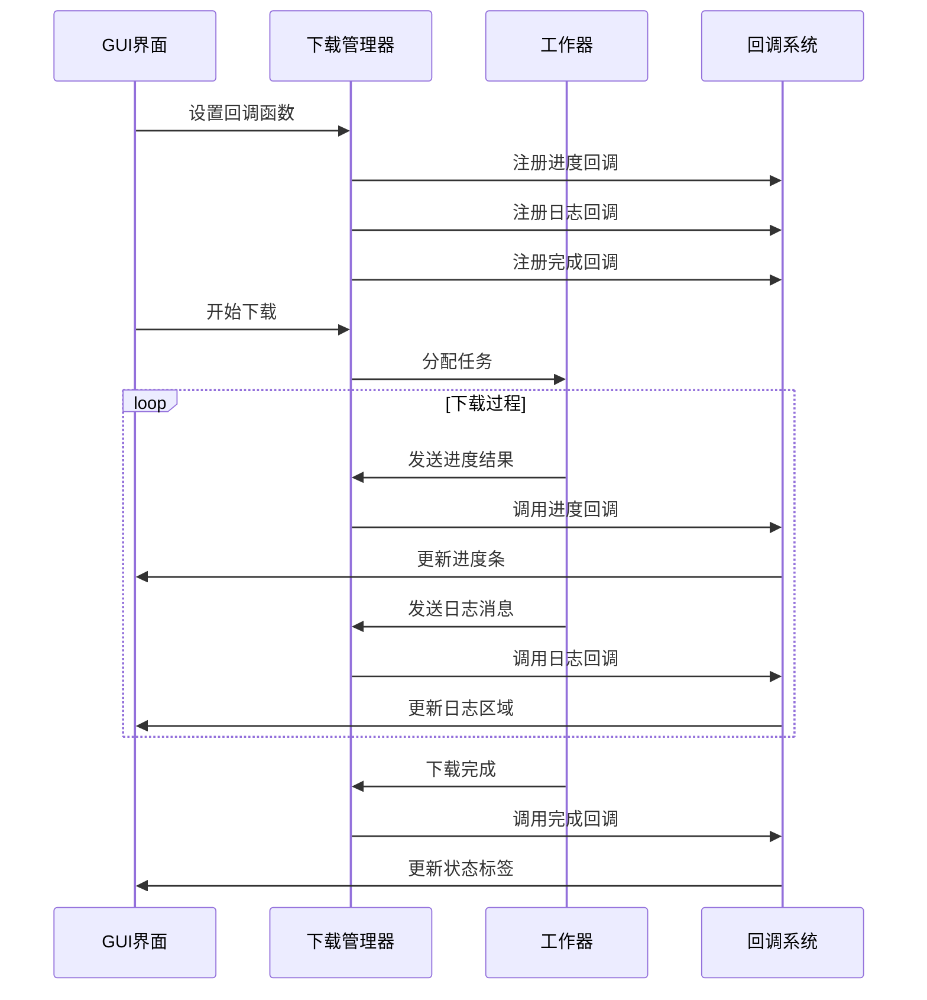
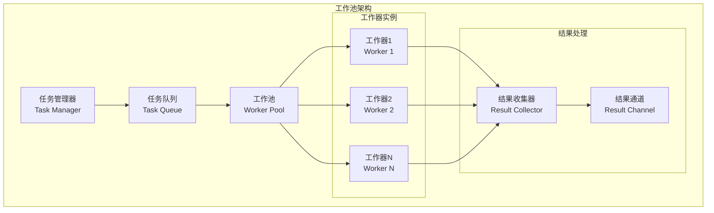
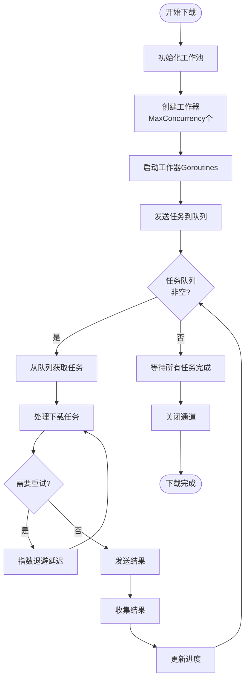
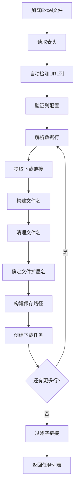
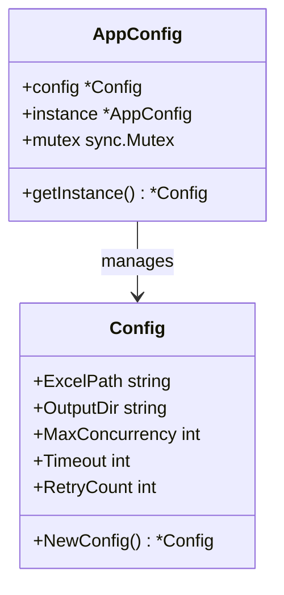
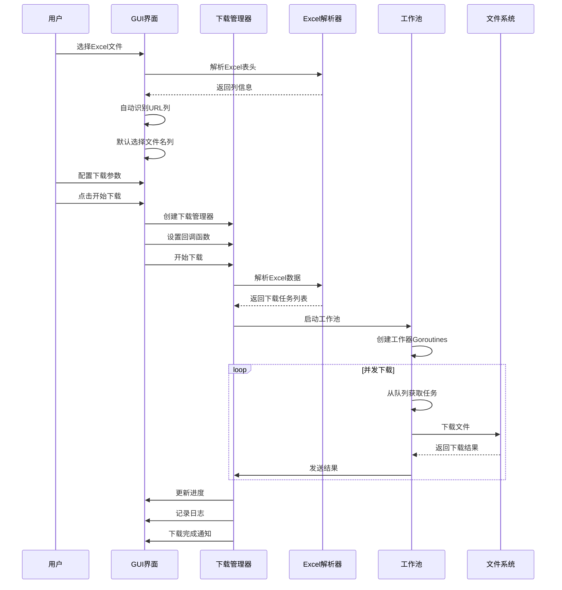

# 核心架构设计

<cite>
**本文档引用的文件**
- [main.go](file://main.go)
- [gui/app.go](file://gui/app.go)
- [downloader/manager.go](file://downloader/manager.go)
- [downloader/worker.go](file://downloader/worker.go)
- [downloader/excel_parser.go](file://downloader/excel_parser.go)
- [downloader/types.go](file://downloader/types.go)
- [config/config.go](file://config/config.go)
</cite>

## 目录
1. [项目概述](#项目概述)
2. [整体架构设计](#整体架构设计)
3. [MVC架构模式实现](#mvc架构模式实现)
4. [观察者模式与回调机制](#观察者模式与回调机制)
5. [工作池模式实现](#工作池模式实现)
6. [Excel解析器设计](#excel解析器设计)
7. [单例模式与配置管理](#单例模式与配置管理)
8. [数据流分析](#数据流分析)
9. [性能优化策略](#性能优化策略)
10. [总结](#总结)

## 项目概述

批量文件下载器是一个基于Go语言开发的桌面应用程序，采用MVVM架构模式，集成了GUI界面、下载管理和Excel解析功能。该系统通过模块化设计实现了清晰的职责分离，支持并发下载、智能文件名生成和任务状态监控等功能。

## 整体架构设计

系统采用分层架构设计，主要包含以下核心层次：



**图表来源**
- [gui/app.go](file://gui/app.go#L44-L73)
- [downloader/manager.go](file://downloader/manager.go#L13-L31)
- [downloader/excel_parser.go](file://downloader/excel_parser.go#L86-L94)
- [downloader/worker.go](file://downloader/worker.go#L16-L23)

## MVC架构模式实现

### 视图层 (View Layer) - GUI包

GUI包作为系统的视图层，负责用户界面的展示和用户交互处理。主要组件包括：



**图表来源**
- [gui/app.go](file://gui/app.go#L44-L73)

**章节来源**
- [gui/app.go](file://gui/app.go#L1-L743)

### 控制器层 (Controller Layer) - 下载管理器

下载管理器作为系统的控制器，协调各个组件之间的交互，管理下载流程：

```mermaid
classDiagram
    class DownloadManager {
        +config *config.Config
        +workers []*DownloadWorker
        +taskQueue chan DownloadTask
        +resultChan chan DownloadResult
        +progressCallback func(float64, int, int)
        +logCallback func(string)
        +completionCallback func(bool)
        +isRunning atomic.Bool
        +isCancelled atomic.Bool
        +totalTasks int
        +completedTasks int32
        +wg sync.WaitGroup
        +NewDownloadManager(cfg *config.Config) *DownloadManager
        +ParseExcel() []DownloadTask
        +StartDownload(tasks []DownloadTask) void
        +Cancel() void
        +SetProgressCallback(callback func(float64, int, int)) void
        +SetLogCallback(callback func(string)) void
        +SetCompletionCallback(callback func(bool)) void
        +IsRunning() bool
    }
    class DownloadWorker {
        +id int
        +config *config.Config
        +taskQueue <-chan DownloadTask
        +resultChan chan<- DownloadResult
        +client *http.Client
        +stopChan chan struct{}
        +NewDownloadWorker(id int, config *config.Config, taskQueue <-chan DownloadTask, resultChan chan<- DownloadResult) *DownloadWorker
        +Start(wg *sync.WaitGroup) void
        +Stop() void
        +processTask(task DownloadTask) void
        +downloadWithRetry(task DownloadTask) DownloadResult
        +downloadFile(task DownloadTask) (DownloadResult, error)
    }
    class DownloadTask
    class DownloadResult

    DownloadManager --> DownloadWorker : "manages"
    DownloadManager --> DownloadTask : "processes"
    DownloadManager --> DownloadResult : "produces"
```

**图表来源**
- [downloader/manager.go](file://downloader/manager.go#L13-L31)
- [downloader/worker.go](file://downloader/worker.go#L16-L23)

**章节来源**
- [downloader/manager.go](file://downloader/manager.go#L1-L243)

### 模型层 (Model Layer) - Excel解析器和数据结构

模型层包含Excel解析器和核心数据结构，负责数据的解析和存储：



**图表来源**
- [downloader/excel_parser.go](file://downloader/excel_parser.go#L86-L94)
- [downloader/types.go](file://downloader/types.go#L5-L20)

**章节来源**
- [downloader/excel_parser.go](file://downloader/excel_parser.go#L1-L317)
- [downloader/types.go](file://downloader/types.go#L1-L21)

## 观察者模式与回调机制

系统采用观察者模式通过回调函数实现UI与下载状态的实时同步：



**图表来源**
- [gui/app.go](file://gui/app.go#L531-L535)
- [downloader/manager.go](file://downloader/manager.go#L221-L231)

回调机制的核心实现包括：

| 回调类型 | 功能描述 | 触发时机 | 参数说明 |
|---------|---------|---------|---------|
| 进度回调 | 更新下载进度 | 每次任务完成时 | progress: 进度百分比, current: 当前数量, total: 总数量 |
| 日志回调 | 记录下载日志 | 每次状态变化时 | message: 日志消息字符串 |
| 完成回调 | 下载结束通知 | 下载完全结束时 | success: 是否成功完成 |

**章节来源**
- [gui/app.go](file://gui/app.go#L531-L535)
- [downloader/manager.go](file://downloader/manager.go#L221-L231)

## 工作池模式实现

系统采用工作池模式实现高效的并发下载，通过goroutine池管理下载任务：



**图表来源**
- [downloader/manager.go](file://downloader/manager.go#L79-L86)
- [downloader/worker.go](file://downloader/worker.go#L45-L64)

### Goroutine池实现细节

工作池的核心特性：



**图表来源**
- [downloader/manager.go](file://downloader/manager.go#L67-L76)
- [downloader/worker.go](file://downloader/worker.go#L50-L64)

**章节来源**
- [downloader/manager.go](file://downloader/manager.go#L67-L76)
- [downloader/worker.go](file://downloader/worker.go#L45-L64)

## Excel解析器设计

Excel解析器负责从Excel文件中提取下载任务，实现智能的表头识别和文件名生成：



**图表来源**
- [downloader/excel_parser.go](file://downloader/excel_parser.go#L96-L171)

### 文件名生成算法

文件名生成遵循以下规则：

| 优先级 | 生成规则 | 示例 |
|-------|---------|------|
| 1 | 用户指定的文件名列 | "产品名称", "版本号" → "产品名称_版本号" |
| 2 | 自动识别的URL列 | "https://example.com/file.pdf" → "file" |
| 3 | 时间戳生成 | 缺少有效列时 → "file_20240101_120000_1234" |
| 4 | 字符清理 | 移除非法字符如 "<>:\"/\|?*" |
| 5 | 长度限制 | 限制文件名不超过200字符 |

**章节来源**
- [downloader/excel_parser.go](file://downloader/excel_parser.go#L174-L216)

## 单例模式与配置管理

系统采用单例模式管理全局配置，确保配置的一致性和共享性：



**图表来源**
- [config/config.go](file://config/config.go#L8-L14)

配置管理的关键特性：

| 配置项 | 默认值 | 说明 |
|-------|--------|------|
| MaxConcurrency | 10 | 最大并发下载数，范围1-50 |
| Timeout | 30 | 请求超时时间（秒） |
| RetryCount | 3 | 下载失败重试次数 |
| OutputDir | ./downloads | 默认下载目录 |

**章节来源**
- [config/config.go](file://config/config.go#L16-L30)

## 数据流分析

系统的数据流从用户输入到任务执行再到结果反馈的完整过程：



**图表来源**
- [gui/app.go](file://gui/app.go#L451-L578)
- [downloader/manager.go](file://downloader/manager.go#L41-L44)
- [downloader/worker.go](file://downloader/worker.go#L66-L75)

### 数据流向详解

1. **输入阶段**：用户通过GUI界面提供Excel文件路径、输出目录、列配置等参数
2. **解析阶段**：Excel解析器读取文件内容，提取下载链接和文件名信息
3. **任务生成阶段**：系统根据解析结果创建具体的下载任务
4. **执行阶段**：工作池并发执行下载任务，每个工作器独立处理一个任务
5. **结果收集阶段**：下载结果通过通道机制汇总到主管理器
6. **反馈阶段**：通过回调机制将进度和状态信息实时反馈给用户界面

**章节来源**
- [gui/app.go](file://gui/app.go#L451-L578)
- [downloader/manager.go](file://downloader/manager.go#L41-L44)
- [downloader/worker.go](file://downloader/worker.go#L66-L75)

## 性能优化策略

系统采用多种性能优化策略提升下载效率：

### 并发控制优化

- **动态并发调整**：支持1-50的并发数配置，适应不同硬件环境
- **连接池管理**：HTTP客户端使用连接池，复用TCP连接
- **Goroutine池化**：避免频繁创建销毁Goroutine的开销

### 内存管理优化

- **缓冲区控制**：任务队列和结果通道设置合理容量（1000）
- **垃圾回收友好**：及时释放不再使用的资源
- **内存限制**：日志区域限制最大行数，防止内存溢出

### 网络优化

- **超时控制**：可配置的请求超时时间
- **重试机制**：指数退避重试策略
- **临时文件**：下载过程中使用临时文件，确保完整性

## 总结

批量文件下载器通过精心设计的架构实现了高效、可靠的批量下载功能：

### 架构优势

1. **模块化设计**：清晰的职责分离，便于维护和扩展
2. **并发处理**：工作池模式实现高效的并发下载
3. **响应式更新**：观察者模式确保UI与后台状态同步
4. **容错机制**：完善的错误处理和重试策略
5. **用户体验**：实时进度反馈和详细的日志记录

### 技术特色

- **MVC架构**：标准的三层架构模式
- **观察者模式**：松耦合的状态同步机制  
- **工作池模式**：高效的并发任务处理
- **单例模式**：统一的配置管理
- **回调机制**：灵活的事件处理系统

该架构设计不仅满足了当前的功能需求，还为未来的功能扩展提供了良好的基础，是一个设计良好、实现优雅的企业级应用架构。