# 观察者模式实现

<cite>
**本文档引用的文件**
- [downloader/manager.go](file://downloader/manager.go)
- [gui/app.go](file://gui/app.go)
- [downloader/types.go](file://downloader/types.go)
- [downloader/worker.go](file://downloader/worker.go)
- [downloader/excel_parser.go](file://downloader/excel_parser.go)
- [main.go](file://main.go)
</cite>

## 目录
1. [简介](#简介)
2. [项目结构概述](#项目结构概述)
3. [观察者模式核心组件](#观察者模式核心组件)
4. [回调函数类型定义](#回调函数类型定义)
5. [回调函数设置机制](#回调函数设置机制)
6. [UI层回调设置](#ui层回调设置)
7. [回调函数触发流程](#回调函数触发流程)
8. [架构图分析](#架构图分析)
9. [优势与特点](#优势与特点)
10. [潜在问题与解决方案](#潜在问题与解决方案)
11. [总结](#总结)

## 简介

本项目采用观察者模式实现了UI层与业务逻辑层之间的松耦合通信机制。通过定义三种类型的回调函数（进度回调、日志回调、完成回调），实现了下载状态的实时监听和响应。这种设计模式使得UI界面能够及时感知下载进程的变化，同时保持业务逻辑的独立性和可维护性。

## 项目结构概述

项目采用模块化架构，主要分为以下层次：

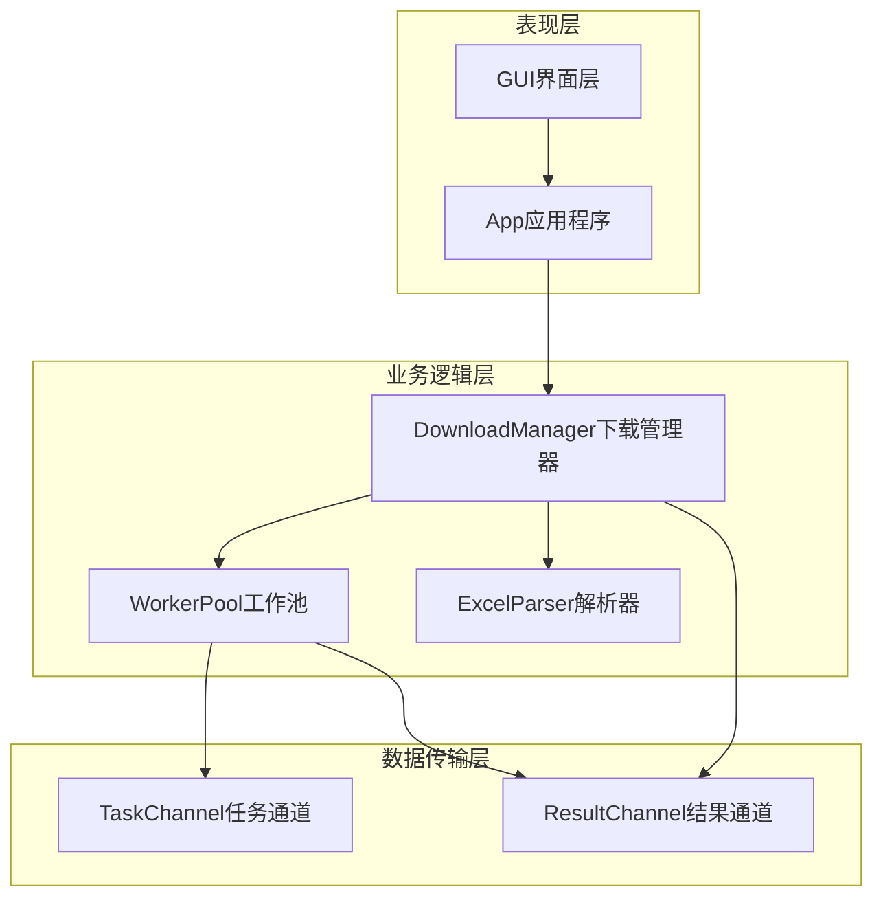

**图表来源**
- [gui/app.go](file://gui/app.go#L44-L68)
- [downloader/manager.go](file://downloader/manager.go#L13-L31)

## 观察者模式核心组件

### DownloadManager - 观察者主体

DownloadManager是观察者模式的核心主体，负责管理下载任务的执行，并通过回调函数通知观察者状态变化。

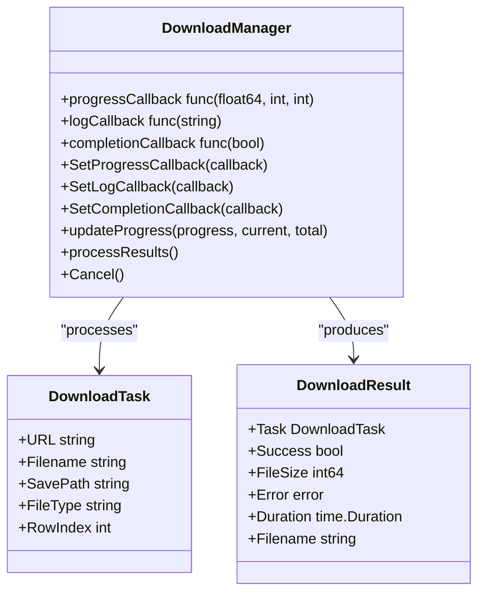

**图表来源**
- [downloader/manager.go](file://downloader/manager.go#L13-L31)
- [downloader/types.go](file://downloader/types.go#L5-L20)

**章节来源**
- [downloader/manager.go](file://downloader/manager.go#L13-L31)
- [downloader/types.go](file://downloader/types.go#L5-L20)

### GUI App - 观察者实现

GUI App作为观察者，实现了具体的回调函数，负责更新用户界面的状态显示。

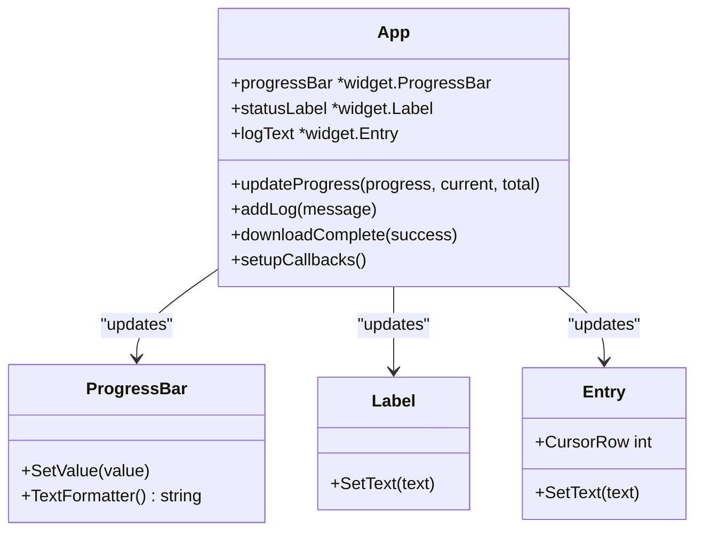

**图表来源**
- [gui/app.go](file://gui/app.go#L44-L68)

**章节来源**
- [gui/app.go](file://gui/app.go#L44-L68)

## 回调函数类型定义

项目定义了三种专门的回调函数类型，每种对应不同的观察目标：

### progressCallback - 进度回调函数

进度回调函数负责通知下载进度的实时变化，其函数签名如下：

| 参数 | 类型 | 描述 |
|------|------|------|
| progress | float64 | 当前进度百分比（0.0-1.0） |
| current | int | 已完成的任务数量 |
| total | int | 总任务数量 |

### logCallback - 日志回调函数

日志回调函数用于记录下载过程中的各种状态信息和错误消息：

| 参数 | 类型 | 描述 |
|------|------|------|
| message | string | 日志消息内容 |

### completionCallback - 完成回调函数

完成回调函数在下载任务全部完成或取消时被调用：

| 参数 | 类型 | 描述 |
|------|------|------|
| success | bool | 是否成功完成下载任务 |

**章节来源**
- [downloader/manager.go](file://downloader/manager.go#L19-L21)

## 回调函数设置机制

### SetProgressCallback 方法

SetProgressCallback方法允许外部组件注册进度回调函数：

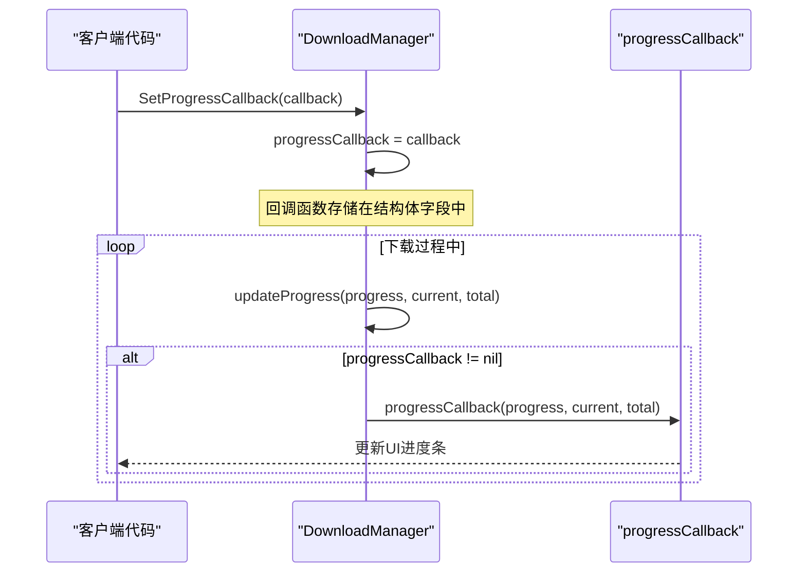

**图表来源**
- [downloader/manager.go](file://downloader/manager.go#L221-L223)

### SetLogCallback 和 SetCompletionCallback 方法

这两个方法的实现机制与SetProgressCallback类似，分别用于设置日志回调和完成回调：

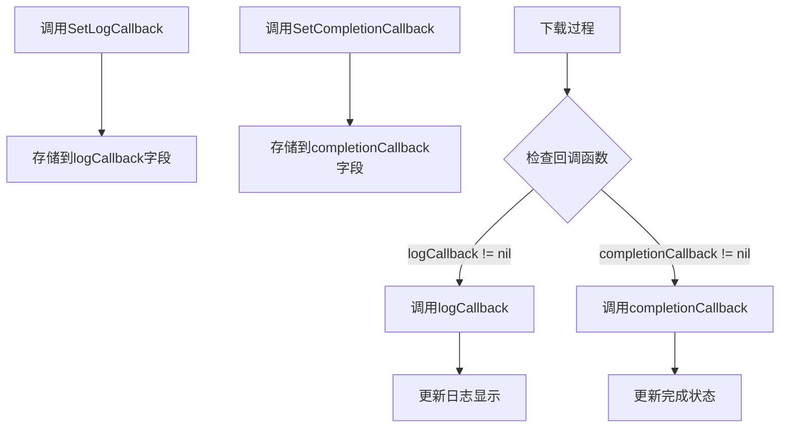

**图表来源**
- [downloader/manager.go](file://downloader/manager.go#L225-L231)

**章节来源**
- [downloader/manager.go](file://downloader/manager.go#L221-L231)

## UI层回调设置

### setupCallbacks 方法

GUI App的setupCallbacks方法负责将UI组件的方法注册为回调函数：

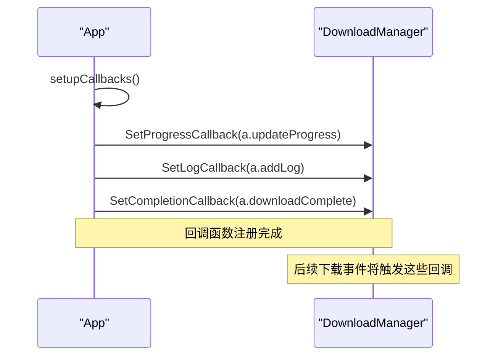

**图表来源**
- [gui/app.go](file://gui/app.go#L531-L533)

### 回调函数的具体实现

#### updateProgress 方法

updateProgress方法实现了UI进度条的更新逻辑，包括节流控制和状态计算：

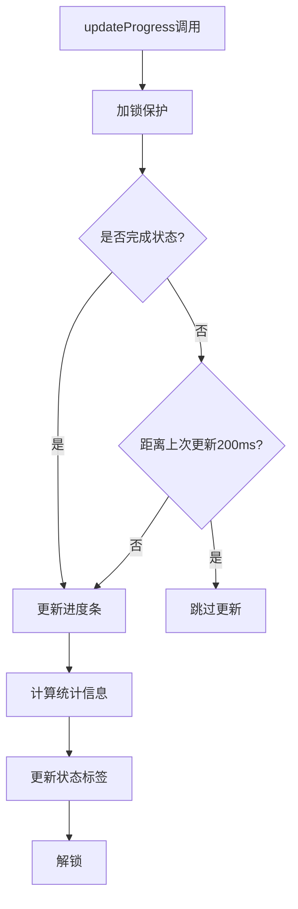

**图表来源**
- [gui/app.go](file://gui/app.go#L591-L616)

#### addLog 方法

addLog方法负责日志消息的显示和管理：

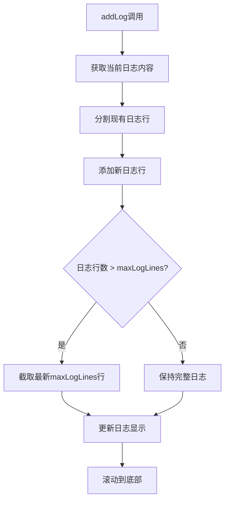

**图表来源**
- [gui/app.go](file://gui/app.go#L668-L689)

**章节来源**
- [gui/app.go](file://gui/app.go#L531-L533)
- [gui/app.go](file://gui/app.go#L591-L616)
- [gui/app.go](file://gui/app.go#L668-L689)

## 回调函数触发流程

### 下载过程中的回调触发

在下载过程中，DownloadManager会根据不同的事件触发相应的回调函数：

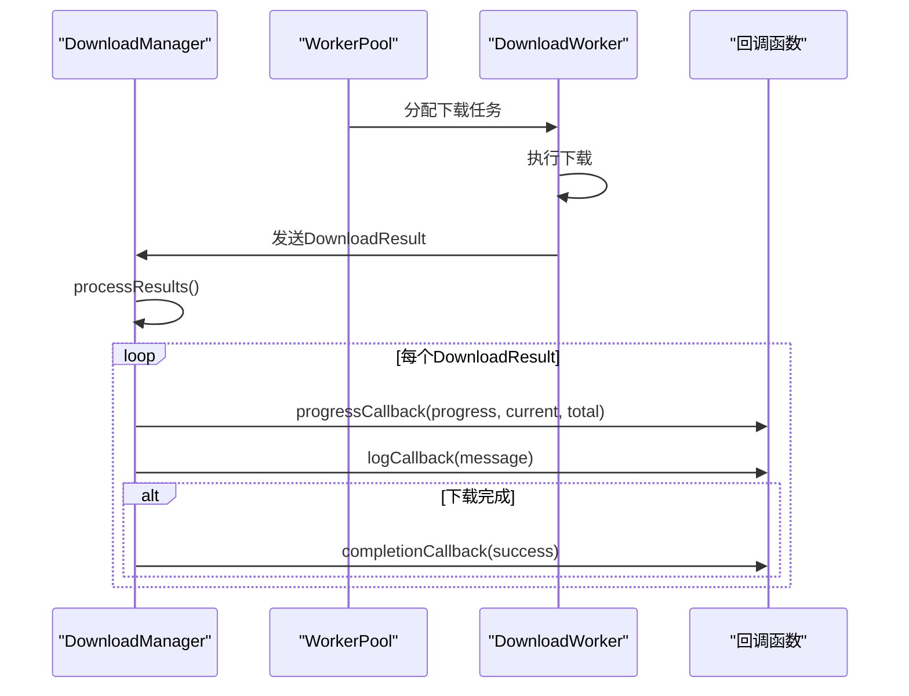

**图表来源**
- [downloader/manager.go](file://downloader/manager.go#L101-L177)

### 回调函数的生命周期

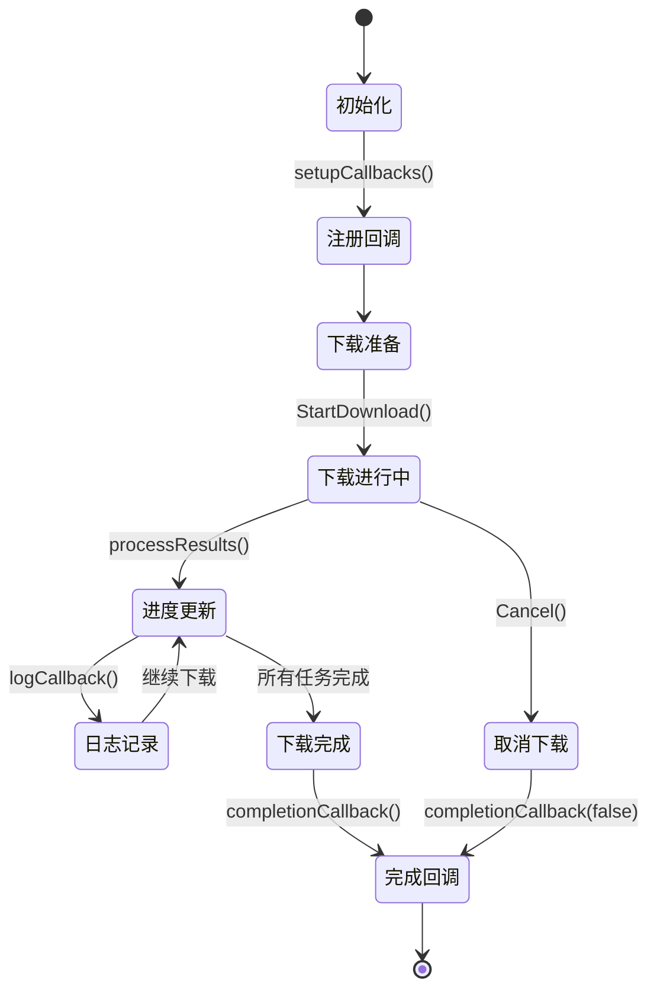

**图表来源**
- [downloader/manager.go](file://downloader/manager.go#L46-L77)
- [downloader/manager.go](file://downloader/manager.go#L160-L177)

**章节来源**
- [downloader/manager.go](file://downloader/manager.go#L101-L177)

## 架构图分析

### 整体观察者模式架构

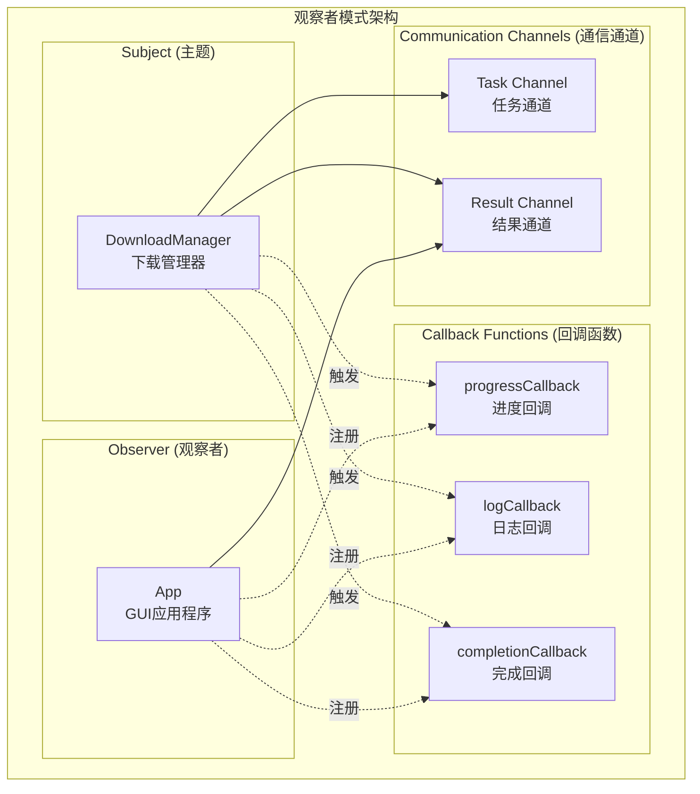

**图表来源**
- [downloader/manager.go](file://downloader/manager.go#L13-L31)
- [gui/app.go](file://gui/app.go#L44-L68)

### 数据流向分析

```mermaid
flowchart LR
subgraph "数据流向"
Excel[Excel文件] --> Parser[ExcelParser<br/>解析器]
Parser --> Tasks[DownloadTask[]<br/>下载任务]
Tasks --> Manager[DownloadManager<br/>管理器]
Manager --> Workers[DownloadWorker[]<br/>工作器池]
Workers --> Results[DownloadResult[]<br/>结果集]
Results --> Callbacks[回调函数<br/>progress/log/complete]
Callbacks --> UI[GUI界面<br/>进度/日志/状态]
end
```

**图表来源**
- [downloader/excel_parser.go](file://downloader/excel_parser.go#L96-L171)
- [downloader/manager.go](file://downloader/manager.go#L41-L44)

## 优势与特点

### 松耦合设计

观察者模式的最大优势在于实现了UI层与业务逻辑层的完全解耦：

1. **职责分离**：UI负责界面展示，业务逻辑负责数据处理
2. **可扩展性**：可以轻松添加新的观察者而无需修改现有代码
3. **灵活性**：支持动态注册和注销回调函数

### 实时响应能力

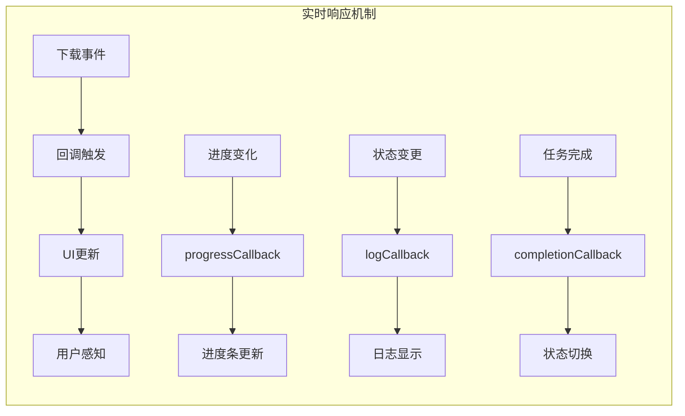

### 异步处理支持

项目充分利用Go语言的并发特性，实现了异步的回调处理：

1. **非阻塞回调**：回调函数在独立的goroutine中执行
2. **通道通信**：通过channel实现线程安全的数据传递
3. **资源隔离**：UI更新不会影响业务逻辑的执行

**章节来源**
- [downloader/manager.go](file://downloader/manager.go#L101-L177)
- [downloader/worker.go](file://downloader/worker.go#L45-L76)

## 潜在问题与解决方案

### 内存泄漏风险

#### 问题描述

回调函数可能导致的内存泄漏风险主要包括：

1. **回调函数持有大量数据**：UI组件可能持有大量历史数据
2. **长时间运行的任务**：回调函数可能在任务结束后仍然被引用
3. **循环引用**：回调函数可能间接引用自身或相关对象

#### 解决方案

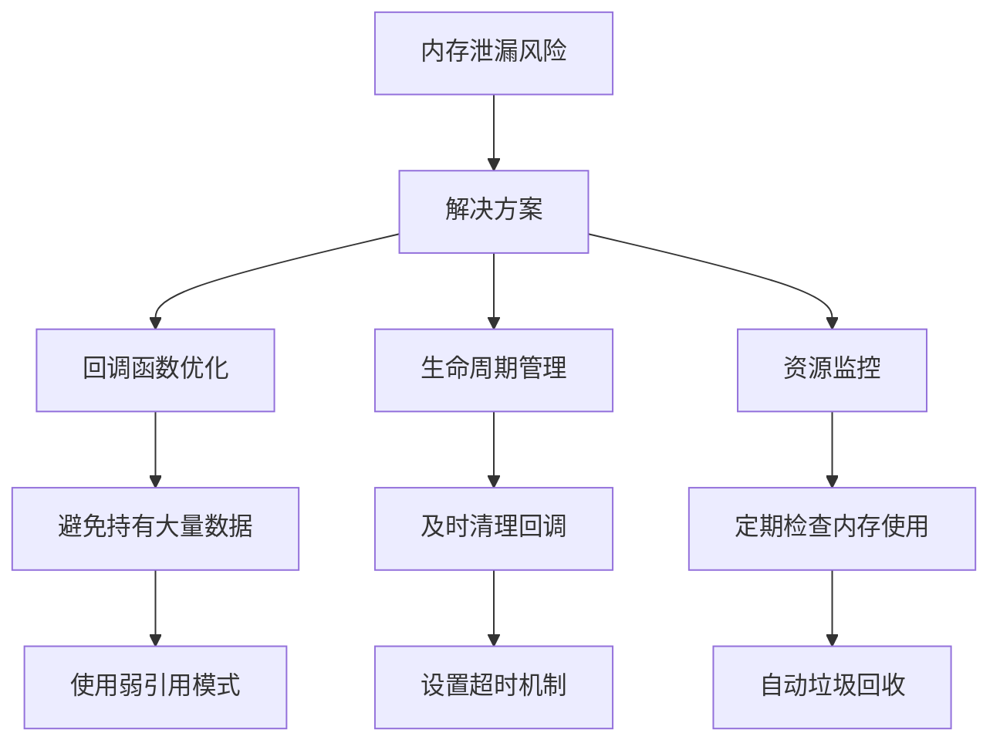

#### 具体实施策略

1. **数据截断**：限制日志缓冲区大小，避免无限增长
2. **弱引用**：使用接口而非具体实例，减少强引用
3. **定时清理**：定期清理不再需要的回调引用
4. **上下文取消**：结合context包实现优雅的资源释放

### 性能优化措施

#### 回调函数节流

为了避免频繁的UI更新导致性能问题，项目实现了多种节流机制：

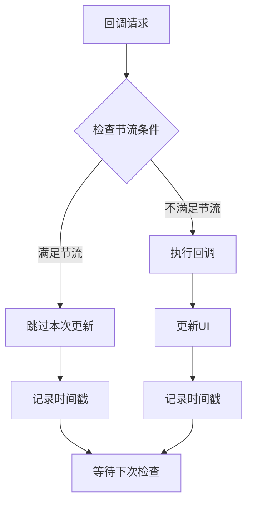

#### 通道缓冲区优化

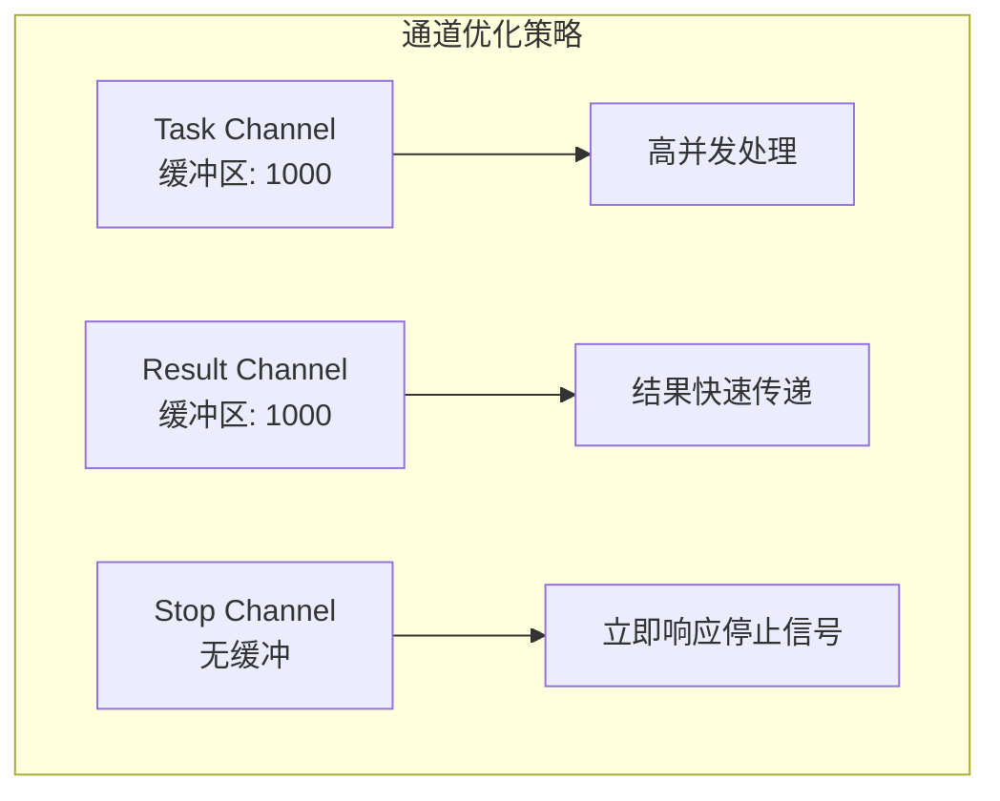

**章节来源**
- [gui/app.go](file://gui/app.go#L591-L616)
- [downloader/manager.go](file://downloader/manager.go#L57-L60)

## 总结

本项目通过观察者模式成功实现了UI层与业务逻辑层的有效解耦，展现了以下关键特点：

### 设计亮点

1. **清晰的职责划分**：DownloadManager专注于业务逻辑，GUI App负责界面展示
2. **灵活的回调机制**：支持进度、日志、完成三种不同类型的回调
3. **高效的异步处理**：利用Go语言的并发特性实现非阻塞的回调执行
4. **良好的扩展性**：可以轻松添加新的观察者或修改现有观察者的实现

### 技术优势

- **松耦合架构**：UI和业务逻辑完全独立，便于维护和测试
- **实时响应**：通过回调机制实现下载状态的即时反馈
- **资源安全**：通过通道和原子操作保证并发安全
- **性能优化**：实现了回调节流和资源管理机制

### 应用价值

这种观察者模式的实现不仅解决了UI与业务逻辑的集成问题，还为构建大型分布式系统提供了可参考的设计模式。通过合理的回调函数设计和生命周期管理，确保了系统的稳定性、可维护性和性能表现。