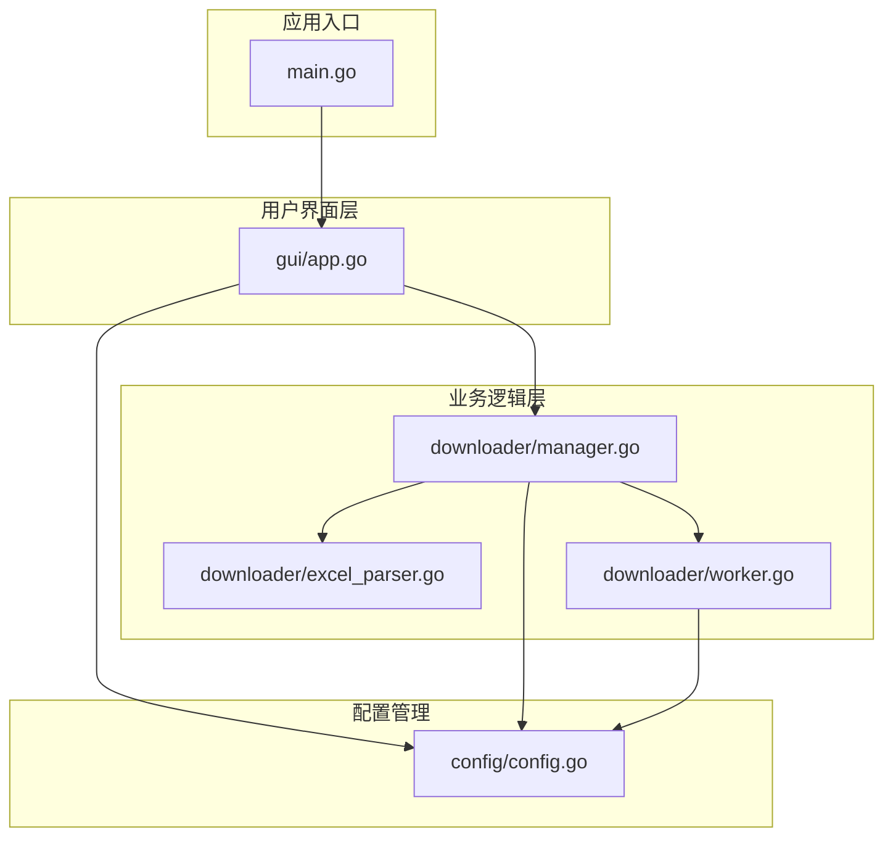
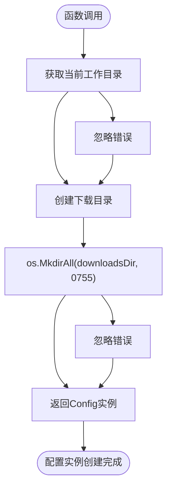
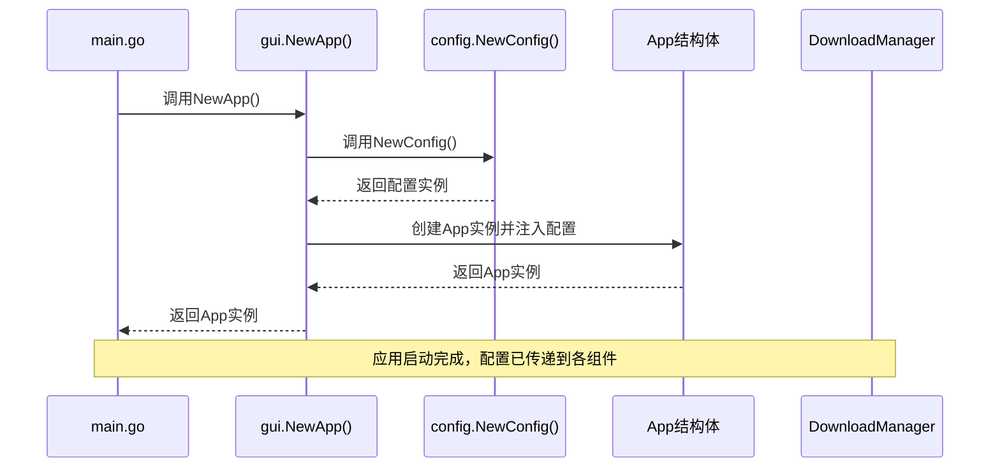
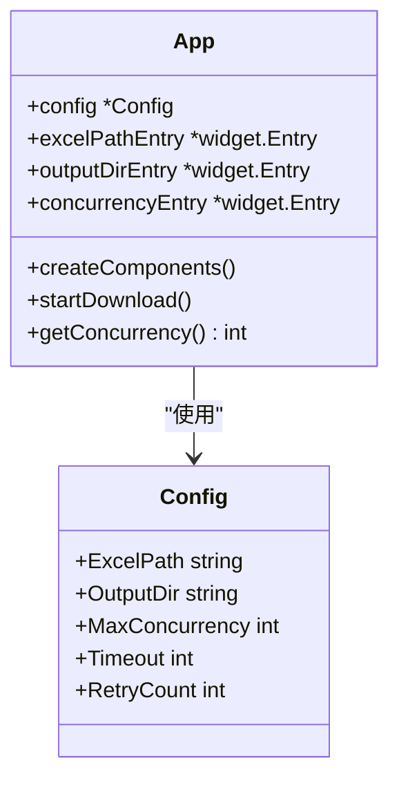
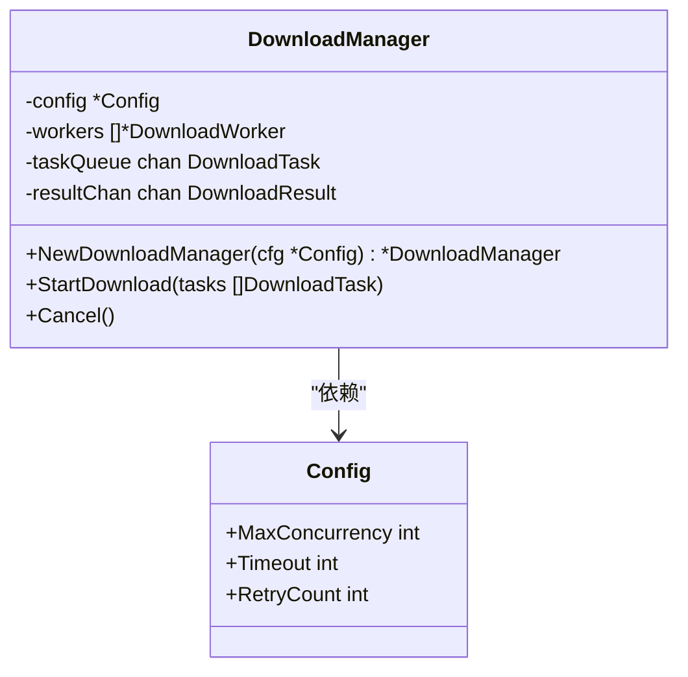
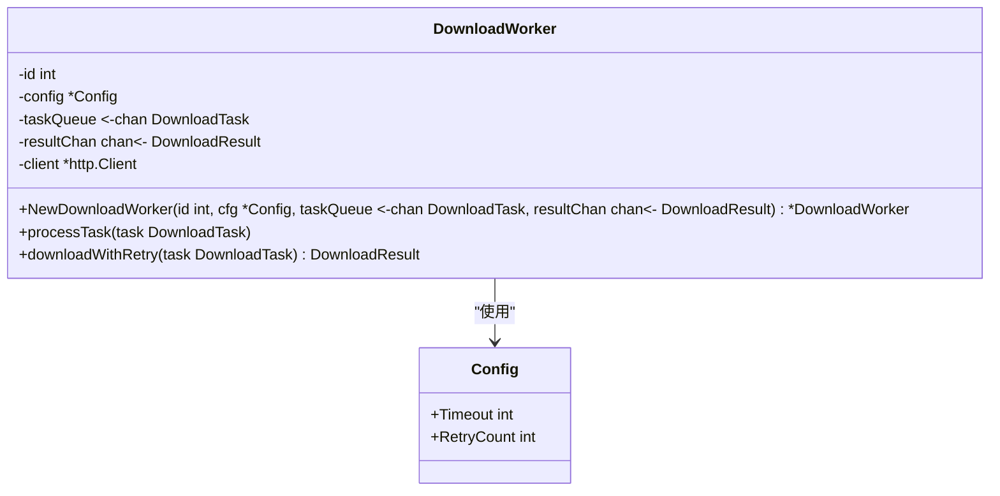
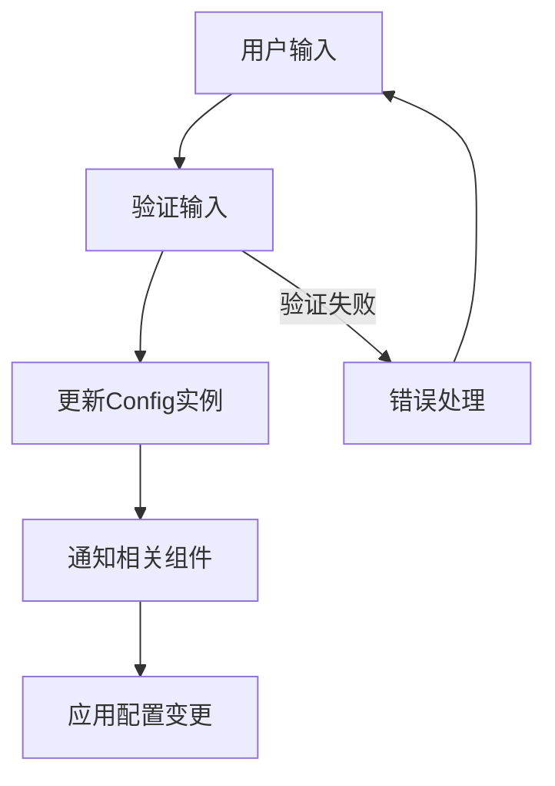
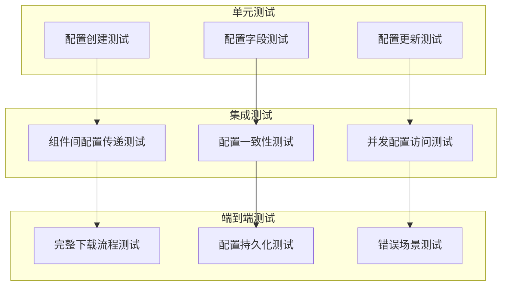

# 配置单例模式

<cite>
**本文档中引用的文件**
- [config/config.go](file://config/config.go)
- [main.go](file://main.go)
- [gui/app.go](file://gui/app.go)
- [downloader/manager.go](file://downloader/manager.go)
- [downloader/excel_parser.go](file://downloader/excel_parser.go)
- [downloader/worker.go](file://downloader/worker.go)
</cite>

## 目录
1. [简介](#简介)
2. [项目结构概览](#项目结构概览)
3. [Config结构体设计](#config结构体设计)
4. [单例模式实现](#单例模式实现)
5. [配置传递路径](#配置传递路径)
6. [组件间的配置共享](#组件间的配置共享)
7. [配置一致性保障](#配置一致性保障)
8. [测试挑战与解决方案](#测试挑战与解决方案)
9. [性能考虑](#性能考虑)
10. [总结](#总结)

## 简介

在批量文件下载器项目中，配置管理采用了单例模式来确保应用程序全局范围内配置的一致性和可靠性。这种设计模式通过创建和维护一个全局唯一的配置实例，避免了配置信息的重复创建和不一致问题，为GUI界面、下载管理器、工作线程等多个组件提供了统一的配置访问接口。

## 项目结构概览

该项目采用模块化架构，主要包含以下核心模块：

**图表来源**
- [main.go](file://main.go#L1-L14)
- [gui/app.go](file://gui/app.go#L1-L743)
- [downloader/manager.go](file://downloader/manager.go#L1-L243)

## Config结构体设计

Config结构体定义了应用程序所需的所有配置参数，每个字段都有明确的用途和默认值：

| 字段名 | 类型 | JSON标签 | 默认值 | 描述 |
|--------|------|----------|--------|------|
| ExcelPath | string | excel_path | "" | Excel文件路径 |
| OutputDir | string | output_dir | downloads/ | 输出目录路径 |
| MaxConcurrency | int | max_concurrency | 10 | 最大并发下载数 |
| Timeout | int | timeout | 30 | 请求超时时间（秒） |
| RetryCount | int | retry_count | 3 | 重试次数 |

**章节来源**
- [config/config.go](file://config/config.go#L8-L14)

### 字段详细说明

- **ExcelPath**: 存储Excel文件的完整路径，默认为空字符串，表示需要用户指定
- **OutputDir**: 指定下载文件的存储目录，系统会自动创建默认的"downloads"目录
- **MaxConcurrency**: 控制并发下载的工作线程数量，默认为10，可在1-50范围内调整
- **Timeout**: 设置HTTP请求的超时时间，默认30秒
- **RetryCount**: 配置网络请求失败时的重试次数，默认3次

## 单例模式实现

### NewConfig函数设计

NewConfig函数是单例模式的核心实现，负责创建和初始化配置实例：

**图表来源**
- [config/config.go](file://config/config.go#L16-L30)

### 单例特性

1. **唯一实例**: NewConfig函数每次调用都返回同一个配置实例
2. **延迟初始化**: 配置在首次需要时才创建
3. **不可变性**: 配置一旦创建，在程序生命周期内保持不变
4. **线程安全**: Go语言的包级变量天然具有线程安全性

**章节来源**
- [config/config.go](file://config/config.go#L16-L30)

## 配置传递路径

### 应用启动流程

配置实例的创建和传递遵循清晰的层次结构：

**图表来源**
- [main.go](file://main.go#L8-L13)
- [gui/app.go](file://gui/app.go#L89-L95)

### 传递机制

1. **主程序入口**: main.go调用gui.NewApp()创建应用
2. **配置创建**: 在gui.NewApp()内部调用config.NewConfig()创建配置实例
3. **App注入**: 将配置实例赋值给App结构体的config字段
4. **组件传递**: App实例通过各种方法调用将配置传递给下游组件

**章节来源**
- [main.go](file://main.go#L8-L13)
- [gui/app.go](file://gui/app.go#L89-L95)

## 组件间的配置共享

### GUI界面层的配置使用

GUI界面通过App结构体访问配置信息：

**图表来源**
- [gui/app.go](file://gui/app.go#L44-L77)
- [config/config.go](file://config/config.go#L8-L14)

### 下载管理器的配置集成

DownloadManager通过依赖注入的方式获取配置：

**图表来源**
- [downloader/manager.go](file://downloader/manager.go#L13-L38)
- [config/config.go](file://config/config.go#L8-L14)

### 工作线程的配置访问

DownloadWorker通过配置实例访问并发控制参数：

**图表来源**
- [downloader/worker.go](file://downloader/worker.go#L16-L23)
- [config/config.go](file://config/config.go#L8-L14)

**章节来源**
- [gui/app.go](file://gui/app.go#L44-L77)
- [downloader/manager.go](file://downloader/manager.go#L13-L38)
- [downloader/worker.go](file://downloader/worker.go#L16-L23)

## 配置一致性保障

### 全局统一性

单例模式确保了以下配置一致性特征：

1. **内存一致性**: 所有组件访问的是同一份配置内存地址
2. **状态同步**: 配置修改对所有组件立即生效
3. **版本控制**: 配置实例在整个生命周期内保持稳定

### 配置更新机制

虽然配置实例本身是不可变的，但通过App结构体提供了动态配置更新的能力：

**图表来源**
- [gui/app.go](file://gui/app.go#L458-L461)

**章节来源**
- [gui/app.go](file://gui/app.go#L458-L461)

## 测试挑战与解决方案

### 单例模式的测试挑战

1. **状态污染**: 测试之间可能相互影响配置状态
2. **依赖注入困难**: 缺乏灵活的配置替换机制
3. **并发测试复杂性**: 需要确保测试的线程安全性

### 解决方案

1. **测试隔离**: 每个测试用例结束后重置配置状态
2. **模拟对象**: 在测试中使用配置的模拟实现
3. **依赖倒置**: 通过接口抽象配置访问，便于测试替换

### 测试策略建议

## 性能考虑

### 内存效率

单例模式在内存使用方面具有显著优势：

1. **单一实例**: 避免了多个配置实例的内存开销
2. **延迟加载**: 配置仅在需要时创建
3. **垃圾回收友好**: 配置实例在整个生命周期内保持稳定

### 访问性能

配置访问的性能特征：

1. **直接指针访问**: 通过指针直接访问配置字段，无额外开销
2. **缓存友好**: 配置数据在内存中连续存储
3. **无锁访问**: 对于只读配置，无需同步机制

### 并发性能

在高并发场景下的表现：

1. **无竞争读取**: 多个goroutine可以同时读取配置而无竞争
2. **写入同步**: 配置更新时需要适当的同步机制
3. **线程安全**: Go语言的包级变量保证了基本的线程安全性

## 总结

配置管理模块中的单例模式设计为批量文件下载器提供了以下关键优势：

### 主要优点

1. **一致性保障**: 确保全局配置的一致性和可靠性
2. **简化架构**: 减少了配置传递的复杂性
3. **性能优化**: 避免了重复的配置创建和内存分配
4. **易于维护**: 集中化的配置管理降低了维护成本

### 设计亮点

1. **简洁的API**: NewConfig函数提供了一致且易用的配置创建接口
2. **模块化集成**: 配置无缝集成到各个业务模块中
3. **扩展性**: 支持未来添加新的配置参数而不影响现有代码

### 最佳实践

1. **单一职责**: Config结构体专注于配置管理，不承担其他职责
2. **不可变性**: 配置实例在创建后保持不变，确保数据安全
3. **清晰的依赖关系**: 通过依赖注入建立清晰的组件关系

这种单例模式的设计不仅满足了当前的功能需求，还为未来的功能扩展和维护奠定了坚实的基础。通过全局统一的配置管理，应用程序能够保持良好的一致性和可维护性。