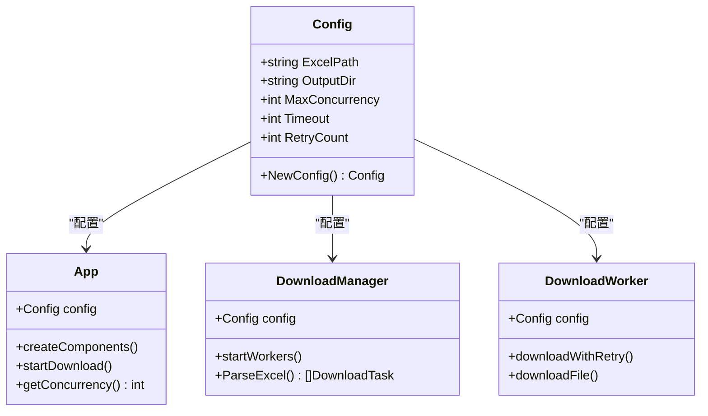
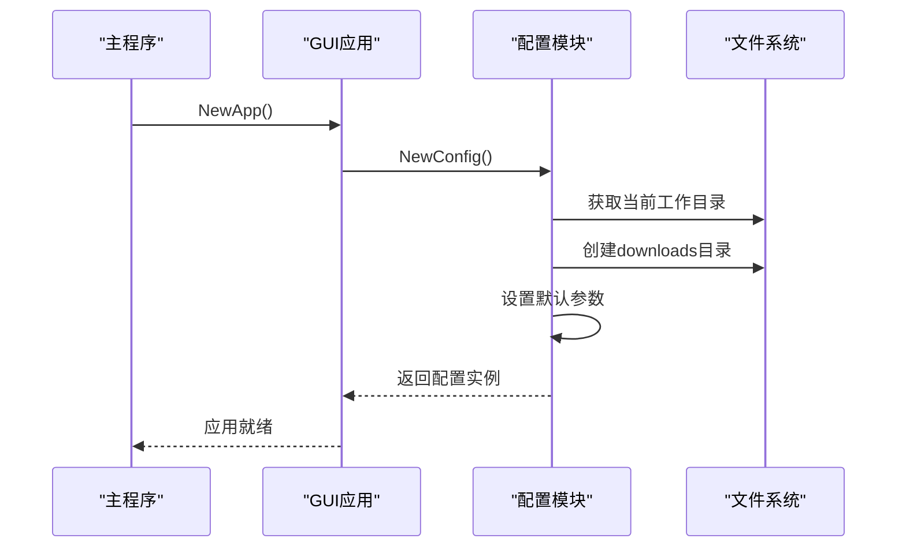
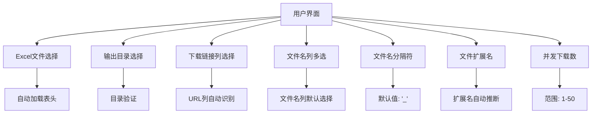
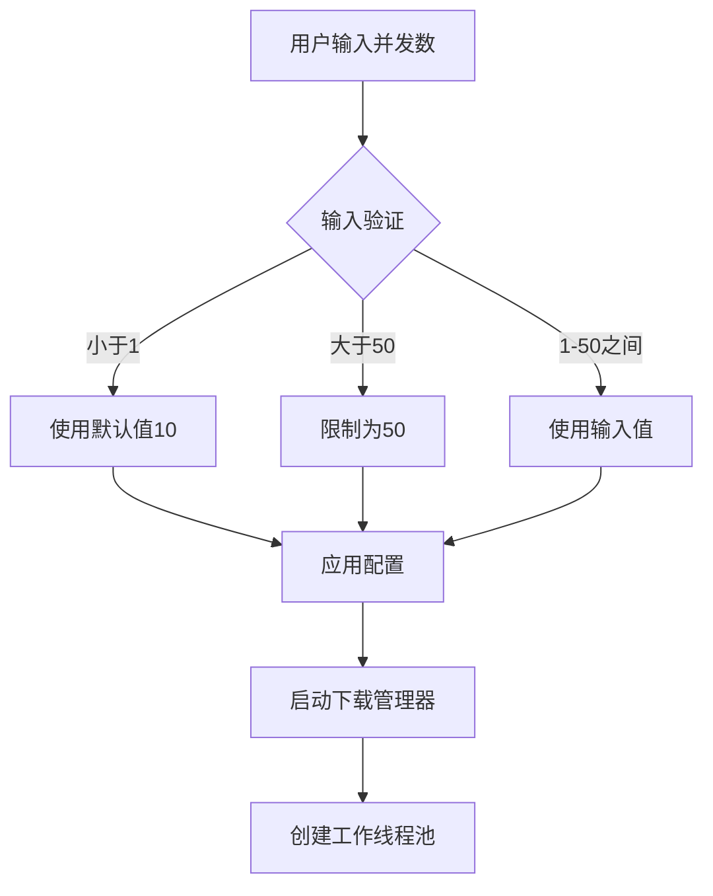
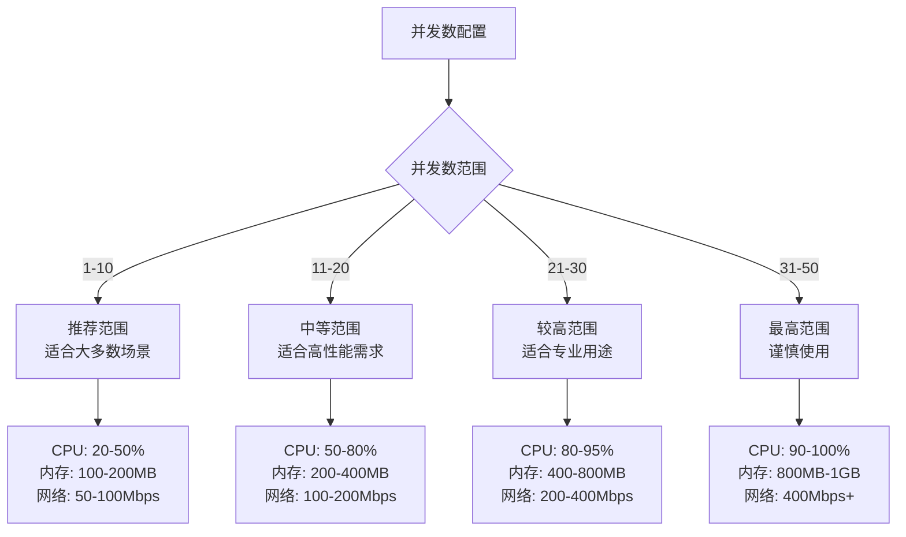
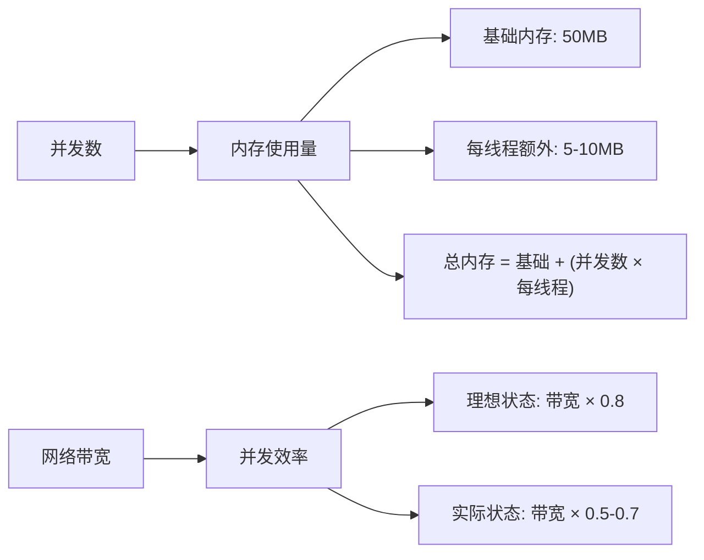
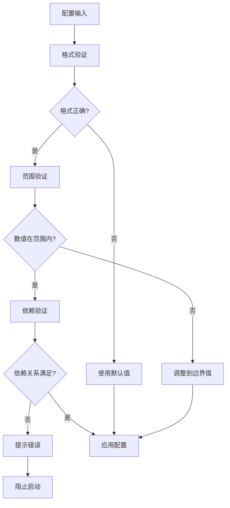

# 配置参数

<cite>
**本文档引用的文件**
- [config.go](file://config/config.go)
- [app.go](file://gui/app.go)
- [manager.go](file://downloader/manager.go)
- [worker.go](file://downloader/worker.go)
- [types.go](file://downloader/types.go)
- [excel_parser.go](file://downloader/excel_parser.go)
- [main.go](file://main.go)
- [README.md](file://README.md)
</cite>

## 目录
1. [简介](#简介)
2. [配置结构概述](#配置结构概述)
3. [核心配置参数](#核心配置参数)
4. [配置生成机制](#配置生成机制)
5. [GUI界面配置](#gui界面配置)
6. [配置参数详解](#配置参数详解)
7. [配置合理性边界](#配置合理性边界)
8. [高级调优建议](#高级调优建议)
9. [故障排除指南](#故障排除指南)
10. [总结](#总结)

## 简介

批量文件下载器采用基于结构体的配置管理系统，通过 `config.Config` 结构体定义所有可配置参数。该系统支持运行时自动生成配置，并提供图形界面让用户直观地调整各项参数。配置系统设计遵循"合理默认值"原则，在保证功能完整性的前提下，为用户提供灵活的调优空间。

## 配置结构概述

配置系统的核心是一个简洁的结构体定义，包含了下载器运行所需的所有基础配置参数：



**图表来源**
- [config.go](file://config/config.go#L8-L14)
- [app.go](file://gui/app.go#L44-L69)
- [manager.go](file://downloader/manager.go#L13-L31)
- [worker.go](file://downloader/worker.go#L16-L23)

**章节来源**
- [config.go](file://config/config.go#L8-L31)

## 核心配置参数

系统定义了五个核心配置参数，每个参数都有明确的作用范围和默认值：

| 参数名称 | 类型 | 默认值 | 作用范围 | 描述 |
|---------|------|--------|----------|------|
| ExcelPath | string | "" | 全局 | Excel文件路径，用于读取下载任务列表 |
| OutputDir | string | downloads目录 | 全局 | 下载文件的保存目录 |
| MaxConcurrency | int | 10 | 并发控制 | 最大并发下载线程数，影响下载性能 |
| Timeout | int | 30 | 网络超时 | 单次下载请求的超时时间（秒） |
| RetryCount | int | 3 | 错误处理 | 下载失败时的最大重试次数 |

**章节来源**
- [config.go](file://config/config.go#L23-L28)

## 配置生成机制

### 自动初始化流程

配置系统采用"懒加载"模式，在应用程序启动时自动初始化配置：



**图表来源**
- [main.go](file://main.go#L8-L13)
- [app.go](file://gui/app.go#L89-L96)
- [config.go](file://config/config.go#L16-L30)

### 默认值设定策略

配置系统采用"保守但实用"的默认值策略：

1. **ExcelPath**: 空字符串，表示需要用户手动选择
2. **OutputDir**: 自动创建的downloads目录，确保下载文件有序存放
3. **MaxConcurrency**: 10个并发线程，平衡性能和资源消耗
4. **Timeout**: 30秒，适应大多数网络环境
5. **RetryCount**: 3次重试，处理临时网络波动

**章节来源**
- [config.go](file://config/config.go#L16-L30)

## GUI界面配置

### 配置界面布局

GUI界面提供了直观的配置入口，所有参数都可以通过图形化方式调整：



**图表来源**
- [app.go](file://gui/app.go#L124-L216)

### 并发数配置约束

GUI界面实现了严格的并发数约束机制：



**图表来源**
- [app.go](file://gui/app.go#L691-L701)

**章节来源**
- [app.go](file://gui/app.go#L124-L216)
- [app.go](file://gui/app.go#L691-L701)

## 配置参数详解

### ExcelPath - Excel文件路径

**作用**: 指定包含下载任务的Excel文件路径

**默认值**: 空字符串（需要用户手动选择）

**使用场景**:
- 用户必须通过"浏览"按钮选择Excel文件
- 支持相对路径和绝对路径
- 文件格式必须为标准Excel(.xlsx)或旧版Excel(.xls)

**验证机制**:
- 文件存在性检查
- Excel格式验证
- 权限检查

### OutputDir - 输出目录

**作用**: 指定下载文件的保存位置

**默认值**: 当前工作目录下的"downloads"文件夹

**特性**:
- 自动创建不存在的目录
- 支持嵌套目录结构
- 权限自动设置为0755

**章节来源**
- [config.go](file://config/config.go#L23-L25)
- [app.go](file://gui/app.go#L132-L133)

### MaxConcurrency - 最大并发数

**作用**: 控制同时进行的下载任务数量

**默认值**: 10

**配置范围**: 1-50

**性能影响**:
- **低并发(1-5)**: 适合网络不稳定或服务器限制严格的场景
- **中等并发(6-20)**: 适合大多数常规使用场景
- **高并发(21-50)**: 适合高速网络和强大服务器环境

**资源消耗**:
- CPU使用率随并发数线性增长
- 内存使用量与并发数成正比
- 网络带宽利用率最大化

**章节来源**
- [config.go](file://config/config.go#L26)
- [app.go](file://gui/app.go#L30-L32)
- [app.go](file://gui/app.go#L691-L701)

### Timeout - 下载超时时间

**作用**: 设置单次下载请求的最大等待时间

**默认值**: 30秒

**配置范围**: 10-300秒

**网络环境适配**:
- **快速网络(100Mbps+)**: 15-30秒
- **普通网络(10-100Mbps)**: 30-60秒  
- **慢速网络(<10Mbps)**: 60-120秒
- **不稳定网络**: 120-300秒

**超时处理机制**:
- HTTP客户端级别超时
- 请求中断后的优雅处理
- 资源清理和状态恢复

**章节来源**
- [config.go](file://config/config.go#L27)
- [worker.go](file://downloader/worker.go#L26-L33)

### RetryCount - 重试次数

**作用**: 定义下载失败时的最大重试次数

**默认值**: 3次

**重试策略**:
- **指数退避算法**: 第1次延迟1秒，第2次4秒，第3次9秒
- **最大延迟**: 25秒（第5次重试）
- **失败条件**: 达到最大重试次数或发生致命错误

**适用场景**:
- **网络波动**: 3-5次重试
- **服务器限流**: 2-3次重试
- **文件损坏**: 1-2次重试
- **权限问题**: 0次重试（通常为永久失败）

**章节来源**
- [config.go](file://config/config.go#L28)
- [worker.go](file://downloader/worker.go#L78-L102)

## 配置合理性边界

### 并发数限制原理

系统将并发数限制在1-50之间的设计考虑：



**图表来源**
- [app.go](file://gui/app.go#L30-L32)

### 超时时间合理性

不同网络环境下的超时时间建议：

| 网络类型 | 带宽范围 | 推荐超时 | 说明 |
|---------|----------|----------|------|
| 局域网 | 1Gbps+ | 10-15秒 | 文件传输速度快，无需长时间等待 |
| 家庭宽带 | 100-1000Mbps | 15-30秒 | 平衡响应速度和成功率 |
| 移动网络 | 10-100Mbps | 30-60秒 | 网络波动较大，需要更长等待时间 |
| 企业网络 | 10-1000Mbps | 20-45秒 | 根据具体网络质量调整 |
| 国际网络 | <10Mbps | 60-120秒 | 延迟高，稳定性差 |

### 内存使用估算

并发下载对系统资源的影响：



**章节来源**
- [app.go](file://gui/app.go#L30-L32)
- [manager.go](file://downloader/manager.go#L79-L86)

## 高级调优建议

### 网络环境优化

#### 网络状况良好（带宽充足，延迟低）

**推荐配置**:
- MaxConcurrency: 20-30
- Timeout: 15-25秒
- RetryCount: 2-3次

**优化策略**:
- 增加并发数以充分利用带宽
- 减少超时时间提高响应速度
- 适度降低重试次数避免资源浪费

#### 网络状况一般（带宽有限，偶尔波动）

**推荐配置**:
- MaxConcurrency: 10-15
- Timeout: 30-45秒
- RetryCount: 3-4次

**优化策略**:
- 保持适中并发数避免资源竞争
- 增加超时时间应对网络波动
- 增加重试次数提高成功率

#### 网络状况较差（带宽不足，频繁断连）

**推荐配置**:
- MaxConcurrency: 5-10
- Timeout: 60-90秒
- RetryCount: 4-5次

**优化策略**:
- 降低并发数减轻网络压力
- 增加超时时间适应慢速连接
- 增加重试次数应对频繁失败

### 服务器负载优化

#### 服务器限制严格

**配置策略**:
- MaxConcurrency: 3-5
- Timeout: 45-60秒
- RetryCount: 2次

**注意事项**:
- 避免短时间内大量请求
- 实施指数退避重试策略
- 监控服务器响应状态

#### 服务器负载适中

**配置策略**:
- MaxConcurrency: 8-15
- Timeout: 30-45秒
- RetryCount: 3次

**监控指标**:
- 服务器响应时间
- 错误率变化
- 并发连接数

### 存储系统优化

#### SSD存储环境

**优势利用**:
- 可以承受更高的并发写入
- 文件I/O性能优异
- 建议并发数可适当增加

#### HDD存储环境

**性能考虑**:
- 并发写入可能导致性能下降
- 建议降低并发数
- 注意磁盘空间预留

**章节来源**
- [worker.go](file://downloader/worker.go#L78-L102)
- [manager.go](file://downloader/manager.go#L79-L86)

## 故障排除指南

### 常见配置问题

#### 下载速度异常缓慢

**可能原因**:
1. 并发数设置过低
2. 超时时间设置过短
3. 重试次数过多导致延迟累积

**解决方案**:
```bash
# 增加并发数
MaxConcurrency: 20

# 调整超时时间
Timeout: 45

# 优化重试策略
RetryCount: 2
```

#### 下载频繁失败

**可能原因**:
1. 网络不稳定
2. 服务器限制
3. 配置参数不合理

**诊断步骤**:
1. 检查网络连接稳定性
2. 观察服务器响应状态码
3. 调整超时和重试参数

#### 内存占用过高

**可能原因**:
1. 并发数设置过高
2. 下载文件过大
3. 内存泄漏

**解决措施**:
```bash
# 降低并发数
MaxConcurrency: 5-10

# 监控内存使用情况
# 考虑分批下载大文件
```

### 配置验证机制

系统内置了多层次的配置验证：



**章节来源**
- [app.go](file://gui/app.go#L691-L701)
- [manager.go](file://downloader/manager.go#L479-L508)

## 总结

批量文件下载器的配置系统设计体现了"易用性与灵活性并重"的理念。通过合理的默认值设置、直观的GUI界面和完善的验证机制，用户可以在不深入了解技术细节的情况下获得良好的使用体验。

### 关键设计原则

1. **最小化配置**: 只暴露最重要的参数，隐藏复杂的技术细节
2. **合理默认值**: 采用保守但实用的默认配置，适应大多数使用场景
3. **直观界面**: 通过图形化界面让用户轻松调整参数
4. **智能验证**: 内置参数验证和边界检查，防止错误配置
5. **动态调整**: 支持运行时修改配置，无需重启应用

### 未来发展

配置系统具备良好的扩展性，未来可以考虑添加：
- 更多高级参数选项
- 配置文件持久化
- 配置模板功能
- 性能监控集成

通过持续优化配置系统，可以进一步提升用户体验和系统性能，为用户提供更加专业和可靠的批量下载解决方案。