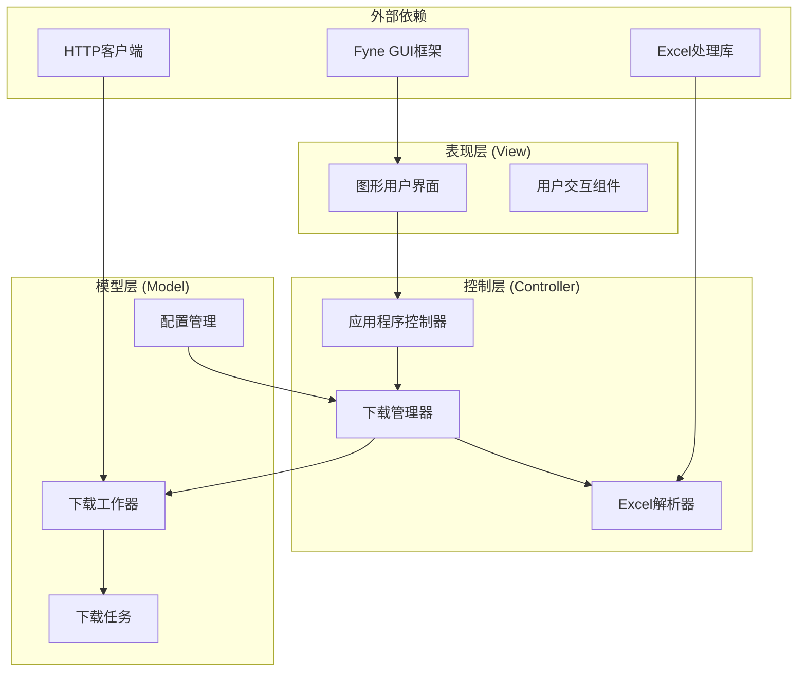
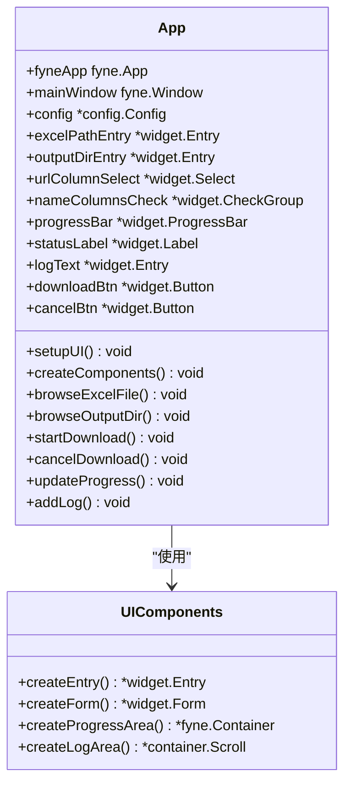
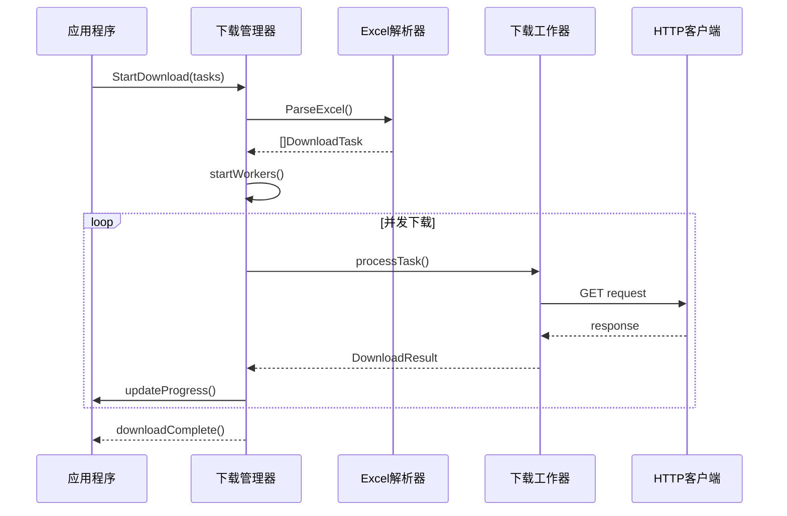
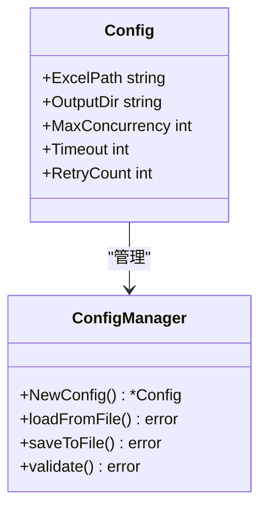
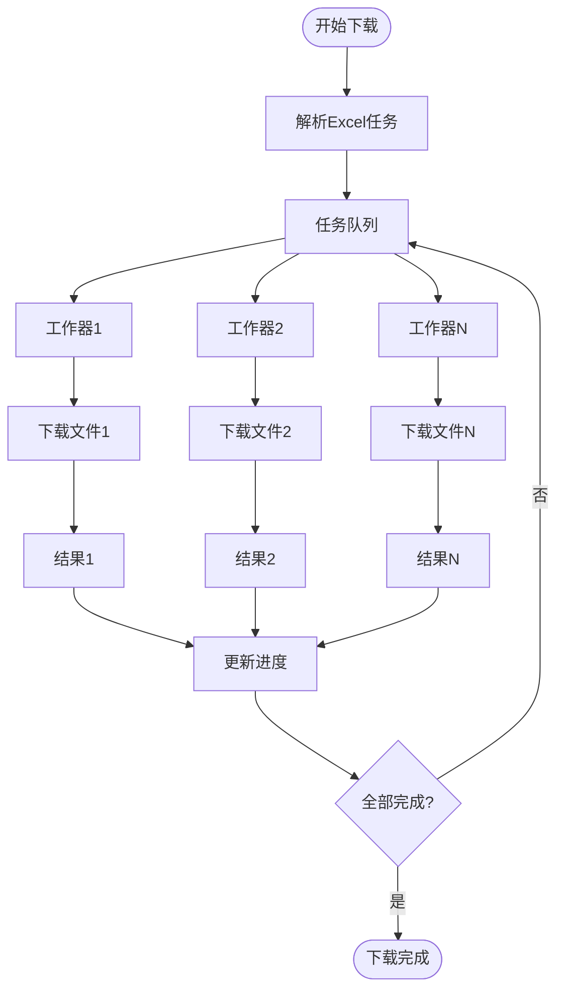

# 批量文件下载器项目概述

<cite>
**本文档引用的文件**
- [README.md](file://README.md)
- [main.go](file://main.go)
- [go.mod](file://go.mod)
- [gui/app.go](file://gui/app.go)
- [downloader/manager.go](file://downloader/manager.go)
- [downloader/excel_parser.go](file://downloader/excel_parser.go)
- [downloader/worker.go](file://downloader/worker.go)
- [downloader/types.go](file://downloader/types.go)
- [config/config.go](file://config/config.go)
</cite>

## 目录
1. [项目简介](#项目简介)
2. [核心价值与目标用户](#核心价值与目标用户)
3. [项目架构概览](#项目架构概览)
4. [技术栈与设计哲学](#技术栈与设计哲学)
5. [模块化架构分析](#模块化架构分析)
6. [功能特性详解](#功能特性详解)
7. [性能优化策略](#性能优化策略)
8. [用户体验设计](#用户体验设计)
9. [开发与部署考虑](#开发与部署考虑)
10. [总结](#总结)

## 项目简介

批量文件下载器是一个基于Go语言开发的图形界面应用程序，专门设计用于从Excel表格中读取URL并自动下载相关文件。该项目旨在解决大量文件批量下载的痛点，为用户提供一个直观、高效的文件下载解决方案。

### 主要应用场景
- **运营人员**：批量下载产品文档、宣传资料
- **开发人员**：获取项目依赖文件、测试资源
- **研究人员**：收集学术资料、数据集
- **内容创作者**：批量下载素材、模板文件

**章节来源**
- [README.md](file://README.md#L1-L10)
- [main.go](file://main.go#L1-L14)

## 核心价值与目标用户

### 核心价值主张

**1. 效率提升**
- 支持多线程并发下载，显著提升下载速度
- 自动识别Excel列结构，减少手动配置时间
- 智能文件命名规则，避免文件覆盖冲突

**2. 操作简化**
- 图形界面设计，无需命令行操作
- 可视化配置选项，降低使用门槛
- 实时进度监控，随时掌握下载状态

**3. 灵活性与定制性**
- 支持自定义文件命名规则
- 可调节并发下载数量
- 灵活的文件分类保存机制

### 目标用户群体

**专业用户**
- 需要批量处理大量文件的企业用户
- 需要定期更新资源的研究机构
- 内容管理系统维护人员

**技术用户**
- 开发团队的资源管理者
- IT部门的系统维护人员
- 数据分析师的资料收集者

**普通用户**
- 需要批量下载学习资料的学生
- 内容创作者的素材收集者
- 个人用户的批量文件管理需求

## 项目架构概览

该项目采用经典的MVC（Model-View-Controller）架构变体，结合现代GUI应用程序的设计模式，形成了清晰的分层架构体系。

**图表来源**
- [gui/app.go](file://gui/app.go#L44-L73)
- [downloader/manager.go](file://downloader/manager.go#L13-L31)
- [downloader/excel_parser.go](file://downloader/excel_parser.go#L86-L95)

### 架构层次说明

**表现层（View Layer）**
- 负责用户界面展示和交互响应
- 使用Fyne框架实现跨平台GUI
- 提供直观的操作界面和实时反馈

**控制层（Controller Layer）**
- 协调各个组件间的交互
- 管理下载流程和状态转换
- 处理用户输入和业务逻辑

**模型层（Model Layer）**
- 封装核心业务逻辑
- 管理下载任务和配置信息
- 提供数据持久化和状态管理

**章节来源**
- [gui/app.go](file://gui/app.go#L104-L122)
- [downloader/manager.go](file://downloader/manager.go#L33-L40)

## 技术栈与设计哲学

### 技术选型分析

**Go语言选择**
- **性能优势**：原生编译执行，内存占用低
- **并发支持**：内置goroutine，天然支持高并发
- **跨平台性**：一次编译，多平台运行
- **生态系统**：丰富的第三方库支持

**Fyne GUI框架**
- **跨平台支持**：Windows、macOS、Linux全覆盖
- **原生外观**：提供各平台的原生视觉体验
- **轻量级**：相比其他GUI框架更加轻量
- **活跃社区**：持续更新和维护

**Excelize库**
- **功能完整**：支持Excel 2007+格式
- **性能优异**：处理大型Excel文件高效
- **易于使用**：API设计简洁直观
- **广泛兼容**：支持多种Excel操作场景

### 设计哲学

**1. 简洁性原则**
- 最小化用户操作步骤
- 直观的界面布局设计
- 默认配置满足大多数场景

**2. 高效性原则**
- 多线程并发处理
- 智能任务调度算法
- 内存和CPU资源优化

**3. 可靠性原则**
- 完善的错误处理机制
- 自动重试和恢复功能
- 详细的日志记录系统

**4. 可扩展性原则**
- 模块化设计便于功能扩展
- 插件化的架构支持
- 配置驱动的灵活性

**章节来源**
- [go.mod](file://go.mod#L1-L50)
- [README.md](file://README.md#L15-L20)

## 模块化架构分析

### GUI模块（gui/）

GUI模块负责用户界面的完整实现，采用Fyne框架构建现代化的桌面应用程序界面。

**图表来源**
- [gui/app.go](file://gui/app.go#L44-L73)
- [gui/app.go](file://gui/app.go#L124-L188)

#### 核心功能特性

**智能界面设计**
- 自动检测Excel列类型
- 动态表单验证
- 实时进度反馈
- 错误提示和状态指示

**用户体验优化**
- 拖拽式文件选择
- 目录浏览器集成
- 可配置的并发设置
- 详细的下载日志

**章节来源**
- [gui/app.go](file://gui/app.go#L281-L300)
- [gui/app.go](file://gui/app.go#L451-L477)

### 下载管理模块（downloader/）

下载管理模块是整个应用程序的核心，实现了复杂的并发下载管理和任务调度机制。

**图表来源**
- [downloader/manager.go](file://downloader/manager.go#L46-L77)
- [downloader/worker.go](file://downloader/worker.go#L50-L64)

#### 核心架构组件

**下载管理器（DownloadManager）**
- 任务队列管理
- 工作器生命周期控制
- 进度和状态跟踪
- 错误处理和重试机制

**Excel解析器（ExcelParser）**
- 表头自动识别
- 数据验证和清洗
- 文件名智能生成
- 扩展名自动推断

**下载工作器（DownloadWorker）**
- 并发任务处理
- HTTP请求管理
- 断点续传支持
- 资源清理机制

**章节来源**
- [downloader/manager.go](file://downloader/manager.go#L33-L40)
- [downloader/excel_parser.go](file://downloader/excel_parser.go#L86-L95)
- [downloader/worker.go](file://downloader/worker.go#L16-L43)

### 配置模块（config/）

配置模块提供应用程序的配置管理和持久化功能。

**图表来源**
- [config/config.go](file://config/config.go#L8-L15)

#### 配置特性

**默认配置**
- 最大并发数：10
- 下载超时：30秒
- 重试次数：3次
- 输出目录：程序同目录下的downloads文件夹

**配置持久化**
- 自动创建配置文件
- 用户偏好保存
- 配置验证机制
- 默认值回退策略

**章节来源**
- [config/config.go](file://config/config.go#L16-L31)

## 功能特性详解

### 图形用户界面

#### 界面布局设计

应用程序采用分层布局设计，将不同功能区域合理组织：

**表单区域**：包含Excel文件选择、输出目录设置、列配置等输入控件
**进度区域**：显示下载进度条、状态信息和控制按钮
**日志区域**：实时显示下载过程中的详细信息和错误提示

#### 交互特性

**智能表单验证**
- 实时验证Excel文件有效性
- 自动检测列类型和数据格式
- 提供友好的错误提示信息

**拖拽式文件操作**
- 支持拖拽Excel文件到界面
- 目录选择的可视化浏览器
- 自动路径补全和验证

**动态界面更新**
- 实时进度条更新
- 状态信息动态变化
- 按钮状态智能控制

### 多线程并发下载

#### 并发架构设计

**图表来源**
- [downloader/manager.go](file://downloader/manager.go#L79-L87)
- [downloader/worker.go](file://downloader/worker.go#L45-L64)

#### 性能优化策略

**任务调度优化**
- 动态调整并发数量
- 智能负载均衡
- 任务优先级管理

**网络连接优化**
- 连接池复用
- 超时控制机制
- 重试策略配置

**资源管理优化**
- 内存使用控制
- 文件句柄管理
- 磁盘空间监控

### 自定义命名规则

#### 文件命名算法

应用程序提供了灵活的文件命名机制，支持多种组合方式：

**基础命名规则**
- 支持多列数据组合
- 可配置分隔符
- 自动清理非法字符
- 长度限制和安全检查

**智能扩展名处理**
- URL自动解析
- 配置优先级
- 默认扩展名回退
- 类型验证机制

**章节来源**
- [downloader/excel_parser.go](file://downloader/excel_parser.go#L174-L249)

### 实时进度监控

#### 进度跟踪机制

**多维度进度计算**
- 总体下载进度
- 当前文件进度
- 平均下载速度
- 预估剩余时间

**性能统计信息**
- 实时速度计算
- 错误率统计
- 资源使用监控
- 时间趋势分析

**用户反馈优化**
- 进度条动画效果
- 状态文本更新
- 声音和视觉提示
- 日志信息分级

**章节来源**
- [gui/app.go](file://gui/app.go#L591-L616)
- [downloader/manager.go](file://downloader/manager.go#L101-L151)

## 性能优化策略

### 并发控制优化

#### 工作器池管理

应用程序采用固定大小的工作器池，平衡性能和资源消耗：

**工作器生命周期**
- 动态创建工作器
- 智能回收资源
- 异常情况处理
- 资源泄漏防护

**任务分配策略**
- 负载均衡算法
- 优先级队列
- 热点避免机制
- 动态调整策略

### 内存管理优化

#### 资源使用控制

**内存使用策略**
- 流式处理大文件
- 对象池复用机制
- 及时资源释放
- 内存泄漏检测

**垃圾回收优化**
- 减少临时对象创建
- 大对象缓存管理
- 垃圾回收时机控制
- 内存压力监控

### 网络性能优化

#### HTTP客户端配置

**连接管理**
- 连接池大小控制
- 空闲连接复用
- 连接超时设置
- 重试间隔策略

**请求优化**
- 请求头优化
- 响应压缩支持
- DNS缓存机制
- 代理支持配置

**章节来源**
- [downloader/worker.go](file://downloader/worker.go#L25-L42)

## 用户体验设计

### 界面设计原则

#### 视觉设计

**一致性原则**
- 统一的色彩方案
- 一致的控件样式
- 标准的交互模式
- 渐进式的复杂度

**可用性设计**
- 直观的布局结构
- 清晰的信息层次
- 有效的视觉引导
- 错误预防机制

#### 交互设计

**反馈机制**
- 即时的状态反馈
- 渐进式的加载指示
- 清晰的成功/失败提示
- 详细的错误信息

**操作便利性**
- 快捷键支持
- 批量操作功能
- 撤销/重做机制
- 自动保存功能

### 可访问性考虑

#### 用户群体适配

**技术能力适配**
- 新手友好界面
- 渐进式功能揭示
- 详细的帮助文档
- 示例数据演示

**设备兼容性**
- 多分辨率支持
- 高DPI显示器适配
- 触摸屏优化
- 辅助功能支持

**章节来源**
- [gui/app.go](file://gui/app.go#L24-L34)

## 开发与部署考虑

### 开发环境配置

#### 环境要求

**硬件要求**
- CPU：多核处理器（推荐4核以上）
- 内存：2GB RAM（推荐4GB以上）
- 存储：100MB可用空间
- 网络：稳定的互联网连接

**软件要求**
- Go 1.25或更高版本
- Windows系统（当前仅支持Windows）
- Excel文件格式支持

### 构建和打包

#### 构建流程

**开发构建**
- 本地开发环境配置
- 自动化测试集成
- 代码质量检查
- 文档自动生成

**发布构建**
- 跨平台编译
- 依赖项打包
- 数字签名处理
- 版本标记管理

### 部署策略

#### 分发方式

**官方渠道**
- GitHub Releases页面
- 官方网站下载
- 包管理器支持
- 自动更新机制

**企业部署**
- 离线安装包
- 企业内网部署
- 安全扫描支持
- 批量部署工具

**章节来源**
- [README.md](file://README.md#L28-L51)

## 总结

批量文件下载器项目展现了现代Go语言应用程序开发的最佳实践。通过精心设计的架构、完善的功能特性和优秀的用户体验，该项目成功解决了批量文件下载这一实际需求。

### 技术亮点

**架构设计**
- 清晰的模块分离
- 良好的可扩展性
- 完善的错误处理
- 优雅的并发控制

**功能实现**
- 智能的Excel解析
- 高效的并发下载
- 灵活的命名规则
- 实时的进度监控

**用户体验**
- 直观的图形界面
- 智能的交互设计
- 详尽的帮助信息
- 良好的性能表现

### 发展前景

该项目不仅满足了当前的批量下载需求，还为未来的功能扩展奠定了坚实的基础。随着技术的不断发展和完善，该应用程序有望成为文件批量处理领域的优秀解决方案。

对于开发者而言，这是一个学习Go语言并发编程、GUI开发和跨平台应用开发的优秀案例；对于用户而言，它提供了一个高效、可靠、易用的文件下载工具，大大提升了工作效率。