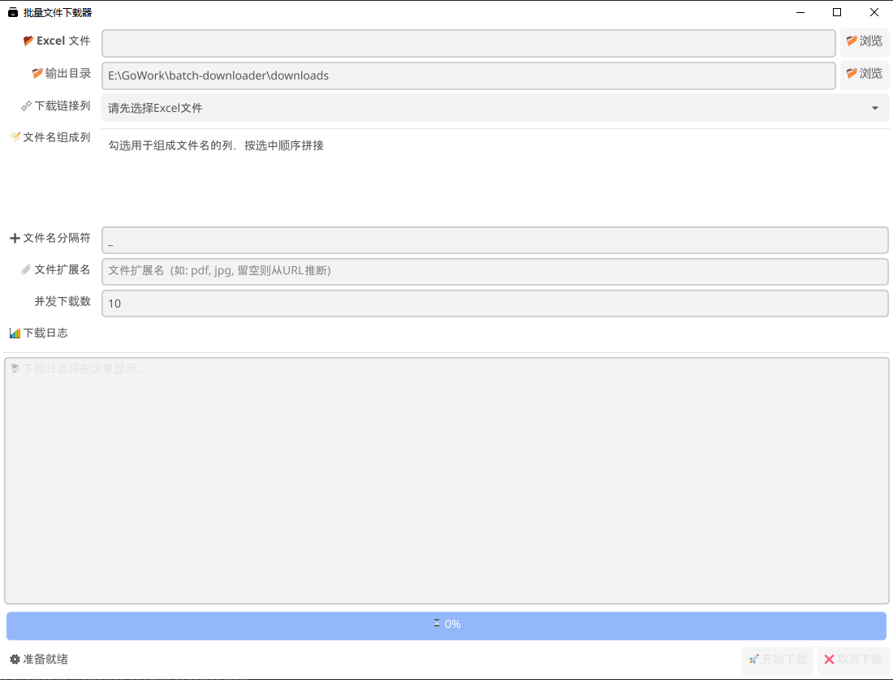

# 批量文件下载器

一个基于 Go 语言开发的图形界面批量文件下载工具，可以从 Excel 表格中读取 URL 并自动下载文件。

## 功能特点

- 🖥️ 图形用户界面，易于操作
- 📊 通过 Excel 表格管理下载任务
- ⚡ 多线程并发下载，提高效率
- 📝 自定义文件命名规则
- 📈 实时显示下载进度和统计信息
- 🛑 支持随时取消下载任务
- 📁 自动分类保存下载文件

## 技术栈

- [Go 1.25](https://golang.org/)
- [Fyne GUI Toolkit](https://fyne.io/) - 跨平台 GUI 框架
- [Excelize](https://github.com/qiniu/excelize) - Excel 文件处理库

## 快速开始

### 下载与安装

1. 从 [Releases](https://github.com/LxShine/releases) 页面下载最新版本
2. 解压后双击 `batch-downloader.exe` 即可运行

### 编译构建

#### 环境要求

- Go 1.25 或更高版本
- Windows 系统（目前仅支持 Windows）

#### 构建步骤

1. 克隆项目：
   ```
   git clone https://github.com/LxShine/batch-downloader.git
   cd batch-downloader
   ```

2. 构建可执行文件：
   ```
   build.bat
   ```

3. 运行程序：
   ```
   batch-downloader.exe
   ```

## 使用说明

### 准备 Excel 文件

创建一个 Excel 文件，至少包含以下列：

| URL | 名称1 | 名称2 | 分类 |
|-----|-------|-------|------|
| http://example.com/file1.pdf | 产品A | 说明书 | 用户手册 |
| http://example.com/file2.pdf | 产品B | 说明书 | 用户手册 |

### 操作步骤

1. 点击「浏览」按钮选择 Excel 文件
2. 选择输出目录（默认为程序同目录下的 downloads 文件夹）
3. 在「下载链接列」中选择包含 URL 的列
4. 勾选用于组成文件名的列（可多选）
5. 设置文件名分隔符（默认为 `_`）
6. 设置并发下载数（1-50，默认为 10）
7. 点击「开始下载」

### 界面说明

- **Excel 文件**：选择包含下载链接的 Excel 文件
- **输出目录**：设置下载文件的保存位置
- **下载链接列**：指定包含 URL 的列
- **文件名组成列**：选择用于组合文件名的列
- **文件名分隔符**：各列之间的连接字符
- **并发下载数**：同时进行的下载任务数量
- **开始下载**：启动下载任务
- **取消下载**：中断正在进行的下载

## 配置参数

程序会在运行时自动生成配置，默认参数如下：

- 最大并发数：10
- 下载超时：30 秒
- 重试次数：3 次

## 截图预览



## 常见问题

### 为什么下载速度很慢？

可以适当增加并发下载数来提升速度，但注意不要设置过高以免对服务器造成压力。

### 下载的文件名乱码怎么办？

确保 Excel 文件以 UTF-8 编码保存，避免使用特殊字符作为文件名。

### 如何自定义文件扩展名？

可以在「文件扩展名」字段中指定统一的扩展名，如 `pdf`、`jpg` 等。

## 开发计划

- [ ] 支持更多文件格式（CSV、JSON 等）
- [ ] 增加代理设置功能
- [ ] 添加下载历史记录
- [ ] 支持 macOS 和 Linux 平台

## 贡献

欢迎提交 Issue 和 Pull Request 来帮助改进这个项目。

## 许可证

[MIT License](LICENSE)
